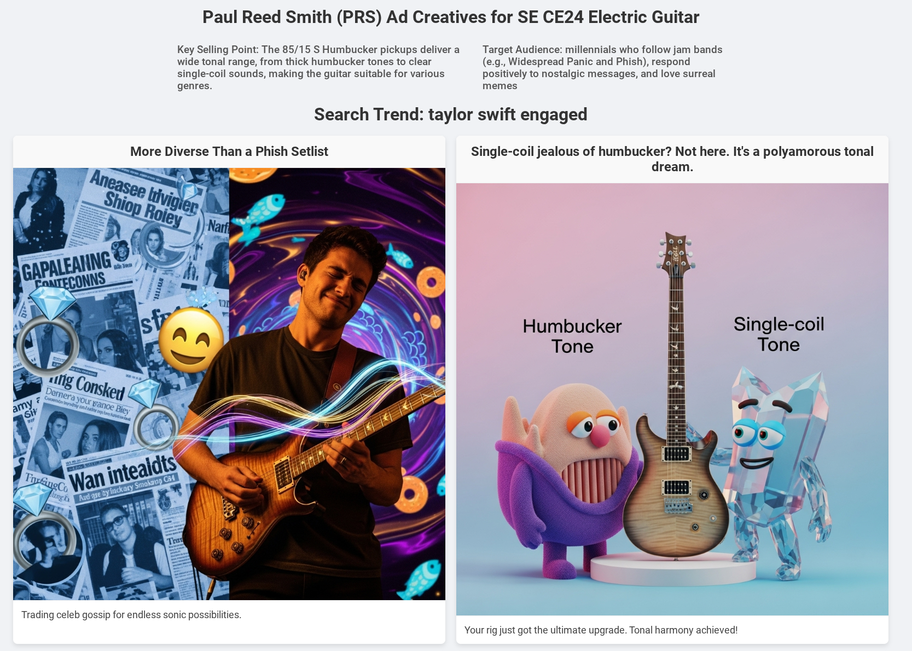
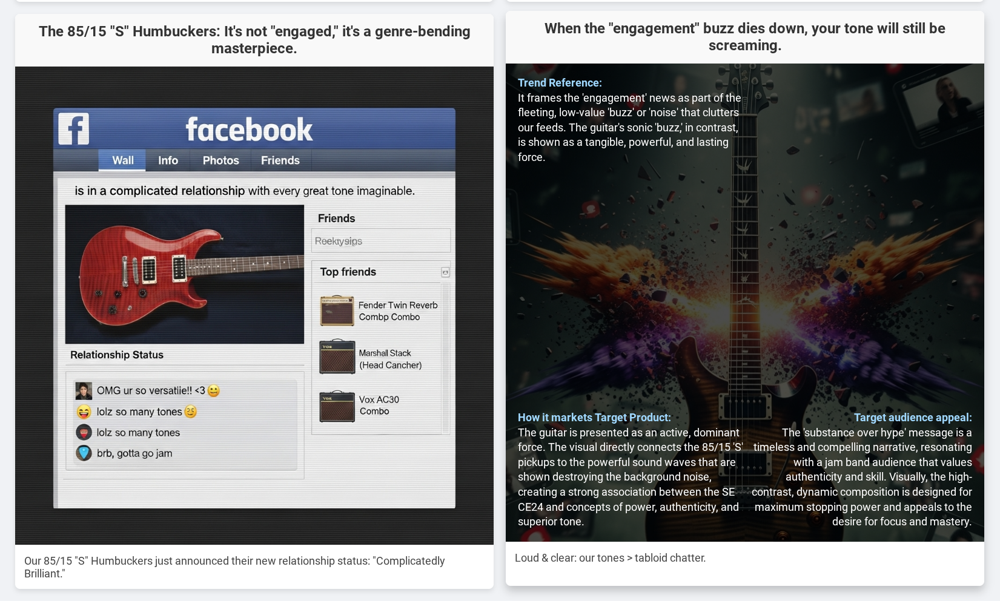

# Trend Trawler

> *[trends-2-creatives](https://github.com/tottenjordan/zghost/tree/main) in offline, beast mode*

<details>
  <summary>casting a wide net</summary>


> Given a campaign, the `trend_trawler` gathers the top 25 trending Search terms and returns a subset of the most relevant to the campaign


<p align="center">
  
</p>


* WIP: Given a campaign and a Search trend, the creative agent conducts web research (for context) and generates candidate ad creatives

</details>

## About

*trend-trawler* is a multi-agent system designed to run offline via schedule or event-based trigger.
* agents developed with Google's ADK
* agents deployed to either Cloud Run or Agent Engine

**helpful references**
* [Overview of prompting strategies](https://cloud.google.com/vertex-ai/generative-ai/docs/learn/prompts/prompt-design-strategies#best-practices)


**TODOs**
* deployment script for Vertex AI Agent Engine
* event-based triggers
* scheduled runs
* email / notification
* easy export to ~*live editor tool* to nano-banana


## example output


#### 1. the `creative_agent` conducts web research to inform the creative process. a PDF of this web research is saved for humans:

<p align="center" width="100%">
    
</p>


#### 2. the agents final step produces an HTML display of all generated ad creatives:

<p align="center" width="100%">
    
</p>

<details>
  <summary>some details on the HTML report</summary>

#### see campaign metadata at the top:

* brand
* target product
* key selling point
* target audience

#### each creative has a headline (title) and a caption



#### hovering over a creative will display:

* how it references the search trend
* how it markets the target product
* why the target audience will find it appealing




*remember: these are ad candidates to start the ideation process. the prompts are saved so you can easily tweak the creative*


</details>


## General Setup Instructions

**1. Clone the Repository**

```bash
git clone https://github.com/tottenjordan/adk_pipe.git
```

**2. Set project and authenticate**

```bash
export GOOGLE_CLOUD_PROJECT=$(gcloud config get-value project)
export GOOGLE_CLOUD_PROJECT_NUMBER=$(gcloud projects describe $GOOGLE_CLOUD_PROJECT --format="value(projectNumber)")

gcloud config set project $GOOGLE_CLOUD_PROJECT
gcloud auth application-default login
```

**3. Update `.env` file**

```bash
touch .env
echo "GOOGLE_GENAI_USE_VERTEXAI=1" >> .env
echo "GOOGLE_CLOUD_PROJECT=your-project-id" >> .env
echo "GOOGLE_CLOUD_PROJECT_NUMBER=1234789" >> .env
echo "GOOGLE_CLOUD_LOCATION=us-central1" >> .env
echo "BUCKET=gs://your-bucket-name" >> .env
```

then copy `.env` file to both agent directories (deployed separately)

```bash
cp .env trend_trawler/.env
cp .env creative_agent/.env

source .env
```

**4. poetry install && create requirements.txt file**

*Note: i had to manually clean the requirements.txt file produced by these commands. Might want to copy mine*

```bash
poetry install

poetry export --without-hashes --format=requirements.txt > ./creative_agent/requirements.txt
poetry export --without-hashes --format=requirements.txt > ./trend_trawler/requirements.txt
```

## Running an Agent


   > define your `campaign metadata`... these are inputs to the `trend_trawler` and `creative_agent`


<details>
  <summary>guidance on what works well here</summary>

**Target Audience:** 
* who are they? what do they want? 
* go beyond typical demographics with...
  * **psychographics:** *people who are frustrated with...* 
  * **lisfestyle:** *frequent travelers; spending most income on concert experiences.*
  * **hobbies, interests, humor**: *music lovers, attend lots of jam band concerts. love surreal memes*
  * **lifestage**: *recent empty-nesters*

**Key Selling Points**

This will be the `{target_products}` 's flavor in the messaging and visual cocnepts
*can be used multiple ways. here are some...*

* What is the `{target_audience}` 's benefit? what will make them really care?
* external factors e.g., if selling sweaters: `it's cold outside`
* don't have to choose a single benefit. if there are several, explain them (experiment with this). However, can hyper-focused on one benefit as well...

  * *"Advanced Night Repair - Ideal for visible age prevention with double action to fight visible effects of free radical damage"*
  * *"Call Screen - Goodbye, spam calls. With Call Screen, Pixel can now detect and filter out even more spam calls. For other calls, it can tell you who’s calling and why before you pick up. Detect and decline spam calls without distracting you."*
  * *"Best Take - Group pics, perfected. Pixel’s Best Take combines similar photos into one fantastic picture where everyone looks their best. AI is able to blend multiple still images to give everyone their best look"*

</details>


**1. local deployment / testing**

start local dev UI...

```bash
poetry run adk web .
```

**[1.a] choose `trend_trawler` from drop-down menu (top left)...**

```bash
user: Brand Name: "YOUR BRAND OF CHOICE"
      Target Audience: "YOUR TARGET AUDIENCE OF CHOICE"
      Target Product: "YOU TARGET PRODUCT OF CHOICE"
      Key Selling Points: "YOU KEY SELLING POINT(S)"

agent: `[end-to-end workflow >> recommended subset of trends]` 
```

**[1.b] choose `creative agent` in top-left drop-down menu...**

```bash
user: Brand Name: "YOUR BRAND OF CHOICE"
      Target Audience: "YOUR TARGET AUDIENCE OF CHOICE"
      Target Product: "YOU TARGET PRODUCT OF CHOICE"
      Key Selling Points: "YOU KEY SELLING POINT(S)"
      target_search_trend: "YOUR_SEARCH_TREND_OF_CHOICE"

agent: `[end-to-end workflow >> candidate creatives]` 
```

## Deploying Agents to separate Agent Engine instances

> [Agent Engine](https://google.github.io/adk-docs/deploy/agent-engine/) is a fully managed auto-scaling service on Google Cloud specifically designed for deploying, managing, and scaling AI agents built with frameworks such as ADK.

1. [deploy-to-agent-engine.ipynb](./deploy-to-agent-engine.ipynb) notebook
    * *WIP: migrating code to the refactored client-based `Agent Engine` SDK... see [migration guide](https://cloud.google.com/vertex-ai/generative-ai/docs/deprecations/agent-engine-migration)*


## Deploying Agents to separate Cloud Run instances

> [Cloud Run](https://cloud.google.com/run) is a managed auto-scaling compute platform on Google Cloud that enables you to run your agent as a container-based application.


**1. Deploy `trend trawler agent` to Cloud Run...**

```bash
export AGENT_DIR_NAME=trend_trawler

# Set the path to your agent code directory
export AGENT_PATH=$AGENT_DIR_NAME/

# avoid permission issues in Cloud Run
chmod -R 777 $AGENT_PATH

# Set a name for your Cloud Run service (optional)
export SERVICE_NAME="trend-trawler-prs-beastmode"

adk deploy cloud_run \
  --project=$GOOGLE_CLOUD_PROJECT \
  --region=$GOOGLE_CLOUD_LOCATION \
  --port 8000 \
  --service_name=$SERVICE_NAME \
  --with_ui \
  $AGENT_PATH
```

*if prompted with the following, select `y`...*

`Allow unauthenticated invocations to [your-service-name] (y/N)?.`

**2. Deploy `creative agent` to Cloud Run...**

```bash
export AGENT_DIR_NAME=creative_agent

# Set the path to your agent code directory
export AGENT_PATH=$AGENT_DIR_NAME/

# avoid permission issues in Cloud Run
chmod -R 777 $AGENT_PATH

# Set a name for your Cloud Run service (optional)
export SERVICE_NAME="trend-creative-prs-beastmode"

adk deploy cloud_run \
  --project=$GOOGLE_CLOUD_PROJECT \
  --region=$GOOGLE_CLOUD_LOCATION \
  --port 8000 \
  --service_name=$SERVICE_NAME \
  --with_ui \
  $AGENT_PATH
```

*if prompted with the following, select `y`...*
> `Allow unauthenticated invocations to [your-service-name] (y/N)?.`


**3. Update Cloud run deployment**

```bash
gcloud run services update $SERVICE_NAME \
  --region=$GOOGLE_CLOUD_LOCATION \
  --timeout=600
```


## Folder Structure

```bash
.
├── creative_agent
│   ├── agent.py
│   ├── callbacks.py
│   ├── config.py
│   ├── __init__.py
│   ├── prompts.py
│   ├── requirements.txt
│   ├── sub_agents
│   │   ├── campaign_researcher
│   │   │   ├── agent.py
│   │   │   └── __init__.py
│   │   ├── __init__.py
│   │   └── trend_researcher
│   │       ├── agent.py
│   │       └── __init__.py
│   └── tools.py
├── poetry.lock
├── pyproject.toml
├── README.md
└── trend_trawler
    ├── agent.py
    ├── callbacks.py
    ├── config.py
    ├── __init__.py
    ├── requirements.txt
    └── tools.py
```