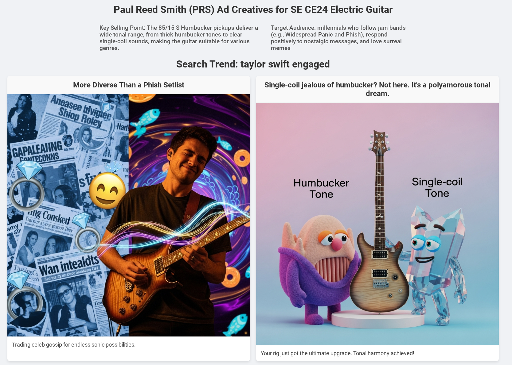
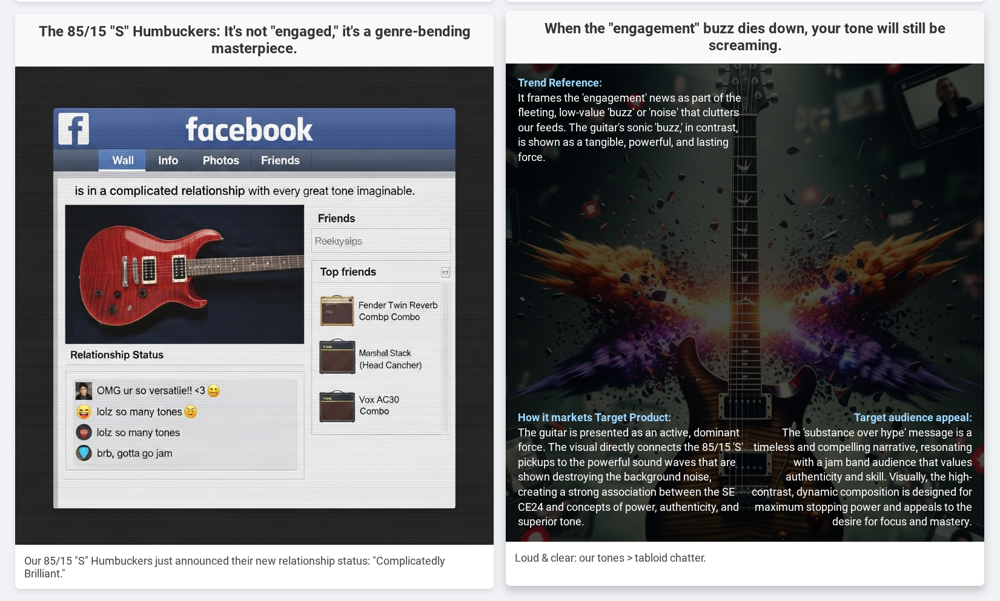

<div align="center">


<h1 align="center">🌊 Trend Trawler 🎣</h1>

> Turn trending Google Search terms into campaign-ready ad creatives — a multi-agent system built with Google's **ADK**, deployed to **Vertex AI Agent Engine**, and fanned out via **Cloud Run Functions + Pub/Sub**.


</div>

**Trend Trawler** runs a two-phase, event-driven pipeline: first it finds culturally relevant Google Search trends for a campaign, then it researches each trend and generates, evaluates, and exports candidate ad copy and visual concepts. It can run headless (offline, event-triggered) or interactively through a custom web UI.

| Stage | Agent | What it does |
| :---: | --- | --- |
| 1 | 🔦 **`trend_trawler`** | Gathers the top 25 Google Search trends, researches cultural context, and filters to the 3 most campaign-relevant |
| 2 | 🎨 **`creative_agent`** | Researches a `<trend, campaign>` pair and generates candidate ad copy + visual concepts, rendering an image for each |
| 2 | ⚖️ **`creative_eval`** | Scores every ad copy and visual concept via LLM-as-judge across 12 quality dimensions |
| 2 | 🧑‍💻 **`interactive_creative`** | Same pipeline as `creative_agent`, with human-in-the-loop review checkpoints after research, ad copies, and visual concepts |

<details>
  <summary>casting a wide net — how the pipeline flows</summary>

<br />

Trend Trawler works like its namesake: it drops a **wide net** over the day's Search trends, then hauls in only the catch worth keeping.

1. **Cast** — `trend_trawler` pulls the top 25 Google Search trends and researches each for cultural context.
2. **Haul in** — it filters to the 3 trends most relevant to your campaign and writes them to BigQuery.
3. **Work the catch** — for each `<trend, campaign>` pair, `creative_agent` runs parallel web research, synthesizes a strategic brief, and generates candidate ad copy plus a rendered image per visual concept.
4. **Grade it** — `creative_eval` scores every ad copy and visual concept with an LLM-as-judge across 12 quality dimensions (passing threshold 0.7).
5. **Land it** — the research PDF, HTML gallery, and evaluation report are exported to Cloud Storage.

Prefer to stay hands-on? `interactive_creative` runs the same flow but pauses for your review after the research report, the ad copies, and the visual concepts.

</details>


## Table of Contents
- [Installation](#installation)
- [Usage](#usage)
  - [Running an Agent](#running-an-agent)
  - [Creative Evaluation](#creative-evaluation)
  - [Example Output](#example-output)
- [Frontend UI](#frontend-ui)
- [Deployment](#deployment)
  - [Deploying Agents to Agent Engine](#deploying-agents-to-agent-engine)
  - [Cloud Run Functions Fan-out Pattern](#cloud-run-functions-fan-out-pattern-with-event-based-triggers)
  - [Alternative: Deploy to Cloud Run](#alternative-deployment-deploy-to-cloud-run-instances)
- [Testing](#testing)
- [Repo Structure](#repo-structure)
- [TODO](#todo)


## Installation


**helpful references**
* [Overview of prompting strategies](https://cloud.google.com/vertex-ai/generative-ai/docs/learn/prompts/prompt-design-strategies#best-practices)
* [ADK documentation](https://google.github.io/adk-docs/get-started/)
* [Sample Agents](https://github.com/google/adk-samples/tree/main/python/agents)
* [adk-python SDK samples](https://github.com/google/adk-python/tree/main/contributing/samples)


### Setup & Config

**1. Clone the Repository**

```bash
git clone https://github.com/tottenjordan/adk_pipe.git
```

**2. Set project and authenticate**

```bash
export GOOGLE_CLOUD_PROJECT=$(gcloud config get-value project)
export GOOGLE_CLOUD_PROJECT_NUMBER=$(gcloud projects describe $GOOGLE_CLOUD_PROJECT --format="value(projectNumber)")

gcloud config set project $GOOGLE_CLOUD_PROJECT
gcloud auth application-default login
```

**3.  Make `.env` by copying `.env.example`**

```bash
cp .env.example .env
```

then edit `.env` with your project values — see [.env.example](./.env.example)

<details>
  <summary>expand here</summary>

```bash
GOOGLE_GENAI_USE_VERTEXAI=1
GOOGLE_CLOUD_PROJECT=this-my-project-id
# gemini-3.x models are only served from the `global` Vertex location;
# regional resources (BigQuery, GCS, PubSub, Agent Engine) use us-central1.
GOOGLE_CLOUD_LOCATION=global
GCP_REGION=us-central1
GOOGLE_CLOUD_PROJECT_NUMBER=12345678910


# Cloud Storage
GOOGLE_CLOUD_STORAGE_BUCKET=this-my-bucket-name
BUCKET=gs://this-my-bucket-name


# PubSub
CREATIVE_TOPIC_NAME=creative-eventarc-topic
CREATIVE_WORKER_TOPIC_NAME=creative-worker-queue-topic


# Cloud Run Functions
BASE_IMAGE=python313

CREATIVE_CRF_NAME=creative-trawler-crf
CRF_ENTRYPOINT=crf_entrypoint
CREATIVE_TRIGGER_NAME=creative-eventarc-trigger

CREATIVE_WORKER_CRF_NAME=creative-worker-crf
CREATIVE_WORKER_ENTRYPOINT=agent_worker_entrypoint
CREATIVE_WORKER_TRIGGER_NAME=creative-worker-starter-trigger


# BigQuery 
BQ_PROJECT_ID='this-my-project-bq-id'
BQ_DATASET_ID='trend_trawler'
BQ_TABLE_TARGETS='target_trends_crf'
BQ_TABLE_CREATIVES='trend_creatives'
BQ_TABLE_ALL_TRENDS='all_trends'


# Agent Engine (leave blank)
CREATIVE_AGENT_ENGINE_ID=""
TRAWLER_AGENT_ENGINE_ID=""


# campaign metadata
BRAND="Paul Reed Smith (PRS)"
TARGET_AUDIENCE="millennials who follow jam bands (e.g., Widespread Panic and Phish), respond positively to nostalgic messages"
TARGET_PRODUCT="PRS SE CE24 Electric Guitar"
KEY_SELLING_POINT="The 85/15 S Humbucker pickups deliver a wide tonal range, from thick humbucker tones to clear single-coil sounds, making the guitar suitable for various genres."
TARGET_SEARCH_TREND="tswift engaged"

```

</details>

source `.env` variables

```bash
source .env
```

**4. uv sync**

```bash
uv sync
```

**5. Create BigQuery Dataset and Tables**

```bash
bq --location=US mk --dataset $BQ_PROJECT_ID:$BQ_DATASET_ID
```

Create the BQ table to store selected search trends:

```bash
bq mk \
 -t \
 $BQ_PROJECT_ID:$BQ_DATASET_ID.$BQ_TABLE_TARGETS \
 uuid:STRING,processed_status:STRING,target_trend:STRING,refresh_date:DATE,trawler_date:DATE,entry_timestamp:TIMESTAMP,trawler_gcs:STRING,brand:STRING,target_audience:STRING,target_product:STRING,key_selling_point:STRING
```

Create the BQ table to store details for the target trend creatives:

```bash
bq mk \
 -t \
 $BQ_PROJECT_ID:$BQ_DATASET_ID.$BQ_TABLE_CREATIVES \
 uuid:STRING,target_trend:STRING,datetime:DATETIME,creative_gcs:STRING,brand:STRING,target_audience:STRING,target_product:STRING,key_selling_point:STRING
```

## Usage

Define your `campaign metadata`... these are inputs to the `trend_trawler` and `creative_agent`

<details>
  <summary>guidance on what works well here</summary>

**Target Audience:** 
* who are they? what do they want? 
* go beyond typical demographics with...
  * **psychographics:** *people who are frustrated with...* 
  * **lisfestyle:** *frequent travelers; spending most income on concert experiences.*
  * **hobbies, interests, humor**: *music lovers, attend lots of jam band concerts. love surreal memes*
  * **lifestage**: *recent empty-nesters*

**Key Selling Points**

This will be the `{target_products}` 's flavor in the messaging and visual concepts
*can be used multiple ways. here are some...*

* What is the `{target_audience}` 's benefit? what will make them really care?
* external factors e.g., if selling sweaters: `it's cold outside`
* don't have to choose a single benefit. if there are several, explain them (experiment with this). However, can hyper-focused on one benefit as well...

  * *"Advanced Night Repair - Ideal for visible age prevention with double action to fight visible effects of free radical damage"*
  * *"Call Screen - Goodbye, spam calls. With Call Screen, Pixel can now detect and filter out even more spam calls. For other calls, it can tell you who’s calling and why before you pick up. Detect and decline spam calls without distracting you."*
  * *"Best Take - Group pics, perfected. Pixel’s Best Take combines similar photos into one fantastic picture where everyone looks their best. AI is able to blend multiple still images to give everyone their best look"*

</details>

```bash
# example campaign metadata
Brand Name: 'Paul Reed Smith (PRS)'
Target Audience: 'millennials who follow jam bands (e.g., Widespread Panic and Phish), respond positively to nostalgic messages, and love surreal memes'
Target Product: 'SE CE24 Electric Guitar'
Key Selling Points: 'The 85/15 S Humbucker pickups deliver a wide tonal range, from thick humbucker tones to clear single-coil sounds, making the guitar suitable for various genres.'
```

### Running an Agent


**1. local deployment / testing**

start local dev UI...

```bash
uv run adk web .
```

**[1.a] choose `trend_trawler` from drop-down menu (top left)...**

```bash
user: Brand Name: "YOUR BRAND OF CHOICE"
      Target Audience: "YOUR TARGET AUDIENCE OF CHOICE"
      Target Product: "YOU TARGET PRODUCT OF CHOICE"
      Key Selling Points: "YOU KEY SELLING POINT(S)"

agent: `[end-to-end workflow >> recommended subset of trends]` 
```

**[1.b] choose `creative agent` in top-left drop-down menu...**

```bash
user: Brand Name: "YOUR BRAND OF CHOICE"
      Target Audience: "YOUR TARGET AUDIENCE OF CHOICE"
      Target Product: "YOU TARGET PRODUCT OF CHOICE"
      Key Selling Points: "YOU KEY SELLING POINT(S)"
      target_search_trend: "YOUR_SEARCH_TREND_OF_CHOICE"

agent: `[end-to-end workflow >> candidate creatives]`
```

**[1.c] choose `interactive_creative` for human-in-the-loop mode...**

Same inputs as the `creative_agent`, but the pipeline pauses at 3 checkpoints for human review:

1. **After research** — review the research report, approve or request changes
2. **After ad copies** — review generated ad copies before visual concept generation
3. **After visual concepts** — review visual concepts and image prompts before image generation

At each checkpoint the UI displays a review panel where you can approve and continue, or provide feedback. Uses ADK's `LongRunningFunctionTool` for pause/resume.

### Creative Evaluation

The `creative_eval` module runs automatically as part of both the `creative_agent` and `interactive_creative` pipelines. It evaluates every generated ad copy and visual concept using an LLM-as-judge approach (`gemini-3.1-pro-preview`). Each creative is scored by an independent judge call, run concurrently in a thread pool. Because the judge is a gemini-3 model, its client uses the `global` Vertex location.

**Ad Copy Dimensions (6):** strategic alignment, trend authenticity, platform viability, copy quality, audience fit, CTA strength

**Visual Concept Dimensions (6):** trend-visual connection, brand representation, audience appeal, prompt technical quality, stopping power, concept coherence

Each dimension is scored 1–10. Scores are normalized to 0.0–1.0 with a **0.7 passing threshold**. The evaluation report includes per-dimension verdicts with rationale, strengths, suggested improvements, and a summary with pass rates and weakest dimensions. The report is saved as JSON to GCS.

### Example Output

**1. the `creative_agent` conducts web research to inform the creative process. a PDF of this web research is saved for humans:**

<p align="center" width="100%">
    
</p>


**2. the agents final step produces an HTML display of all generated ad creatives:**

<p align="center" width="100%">
    
</p>

<details>
  <summary>some details on the HTML report</summary>

#### see campaign metadata at the top:

* brand
* target product
* key selling point
* target audience

#### each creative has a headline (title) and a caption



#### hovering over a creative will display:

* how it references the search trend
* how it markets the target product
* why the target audience will find it appealing




*remember: these are ad candidates to start the ideation process. the prompts are saved so you can easily tweak the creative*

</details>


## Frontend UI

A custom React frontend for running agents and viewing results, built with Next.js, Tailwind CSS, and shadcn/ui.

**Prerequisites:** Node.js >= 18

**1. Start the ADK API server** (backend)

```bash
uv run adk api_server . --allow_origins=http://localhost:3000
```

**2. Start the frontend** (in a separate terminal)

```bash
cd frontend
npm install
npm run dev
```

Open [http://localhost:3000](http://localhost:3000) in your browser.

**Features:**
* Campaign input form with agent selector (`trend_trawler`, `creative_agent`, or `interactive_creative`)
* Live SSE event stream with timeline-style visualization
* Pipeline state widgets (ad copy drafts, visual concepts, critiques) as modal overlays
* **Interactive mode** — human-in-the-loop review checkpoints after research, ad copies, and visual concepts (pause/resume via `LongRunningFunctionTool`)
* Authenticated GCS proxy for viewing research PDFs and generated images
* Clickable trend cards — run `trend_trawler`, then click a recommended trend to launch `creative_agent` with pre-filled metadata
* Results page with artifact gallery, HTML portfolio viewer, evaluation report, and session state inspector


## Deployment

### Deploying Agents to Agent Engine

Deploying Agents to separate Agent Engine instances...

> [Agent Engine](https://google.github.io/adk-docs/deploy/agent-engine/) is a fully managed auto-scaling service on Google Cloud specifically designed for deploying, managing, and scaling AI agents built with frameworks such as ADK.


```bash
# deploy `trend_trawler` agent to Agent Engine
python deployment/deploy_agent.py --version=v1 --agent=trend_trawler --create

# deploy `creative_agent` agent to Agent Engine
python deployment/deploy_agent.py --version=v1 --agent=creative_agent --create

# list existing Agent Engine instances
python deployment/deploy_agent.py --list

# delete an Agent Engine Runtime
python deployment/deploy_agent.py --resource_id=890256972824182784 --delete
```

* Once agent is deployed to Agent Engine, the agent's resource ID will be added to your `.env` file. And this will be used later in the `test_deployment.py` script

#### Test deployment

**Interact with the deployed agents using the `test_deployment.py` script...**

*Note: the `test_deployment.py` script will source the `BRAND`, `TARGET_AUDIENCE`, `TARGET_PRODUCT`, `KEY_SELLING_POINT`, and `TARGET_SEARCH_TREND` from your `.env` file.*

**[1] Kickoff the `trend_trawler` agent workflow.**  

> *This will insert a row into your BigQuery table for each recommended trend*

```bash
export USER_ID='ima_user'
python deployment/test_deployment.py --agent=trend_trawler --user_id=$USER_ID

Found agent with resource ID: ...
Created session for user ID: ...
...

INFO - Deleted session for user ID: ima_user
```

**[2] Next, invoke the deployed `creative_agent` workflow:**

> *This will insert a row into your BigQuery table with the Cloud Storage location of all trend and creative assets*

```bash
export USER_ID='ima_user'
python deployment/test_deployment.py --agent=creative_agent --user_id=$USER_ID

Found agent with resource ID: ...
Created session for user ID: ...
...

INFO - Deleted session for user ID: ima_user
```

* [deploy-to-agent-engine.ipynb](./deploy-to-agent-engine.ipynb) notebook
    * *WIP: migrating code to the refactored client-based `Agent Engine` SDK... see [migration guide](https://cloud.google.com/vertex-ai/generative-ai/docs/deprecations/agent-engine-migration)*


**View logs for an agent**

To view log entries in the [Logs Explorer](https://cloud.google.com/logging/docs/view/logs-explorer-interface), run the query below

```bash
resource.type="aiplatform.googleapis.com/ReasoningEngine"
resource.labels.location="GOOGLE_CLOUD_LOCATION"
resource.labels.reasoning_engine_id="YOUR_AGENT_ENGINE_ID"
```


### Cloud Run Functions Fan-out Pattern with event-based triggers

**objectives**
* create `Agent Orchestrator` to check BQ for trends recommended by the `trawler agent`; dispatch PubSub message for each recommendation
* create `Agent Worker` to process each PubSub message dispatched by the `Orchestrator`, invoking the Agent Engine Runtime to generate ad copy and creatives for each `<trend, campaign>` pair (i.e., row in BQ table)
* handle Pub/Sub's [at-least-once message delivery](https://cloud.google.com/pubsub/docs/subscription-overview#default_properties)
* implement high concurrency orchestration to dispatch parallel workers
* avoid duplicate executions for **long-running tasks** (i.e., the worker)


<details>
  <summary>Why two deployments?</summary>

*The need for two separate deployments stems from the fact that the `Orchestrator` and the `Worker` respond to two different event sources (Pub/Sub topics):*

1. Orchestrator Deployment: Listens to the `$CREATIVE_TRIGGER_NAME` (the one that signals "start the job"). It executes the `crf_entrypoint` function.
2. Worker Deployment: Listens to the `$CREATIVE_WORKER_TOPIC_NAME` (the one that contains single-row payloads). It executes the `agent_worker_entrypoint` function.


This is because when deploying a service triggered by a Pub/Sub topic, we must specify exactly one entry point function to be executed when a message arrives on that topic

Therefore, you must **deploy the code twice**, with each deployment configured to listen to its unique trigger topic and execute the appropriate handler function.

</details>


#### 1. Grant service account required permissions


*Grant Eventarc Event Receiver role (`roles/eventarc.eventReceiver`) to the service account associated with the Eventarc*


```bash
export SERVICE_ACCOUNT=$GOOGLE_CLOUD_PROJECT_NUMBER-compute@developer.gserviceaccount.com

# grant Eventarc Event Receiver role allows trigger to receive events from event providers
gcloud projects add-iam-policy-binding $GOOGLE_CLOUD_PROJECT \
  --member serviceAccount:$SERVICE_ACCOUNT \
  --role=roles/eventarc.eventReceiver


# Cloud Run invoker role allows it to invoke the function
gcloud projects add-iam-policy-binding $GOOGLE_CLOUD_PROJECT \
  --member serviceAccount:$SERVICE_ACCOUNT \
  --role=roles/run.invoker
```

<details>
  <summary> Optional: grant yourself admin access to ignore IAM best practices</summary>

```bash
gcloud projects add-iam-policy-binding $GOOGLE_CLOUD_PROJECT \
    --member="user:YOUR_EMAIL_ADDRESS" \
    --role="roles/pubsub.admin"
```
</details>


#### 2. Create PubSub topics for the Creative Agent's orchestrator and worker


```bash
gcloud pubsub topics create $CREATIVE_TOPIC_NAME

gcloud pubsub topics create $CREATIVE_WORKER_TOPIC_NAME
```


#### 3. Create [event-driven functions](https://cloud.google.com/run/docs/tutorials/pubsub-eventdriven#deploy-function) and [eventarc triggers](https://cloud.google.com/run/docs/tutorials/pubsub-eventdriven#pubsub-trigger)


* `CRF_ENTRYPOINT`: the entry point to the function in your source code. This is the code Cloud Run executes when your function runs. The value of **this flag must be a function name or fully-qualified class name** that exists in your source code.
* `BASE_IMAGE`: base image environment for your function e.g., `python313`. For more details about base images and their packages, see [Supported language runtimes and base images](https://cloud.google.com/run/docs/configuring/services/runtime-base-images#how_to_obtain_runtime_base_images)
* [optional] if `--min-instances=1`, service **always on**
* see [gcloud reference doc](https://cloud.google.com/sdk/gcloud/reference/run/deploy)


**3.1 Creative Agent Orchestrator:** cloud run function

```bash
cd cloud_funktions/creative_crf

gcloud run deploy $CREATIVE_CRF_NAME \
  --source . \
  --function $CRF_ENTRYPOINT \
  --base-image $BASE_IMAGE \
  --region $GOOGLE_CLOUD_LOCATION \
  --memory 8Gi \
  --cpu 4 \
  --min-instances 0 \
  --concurrency=100 \
  --timeout=600s \
  --no-allow-unauthenticated \
  --labels agent-workflow=trend-trawler,function=creative-orchestrator

  # High concurrency since it's just dispatching
```

**3.2 Creative Agent Orchestrator:** eventarc trigger

```bash
gcloud eventarc triggers create $CREATIVE_TRIGGER_NAME  \
  --location=$GOOGLE_CLOUD_LOCATION \
  --destination-run-service=$CREATIVE_CRF_NAME \
  --destination-run-region=$GOOGLE_CLOUD_LOCATION \
  --event-filters="type=google.cloud.pubsub.topic.v1.messagePublished" \
  --transport-topic=$CREATIVE_TOPIC_NAME \
  --service-account=$SERVICE_ACCOUNT
```


**3.3 Creative Agent Worker:** cloud run function

```bash
gcloud run deploy $CREATIVE_WORKER_CRF_NAME \
  --source . \
  --function $CREATIVE_WORKER_ENTRYPOINT \
  --base-image $BASE_IMAGE \
  --region $GCP_REGION \
  --max-instances 1 \
  --timeout 1800s \
  --concurrency=1 \
  --memory 8Gi \
  --cpu 4 \
  --no-allow-unauthenticated \
  --labels agent-workflow=trend-trawler,function=creative-worker
  
  # Note:
  # region=$GCP_REGION (us-central1) — Cloud Run is regional; GOOGLE_CLOUD_LOCATION
  #   is `global` for the gemini-3.x models and is NOT a valid Cloud Run region.
  # concurrency=1 # ensures only one row is processed per instance
  # max-instances=1 # SERIALIZE runs: gemini-3.1-pro-preview (5 RPM) and
  #   flash-image (2 RPM) quotas are project-wide, so parallel runs 503. One run
  #   at a time keeps the fan-out under quota. Raise only if quota is raised.
  # timeout=1800s # a quota-paced single run (throttled eval + image backoff) is
  #   slower than before; 900s risked killing it mid-run.
```

<details>
  <summary>Limiting Cloud Function/Cloud Run Concurrency</summary>

Effect of setting `concurrency=1`

* Only one instance of your function will be running at any given time. This means if Pub/Sub delivers a message, the next message (or a redelivery attempt of the first message) must wait until the first instance finishes and shuts down.

* If your function takes 30 seconds to run and update BQ, the subsequent message/redelivery will not execute until that 30 seconds is over. This gives the first execution time to complete the BQ update (PROCESSED), making the BQ query in the second execution return zero data.

</details>

**3.4 Creative Agent Worker:** eventarc trigger

```bash
gcloud eventarc triggers create $CREATIVE_WORKER_TRIGGER_NAME  \
  --location=$GOOGLE_CLOUD_LOCATION \
  --destination-run-service=$CREATIVE_WORKER_CRF_NAME \
  --destination-run-region=$GOOGLE_CLOUD_LOCATION \
  --event-filters="type=google.cloud.pubsub.topic.v1.messagePublished" \
  --transport-topic=$CREATIVE_WORKER_TOPIC_NAME \
  --service-account=$SERVICE_ACCOUNT
```


#### 4. Confirm triggers and topics


*4.1 confirm triggers successfully created:*

```bash
gcloud eventarc triggers list --location=$GOOGLE_CLOUD_LOCATION
```

*4.2 assign each trigger's PubSub topic to variable:*

```bash
CREATIVE_PUB_TOPIC=$(gcloud eventarc triggers describe $CREATIVE_TRIGGER_NAME --location $GOOGLE_CLOUD_LOCATION --format='value(transport.pubsub.topic)')
echo $CREATIVE_PUB_TOPIC

CREATIVE_WORKER_PUB_TOPIC=$(gcloud eventarc triggers describe $CREATIVE_WORKER_TRIGGER_NAME --location $GOOGLE_CLOUD_LOCATION --format='value(transport.pubsub.topic)')
echo $CREATIVE_WORKER_PUB_TOPIC
```


#### 5. Invoke the Creative Agent Orchestrator function

*5.1 insert sample rows to test the `crf_entrypoint` function*

<details>
  <summary>run this SQL in the BigQuery console</summary>

*edit these values as needed*

```sql
# =========== #
# Insert rows
# =========== #

INSERT INTO 
  `GOOGLE_CLOUD_PROJECT.trend_trawler.target_trends_crf` (uuid, 
    target_trend,
    refresh_date,
    trawler_date,
    entry_timestamp,
    trawler_gcs,
    brand,
    target_audience,
    target_product,
    key_selling_point)
VALUES 
(
    "test_inserts", --uuid
    "olive garden", --target_trend "macho man randy savage"
    PARSE_DATE('%m/%d/%Y', '11/11/2025'), --refresh_date
    PARSE_DATE('%m/%d/%Y', '11/12/2025'), --trawler_date
    CURRENT_TIMESTAMP(), --entry_timestamp
    "https://console.cloud.google.com/storage/browser/trend-trawler-deploy-ae", --trawler_gcs
    "Paul Reed Smith (PRS)", -- brand
    "millennials who follow jam bands (e.g., Widespread Panic and Phish), respond positively to nostalgic messages", -- target_audience
    "PRS SE CE24 Electric Guitar", -- target_product
    "The 85/15 S Humbucker pickups deliver a wide tonal range, from thick humbucker tones to clear single-coil sounds, making the guitar suitable for various genres." -- key_selling_point
);
```
</details>


*5.2 edit [cloud_funktions/creative_crf/message.json](cloud_funktions/creative_crf/message.json) to match your `.env` file:*

```json
{
    "bq_dataset": "trend_trawler",
    "bq_table": "target_trends_crf",
    "agent_resource_id": "<CREATIVE_AGENT_ENGINE_ID>" # e.g., 4622783949466447488
}
```

*5.3  Publish message to the Creative Orchestrator's topic:*

```bash
gcloud pubsub topics publish $CREATIVE_PUB_TOPIC --message "$(cat message.json | jq -c)"
```

* monitor logging: `Cloud Run Function >> Observability >> Logs`
* inspect the `target_trends_crf` BQ table to ensure `processed_status` is updated properly
* the last task of the Creative Agent job inserts rows in the `trend_creatives` BQ table; see Cloud Storage location for research and creative artifacts


### Alternative Deployment: deploy to Cloud Run instances

> [Cloud Run](https://cloud.google.com/run) is a managed auto-scaling compute platform on Google Cloud that enables you to run your agent as a container-based application.

copy `.env` file to each agent directory..

```bash
cp .env trend_trawler/.env
cp .env creative_agent/.env
```


**1. Deploy `trend trawler agent`...**

* set the path to your agent code directory
* avoid permission issues in Cloud Run
* set name for the Cloud Run service

```bash
export AGENT_DIR_NAME=trend_trawler

export AGENT_PATH=$AGENT_DIR_NAME/

chmod -R 777 $AGENT_PATH

export SERVICE_NAME="trend-trawler-cr"

adk deploy cloud_run \
  --project=$GOOGLE_CLOUD_PROJECT \
  --region=$GOOGLE_CLOUD_LOCATION \
  --port 8000 \
  --service_name=$SERVICE_NAME \
  --with_ui \
  --trace_to_cloud \
  $AGENT_PATH
```

*when prompted with the following, select `y`...*
> `Allow unauthenticated invocations to [your-service-name] (y/N)?.`

*update deployment:*

```bash
gcloud run services update $SERVICE_NAME \
  --region=$GOOGLE_CLOUD_LOCATION \
  --timeout=600
```


**2. Deploy `creative agent`...**

```bash
export AGENT_DIR_NAME=creative_agent

export AGENT_PATH=$AGENT_DIR_NAME/

chmod -R 777 $AGENT_PATH

export SERVICE_NAME="trend-creative-cr"

adk deploy cloud_run \
  --project=$GOOGLE_CLOUD_PROJECT \
  --region=$GOOGLE_CLOUD_LOCATION \
  --port 8000 \
  --service_name=$SERVICE_NAME \
  --with_ui \
  --trace_to_cloud \
  $AGENT_PATH
```

*if prompted with the following, select `y`...*
> `Allow unauthenticated invocations to [your-service-name] (y/N)?.`

*update deployment:*

```bash
gcloud run services update $SERVICE_NAME \
  --region=$GOOGLE_CLOUD_LOCATION \
  --timeout=600
```


## Testing

```bash
# Frontend tests (Vitest + React Testing Library + jsdom)
cd frontend
npm test              # single run
npm run test:watch    # watch mode
```

```bash
# Python tests (pytest) — requires GCP credentials
uv run pytest tests/ -v

# Creative evaluation test (real Gemini API calls, ~2 min)
uv run python -m creative_eval.run_eval_test

# ADK evals — end-to-end agent evaluation with LLM-as-judge (real API calls, ~5 min per case)
uv run adk eval trend_trawler tests/eval/evalsets/trend_trawler_evalset.json \
  --config_file_path=tests/eval/eval_config.json --print_detailed_results

# Run a single eval case
uv run adk eval trend_trawler tests/eval/evalsets/trend_trawler_evalset.json:prs_guitars_campaign \
  --config_file_path=tests/eval/eval_config.json --print_detailed_results
```

```bash
# Integration tests — requires deployed agents + GCP credentials
python deployment/integration_test.py --check health                          # verify agents reachable
python deployment/integration_test.py --check session --agent trend_trawler   # session create/delete lifecycle
python deployment/integration_test.py --check smoke --agent creative_agent    # full end-to-end with assertions
python deployment/integration_test.py --check all                             # run all checks
```

**CI:** GitHub Actions runs frontend tests on push/PR to `main` when `frontend/**` files change (`.github/workflows/frontend-tests.yml`).

## Repo Structure

```bash
.
├── trend_trawler/                # Phase 1 — trend discovery agent
│   ├── __init__.py
│   ├── agent.py
│   ├── callbacks.py              # state init, rate limiting, citation processing
│   ├── config.py
│   └── tools.py
├── creative_agent/               # Phase 2 — creative generation agent
│   ├── __init__.py
│   ├── agent.py
│   ├── callbacks.py
│   ├── config.py
│   ├── prompts.py
│   ├── tools.py
│   └── sub_agents/
│       ├── __init__.py
│       ├── campaign_researcher/
│       │   ├── __init__.py
│       │   └── agent.py
│       └── trend_researcher/
│           ├── __init__.py
│           └── agent.py
├── interactive_creative/         # Phase 2 — human-in-the-loop variant
│   ├── __init__.py
│   ├── agent.py
│   └── review_tools.py           # LongRunningFunctionTool review checkpoints
├── creative_eval/                # LLM-as-judge evaluation module
│   ├── __init__.py
│   ├── agent.py
│   ├── config.py
│   ├── evaluate.py               # concurrent per-creative scoring
│   ├── prompts.py
│   ├── run_eval_test.py
│   └── schemas.py
├── cloud_funktions/              # event-driven fan-out (orchestrator + worker)
│   ├── creative_crf/
│   │   ├── config.py
│   │   ├── main.py               # crf_entrypoint + agent_worker_entrypoint
│   │   └── requirements.txt
│   └── trawler_crf/
│       ├── config.py
│       ├── main.py
│       └── requirements.txt
├── deployment/
│   ├── deploy_agent.py           # deploy / list / delete Agent Engine instances
│   ├── headless_run.py           # run creative_agent via a local ADK Runner
│   ├── integration_test.py       # live GCP checks (health, session, smoke)
│   └── test_deployment.py        # invoke deployed agents
├── frontend/                     # Next.js + Tailwind + shadcn/ui web app
│   ├── src/
│   │   ├── app/
│   │   │   ├── layout.tsx
│   │   │   ├── page.tsx           # campaign input form
│   │   │   ├── globals.css
│   │   │   ├── api/
│   │   │   │   ├── adk/[...path]/route.ts   # same-origin ADK proxy
│   │   │   │   └── gcs/route.ts             # authenticated GCS proxy
│   │   │   ├── run/[sessionId]/page.tsx     # live SSE stream + widgets
│   │   │   └── results/[sessionId]/page.tsx # artifacts + eval report
│   │   ├── components/
│   │   │   ├── event-log.tsx
│   │   │   ├── gallery-viewer.tsx
│   │   │   ├── gcs-widget.tsx
│   │   │   ├── trend-cards.tsx
│   │   │   └── ui/                          # shadcn/ui primitives
│   │   ├── lib/
│   │   │   ├── api.ts             # session CRUD, SSE, artifact fetching
│   │   │   ├── presets.ts
│   │   │   ├── types.ts
│   │   │   └── utils.ts           # formatStateValue, cn
│   │   └── __tests__/             # Vitest unit tests
│   ├── next.config.ts
│   ├── package.json
│   └── vitest.config.ts
├── tests/                        # pytest suite
│   ├── __init__.py
│   ├── eval/                     # ADK evals (rubric-based LLM-as-judge)
│   │   ├── eval_config.json
│   │   └── evalsets/
│   │       └── trend_trawler_evalset.json
│   ├── test_callbacks.py
│   ├── test_creative_eval.py
│   ├── test_crf_logic.py
│   ├── test_deploy_utils.py
│   ├── test_pipeline_structure.py
│   ├── test_schemas.py
│   └── test_tools.py
├── docs/
│   ├── baselines/
│   │   └── main.md
│   └── notes/                    # hard-won session notes
│       ├── README.md
│       ├── creative-agent-image-generation.md
│       ├── frontend.md
│       └── local-testing.md
├── imgs/                         # README media
├── .github/workflows/
│   └── frontend-tests.yml
├── deploy-to-agent-engine.ipynb
├── .env.example
├── CLAUDE.md
├── CODE_STANDARDS.md
├── pyproject.toml
├── requirements.txt
├── uv.lock
└── README.md
```


## TODO

* ~~deployment script for Vertex AI Agent Engine~~
* ~~event-based triggers~~
* ~~creative evaluation (LLM-as-judge)~~
* ~~interactive mode (human-in-the-loop review checkpoints)~~
* scheduled runs
* email / notification
* easy export to ~*live editor tool* to nano-banana
