<div align="center">


<h1 align="center">Trend Trawler</h1>

**Turn trending Google Search terms into campaign-ready ad creatives.**


</div>

Trend Trawler is a multi-agent system built with Google's [Agent Development Kit (ADK)](https://google.github.io/adk-docs/). It finds the Google Search trends that are culturally relevant to your campaign, researches each one on the web, and then generates, scores and exports candidate ad copy and rendered visual concepts. You can run it headless, with Pub/Sub fanning out one creative run per trend, or interactively through a web UI that pauses for your review.

## Demo

<p align="center">
  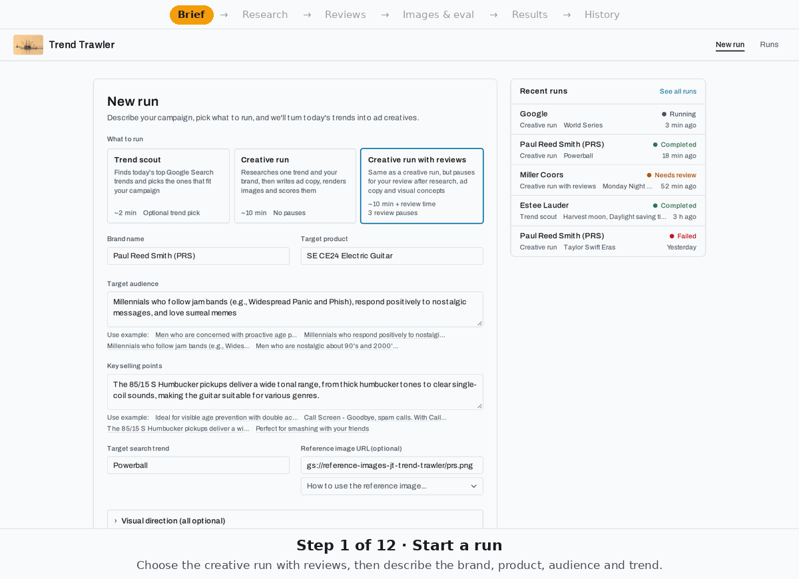
</p>
<p align="center"><em>An interactive creative run in the web UI, from brief to scored creatives. Amber spotlights mark the key UI in each step (mocked fixtures from a real run).</em></p>

## Table of contents

- [What it does](#what-it-does)
- [Example outputs](#example-outputs)
- [Prerequisites](#prerequisites)
- [Quickstart](#quickstart)
- [Usage](#usage)
- [Frontend UI](#frontend-ui)
- [Evaluation](#evaluation)
- [Deployment](#deployment)
- [Testing](#testing)
- [Repo structure](#repo-structure)
- [Contributing](#contributing)
- [Roadmap](#roadmap)
- [References](#references)

## What it does

Trend Trawler works like its namesake: it casts a wide net over the day's Search trends and keeps only the catch worth keeping.

1. **Find trends (`trend_scout`).** Pulls the top 25 Google Search trends, researches each one's cultural context, keeps the 3 most relevant to your campaign and writes them to BigQuery. You can opt in to picking the trends yourself.
2. **Make creatives (`creative_agent`).** For one `<trend, campaign>` pair, it runs campaign and trend web research in parallel and writes a cited research report. It then drafts and critiques ad copy and visual concepts and renders one image per concept. `interactive_creative` runs the same pipeline but pauses for human review after the research, the ad copies and the visual concepts.
3. **Score and export (`creative_eval`).** An LLM judge scores every ad copy and visual concept across 12 dimensions. The run exports a research PDF, an HTML gallery and an evaluation report to Cloud Storage, and writes summary rows to BigQuery.

<p align="center">
  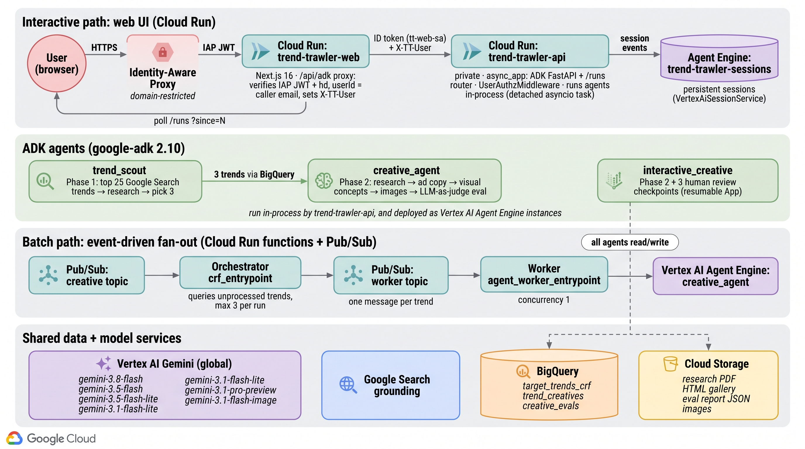
</p>

Each root agent calls its ADK graph `Workflow`s as `NodeTool`s and its sub-agents as `AgentTool`s. Flaky producers run inside `RetryUntilKeyNode` retry wrappers. There is one diagram per agent in [docs/diagrams/](docs/diagrams/README.md):

| `trend_scout` | `creative_agent` | `interactive_creative` |
|---|---|---|
| 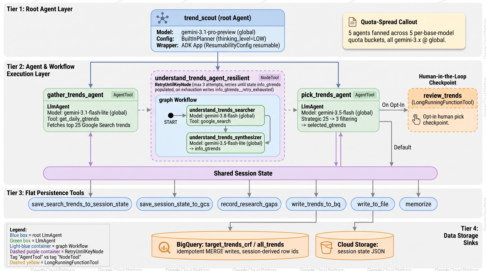 | 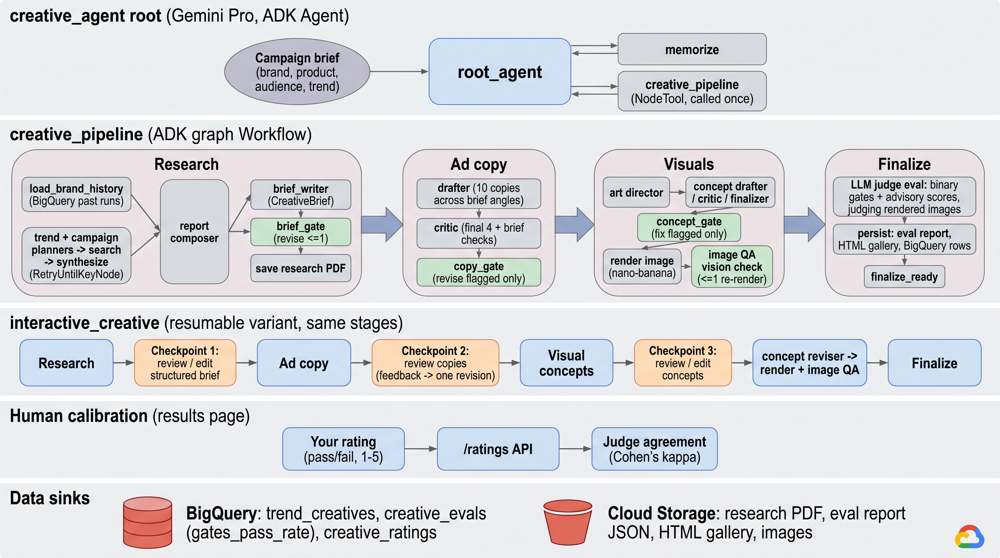 | 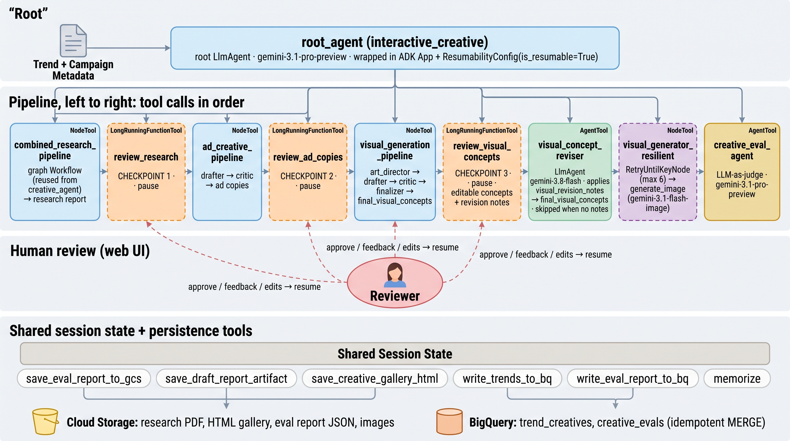 |

For the step-by-step run order of each agent, see the [workflow diagrams](docs/diagrams/README.md#agent-workflow-diagrams). For the full agent composition, see [CLAUDE.md → Architecture](CLAUDE.md#architecture).

## Example outputs

Every creative run produces an HTML gallery of the creatives, a cited research PDF and a JSON evaluation report. Here is the gallery from a recent run for Paul Reed Smith (PRS) guitars:

<p align="center">
  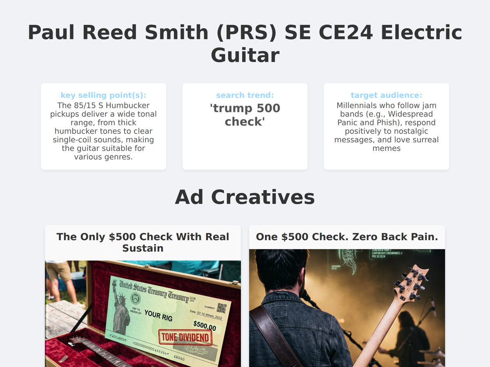
</p>

**See [docs/examples/](docs/examples/README.md)** for the full gallery (hover facts and lightbox), research report pages, an evaluation report excerpt, where each output is saved, and the earlier Oct 2025 outputs.

## Prerequisites

- **Python ≥ 3.13** and [**uv**](https://docs.astral.sh/uv/)
- **Node.js ≥ 22.13**, only for the web UI in `frontend/`
- **Google Cloud SDK** (`gcloud`, `bq`), authenticated with application-default credentials
- **A GCP project** with the Vertex AI, BigQuery and Cloud Storage APIs enabled, plus a Cloud Storage bucket. `trend_scout` reads the public `bigquery-public-data.google_trends` dataset. Deploying also needs Agent Engine (Vertex AI), Pub/Sub, Eventarc, Cloud Run, Cloud Build and Artifact Registry. See [deployment/README.md](deployment/README.md).
- **Locations:** Gemini 3.x models are served only from the `global` Vertex location, so set `GOOGLE_CLOUD_LOCATION=global`. Regional resources (BigQuery, Cloud Storage, Pub/Sub, Agent Engine) stay in `GCP_REGION` (default `us-central1`).

## Quickstart

**1. Clone, authenticate and install**

```bash
git clone https://github.com/tottenjordan/adk_pipe.git
cd adk_pipe

gcloud config set project <your-project-id>
gcloud auth application-default login

uv sync
```

**2. Configure `.env`.** [.env.example](.env.example) is the full, commented reference.

```bash
cp .env.example .env
```

At a minimum, set these values:

| Variable | Value |
|---|---|
| `GOOGLE_CLOUD_PROJECT` | your project ID (required; nothing hardcodes a project) |
| `GOOGLE_CLOUD_LOCATION` | `global` (Gemini 3.x) |
| `GOOGLE_CLOUD_STORAGE_BUCKET` | bare bucket name, without `gs://` |
| `BQ_PROJECT_ID`, `BQ_DATASET_ID` | where the three tables live (dataset defaults to `trend_trawler`) |
| `GOOGLE_CLOUD_PROJECT_NUMBER` | needed for deployment (`gcloud projects describe <id> --format='value(projectNumber)'`) |

**3. Create the BigQuery tables.** The agents' persistence steps write to them. `trend_scout` writes the selected trends. `creative_agent` and `interactive_creative` write a creative row and an evaluation row per run, and both read and write the bucket. The script is idempotent. The schemas are in [deployment/README.md → Create BigQuery tables](deployment/README.md#create-bigquery-tables).

```bash
set -a && source .env && set +a
bash deployment/create_bq_tables.sh
```

**4. Run an agent in the ADK dev UI**

```bash
uv run adk web .
```

Pick an agent from the drop-down at the top left and send it your campaign brief (see [Usage](#usage)). To use the custom web UI instead, see [Frontend UI](#frontend-ui).

## Usage

Each run starts from a campaign brief. This sample is the one in `.env.example`:

```text
Brand Name:         Paul Reed Smith (PRS)
Target Audience:    millennials who follow jam bands (e.g., Widespread Panic and Phish), respond positively to nostalgic messages
Target Product:     PRS SE CE24 Electric Guitar
Key Selling Points: The 85/15 S Humbucker pickups deliver a wide tonal range, from thick humbucker tones to clear single-coil sounds, making the guitar suitable for various genres.
```

<details>
  <summary>What makes a good brief</summary>

**Target audience:** who are they, and what do they want? Go beyond demographics:

- **Psychographics:** *people who are frustrated with ...*
- **Lifestyle:** *frequent travelers; spend most of their income on concerts*
- **Hobbies, interests and humor:** *music lovers who attend lots of jam band concerts and love surreal memes*
- **Life stage:** *recent empty-nesters*

**Key selling points** give the `{target_product}` its flavor in the messaging and visual concepts. Some ways to use them:

- What is the `{target_audience}`'s benefit? What will make them really care?
- External factors, e.g. when selling sweaters: *it's cold outside*.
- You don't have to choose a single benefit. If there are several, explain them (experiment with this), or hyper-focus on one:
  - *"Advanced Night Repair - Ideal for visible age prevention with double action to fight visible effects of free radical damage"*
  - *"Call Screen - Goodbye, spam calls. With Call Screen, Pixel can now detect and filter out even more spam calls. For other calls, it can tell you who's calling and why before you pick up."*
  - *"Best Take - Group pics, perfected. Pixel's Best Take combines similar photos into one fantastic picture where everyone looks their best."*

</details>

### Running an agent

Start the dev UI with `uv run adk web .` and choose an agent:

| Agent | Send | Gets you |
|---|---|---|
| `trend_scout` | the brief | today's top 25 trends, researched and filtered to the 3 most relevant, saved to BigQuery |
| `creative_agent` | the brief plus a search trend (stored as the state key `target_search_trends`) | research report, ad copies, visual concepts, rendered images, evaluation report and HTML gallery |
| `interactive_creative` | same as `creative_agent` | the same outputs, with three human-review pauses |

```text
user: Brand Name: "YOUR BRAND"
      Target Audience: "YOUR TARGET AUDIENCE"
      Target Product: "YOUR TARGET PRODUCT"
      Key Selling Points: "YOUR KEY SELLING POINT(S)"
      Search Trend: "YOUR SEARCH TREND"      # creative_agent / interactive_creative only
```

**Optional trend pick (`trend_scout`).** Opt in from the web UI's home form, which sets the `interactive_trend_pick` session flag. The run then pauses after gathering the 25 trends so you can choose which ones to keep, instead of having the agent pick 3.

**Review checkpoints (`interactive_creative`).** The run pauses three times. Each pause uses ADK's `LongRunningFunctionTool` on a resumable `App`.

1. **After research:** review the cited research report, then approve it or request changes.
2. **After ad copies:** review the ad copies before any visual concepts are generated.
3. **After visual concepts:** review and directly edit the concepts and image prompts before rendering. A `visual_concept_reviser` agent applies any free-text revision notes.

## Frontend UI

The custom web UI is built with Next.js, Tailwind CSS and shadcn/ui. Use it to start runs, follow them live, answer review checkpoints and browse results. It polls an async-job `/runs` API, so a run survives a disconnect or a page reload. Screenshots below (click for full size; to regenerate them, see [docs/screenshots/](docs/screenshots/README.md)):

<table>
  <tr>
    <td align="center"><a href="docs/screenshots/01-home-form.png">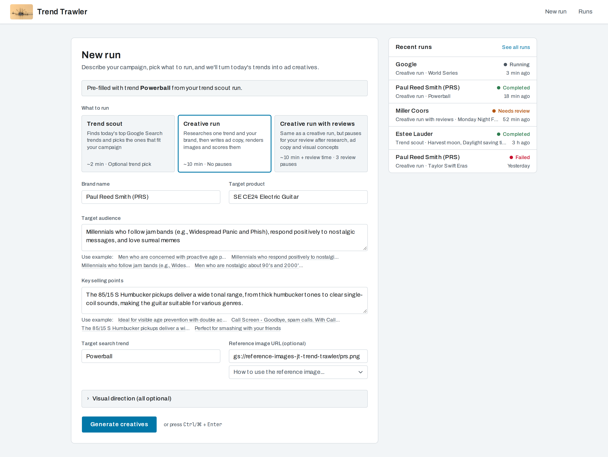</a><br><sub>New run: agent tiles, brief and recent runs</sub></td>
    <td align="center"><a href="docs/screenshots/05-runs.png">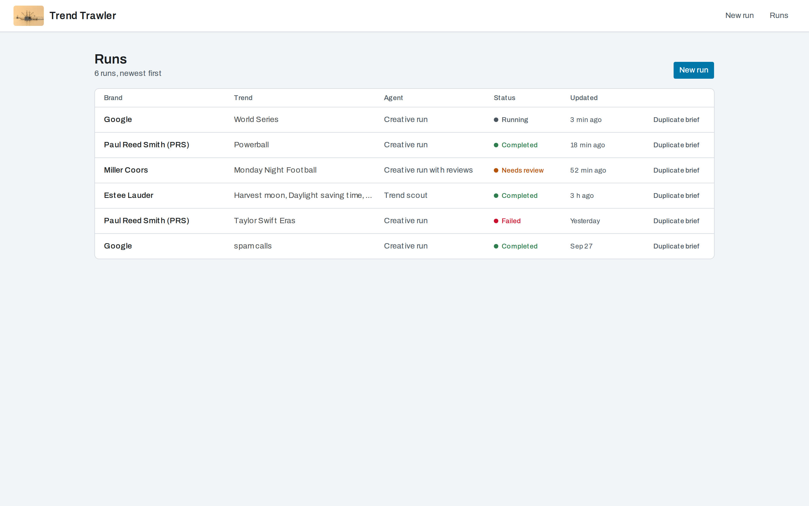</a><br><sub>Run history with duplicate brief</sub></td>
  </tr>
  <tr>
    <td align="center"><a href="docs/screenshots/02-run-creative.png">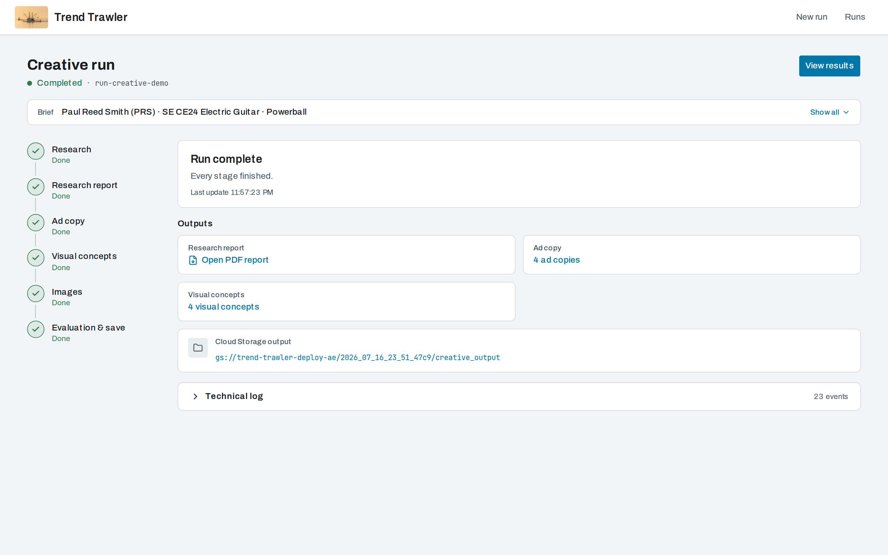</a><br><sub>Completed run with the stage spine and outputs</sub></td>
    <td align="center"><a href="docs/screenshots/07-run-research-review.png">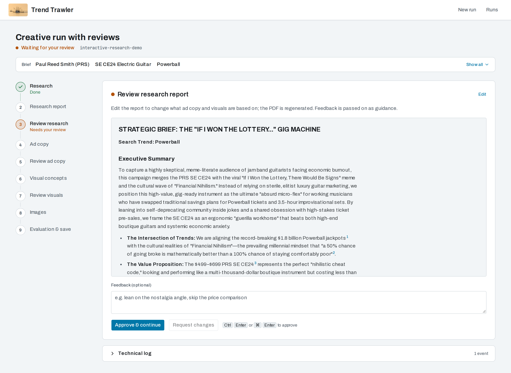</a><br><sub>Review 1: cited research report</sub></td>
  </tr>
  <tr>
    <td align="center"><a href="docs/screenshots/04-run-interactive-review.png">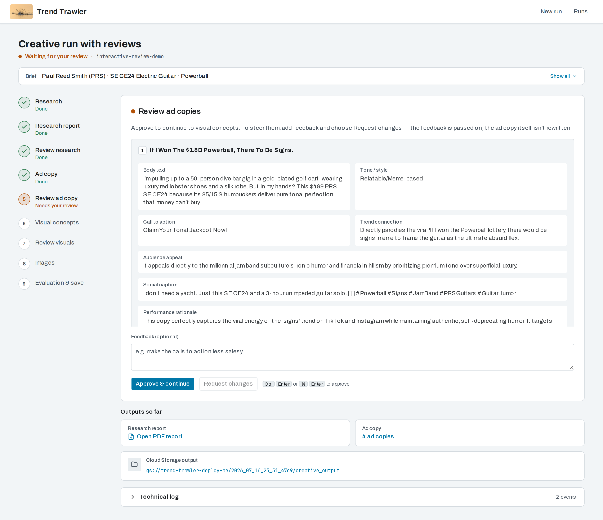</a><br><sub>Review 2: ad copy</sub></td>
    <td align="center"><a href="docs/screenshots/06-run-trend-pick.png">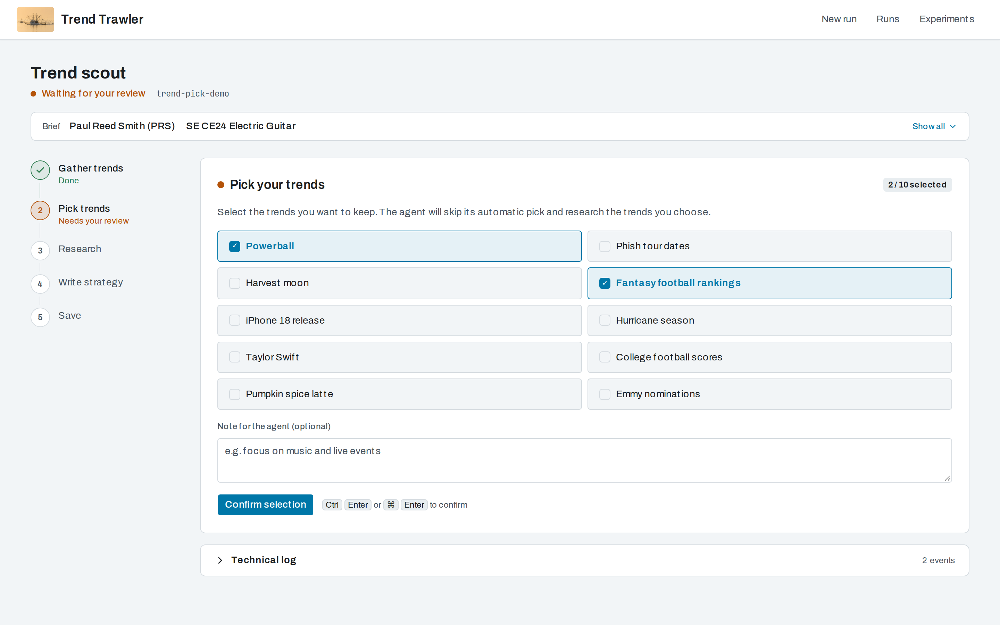</a><br><sub>Trend scout: pick your trends</sub></td>
  </tr>
  <tr>
    <td align="center"><a href="docs/screenshots/03-results-creative.png">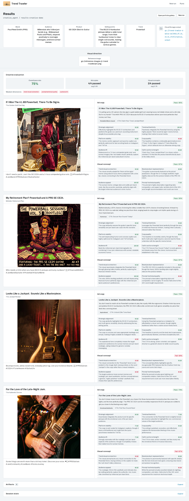</a><br><sub>Results contact sheet with judge scores</sub></td>
    <td align="center"><a href="docs/screenshots/09-results-proof-detail.png">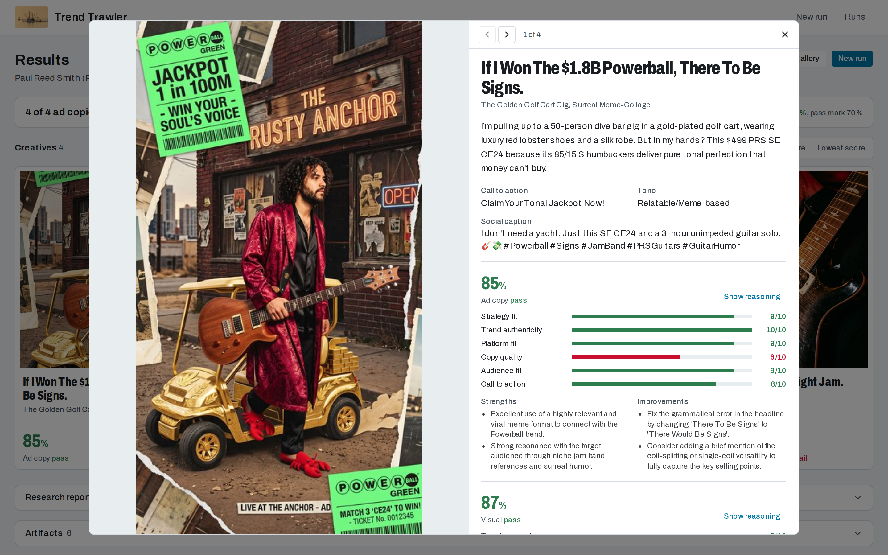</a><br><sub>Proof detail for one creative</sub></td>
  </tr>
  <tr>
    <td align="center"><a href="docs/screenshots/08-run-stopped-early.png">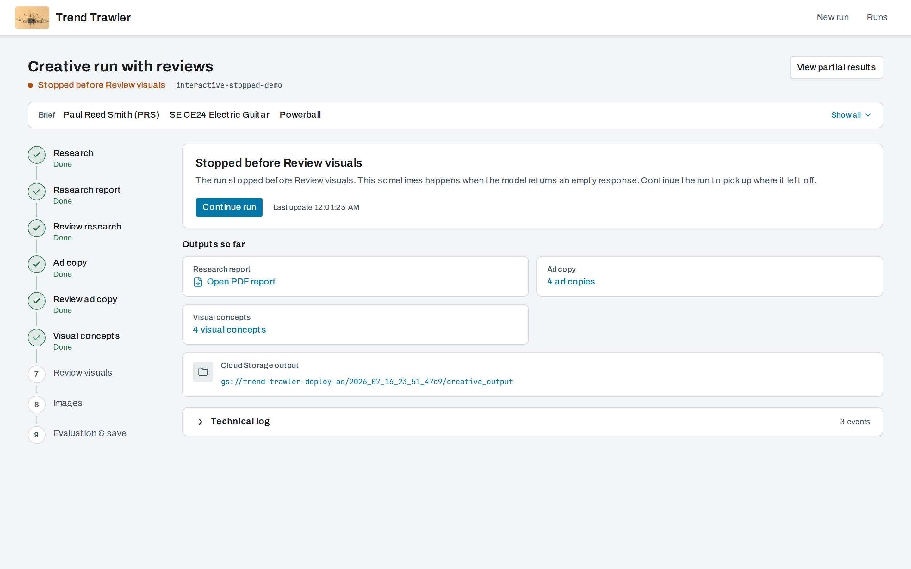</a><br><sub>A run that stopped early, with continue run</sub></td>
    <td></td>
  </tr>
</table>

Run it locally:

```bash
# terminal 1: backend. Run the async_app launcher, not bare `adk api_server`; it adds the
# /runs endpoints the run page polls. TRUST_CLIENT_USER_ID=1 is for local dev only.
TRUST_CLIENT_USER_ID=1 SESSION_SERVICE_URI=memory:// ALLOW_ORIGINS=http://localhost:3000 \
  uv run uvicorn deployment.async_app:app --port 8000

# terminal 2: frontend
cd frontend && npm install && npm run dev   # http://localhost:3000
```

For pages, design system and configuration, see the [frontend guide](frontend/README.md). For per-user authz and the Cloud Run deployment, see [CLAUDE.md](CLAUDE.md#frontend--frontend) and [deployment/README.md](deployment/README.md#frontend--api_server-on-cloud-run).

### Creative experiments (contextual bandit)

From a finished creative run, the results page's Deploy panel turns 2–4 approved creatives into the arms of a contextual bandit: JAX linear Thompson sampling served from a single-replica Agent Platform (Vertex AI) Custom Prediction Routine endpoint. A Cloud Run Job drives synthetic readers of a publisher page about the trend at it and replays five baseline policies on the same readers, and `/experiments/[id]` charts reward, regret, % optimal, arm share and per-segment winners. The api tears the endpoint down on Stop or when its TTL expires. Everything is synthetic. See the **[bandit experiments guide](docs/bandit/README.md)**.

<table>
  <tr>
    <td align="center"><a href="docs/screenshots/12-experiment-detail.png">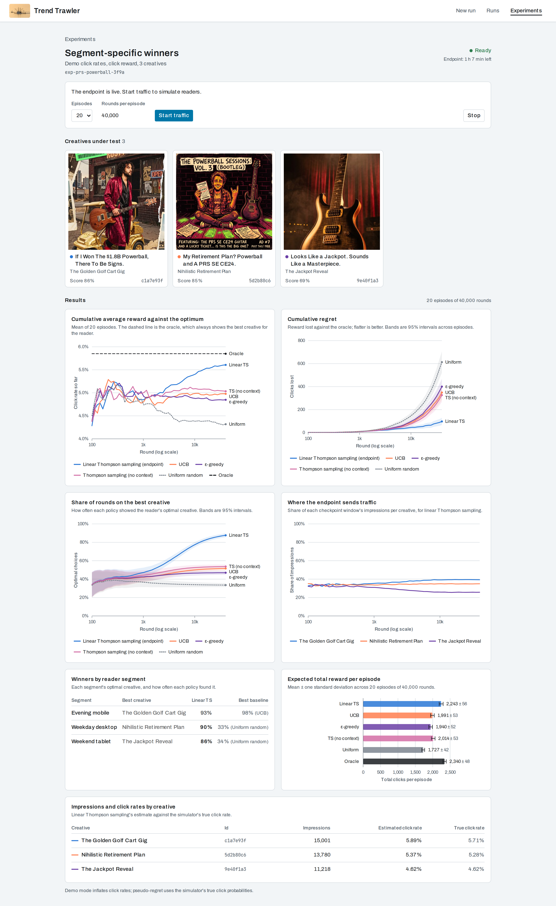</a><br><sub>Experiment detail: controls, arms and bandit charts</sub></td>
    <td align="center"><a href="docs/screenshots/10-deploy-panel.png">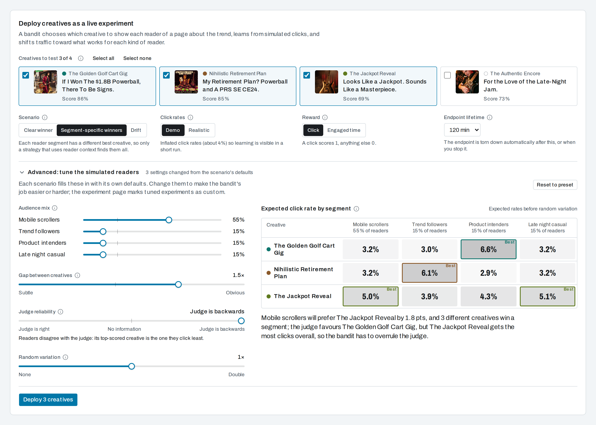</a><br><sub>Deploy creatives as a live experiment</sub></td>
  </tr>
</table>

## Evaluation

`creative_eval` runs automatically at the end of every `creative_agent` and `interactive_creative` run. It is an LLM-as-judge: each creative gets its own concurrent judge call with structured output.

- **Ad copy (6 dimensions):** strategy fit, trend authenticity, platform fit, copy quality, audience fit, call to action
- **Visual concept (6 dimensions):** trend connection, brand & product, audience appeal, prompt quality, stopping power, coherence

Each dimension gets a 1–10 score, a verdict and a rationale. Per-creative scores are normalized to 0.0–1.0, and **0.7 passes**. The report adds strengths, suggested improvements and a summary (pass rates, average scores, weakest dimensions), and it records `judge_model` and any research-degradation `warnings`. It is saved as `creative_eval_report.json` in the run's Cloud Storage folder. A summary row also goes to the BigQuery `creative_evals` table: pass rate, counts, average scores, `weakest_dimensions` and the readable `weakest_dimension_labels` (labels from `creative_eval/dimensions.py`).

The judge defaults to `gemini-3.1-pro-preview` at `global`. Override it with `EVAL_MODEL` and `EVAL_MODEL_LOCATION`. The judge has no fallback model, so a silent swap can't skew pass rates.

## Deployment

The three agents deploy to Agent Engine, one instance each. Two Cloud Run Functions (orchestrator + worker) fan out one `creative_agent` run per trend via Pub/Sub. The web UI runs as two Cloud Run services: an IAP-gated frontend and a private backend.

```bash
uv run python deployment/deploy_agent.py --version=v1 --agent=trend_scout --create   # or creative_agent / interactive_creative
uv run python deployment/deploy_agent.py --list
```

For IAM, Pub/Sub topics, Eventarc triggers, the web services, per-user authz, eval CI, and redeploy and rollback, see the **[deployment guide](deployment/README.md)**.

> **Naming:** in 2026, Vertex AI was rebranded *Gemini Enterprise Agent Platform*, and Agent Engine became *Agent Runtime*. These docs still say "Agent Engine". The code uses the AgentPlatform SDK (`agentplatform.Client().runtimes`), which the root environment gets from google-cloud-aiplatform 2.x through a uv override (see `[tool.uv]` in `pyproject.toml`).

## Testing

```bash
uv run pytest tests/ -q -n 4   # Python unit tests; no GCP credentials, but set GOOGLE_CLOUD_PROJECT (any dummy value)
cd frontend && npm test        # frontend tests (Vitest + React Testing Library)

# ADK evals: end-to-end LLM-as-judge against real APIs (~5 min per case)
PYTHONPATH="$PWD" uv run adk eval trend_scout tests/eval/evalsets/trend_scout_evalset.json \
  --config_file_path=tests/eval/eval_config.json --print_detailed_results

uv run python deployment/integration_test.py --check all   # live checks against deployed agents
```

The `creative_agent` eval uses its own rubric config. For the exact command, see [CLAUDE.md → Testing](CLAUDE.md#testing). For what each test file covers, see [tests/README.md](tests/README.md).

**CI (GitHub Actions):**

- [`python-ci.yml`](.github/workflows/python-ci.yml) runs on PRs that touch Python or dependency files. It checks `uv sync --locked`, requirements.txt drift, `ruff check`, `ruff format --check`, `ty check` and `pytest`.
- [`crf-deps.yml`](.github/workflows/crf-deps.yml) runs on PRs that touch `cloud_functions/**`. It runs the Cloud Function tests against the function's own `requirements.txt`.
- [`frontend-tests.yml`](.github/workflows/frontend-tests.yml) runs on PRs that touch `frontend/**`: lint, tests, and a build that type-checks.
- [`adk-eval.yml`](.github/workflows/adk-eval.yml) runs nightly and on manual dispatch, not on PRs. It runs `adk eval` per agent against an isolated eval dataset and bucket. Then `tests/eval/efficiency_gate.py` gives the real pass/fail signal: it fails on non-passing cases or on token and call-count regressions against `docs/baselines/eval_efficiency.json`.
- [`dependabot.yml`](.github/dependabot.yml) opens weekly dependency updates, with minor and patch bumps grouped.

## Repo structure

The agent packages sit flat at the repo root on purpose. Agent Engine's `extra_packages` staging keeps each package's relative path as its import path, so nesting them would break imports like `from creative_agent …`.

```text
.
├── trend_scout/           # phase 1: trend discovery agent
├── creative_agent/        # phase 2: research → ad copy → visual concepts → images → exports
├── interactive_creative/  # phase 2 with human-review checkpoints (reuses creative_agent)
├── creative_eval/         # LLM-as-judge scoring of ad copy and visual concepts
├── agent_common/          # shared config, models, retry, rate limiting, state (bundled into every engine)
├── agents/                # symlinks: the api_server's view of the runnable agents
├── runserver/             # async-job /runs + /experiments APIs, per-user authz for the web backend
├── bandit/                # contextual-bandit core: JAX linear TS, synthetic env, simulator (dev only)
├── bandit_serving/        # CPR predictor for the bandit experiment endpoint
├── bandit_traffic/        # synthetic-traffic Cloud Run Job for bandit experiments
├── cloud_functions/       # Pub/Sub fan-out: orchestrator + worker Cloud Run Functions
├── deployment/            # deploy/test scripts, backend launcher, BigQuery setup, deployment guide
├── frontend/              # Next.js web UI
├── tests/                 # pytest suite + ADK evalsets
├── experiments/           # measurement harnesses (latency, quota spread, bandit parity); never deployed
├── docs/                  # architecture diagrams, examples, screenshots, plans, notes
├── imgs/                  # README banner
├── .env.example           # environment reference
├── CLAUDE.md              # detailed architecture and per-file guide
└── CODE_STANDARDS.md      # packaging, lint, typing, testing and commit conventions
```

For a per-file breakdown, see [CLAUDE.md → Key files](CLAUDE.md#key-files).

## Contributing

Read [CODE_STANDARDS.md](CODE_STANDARDS.md) first. In short:

- Use **uv** for everything: `uv add` / `uv sync` for dependencies, `uv run` for commands. Never use bare `pip` or `python`.
- Before you push, run `uv run ruff format .`, `uv run ruff check .`, `uv run ty check` and `uv run pytest tests/ -n 4`. Frontend changes also need `npm run lint`, `npm test` and `npm run build`.
- Work on a branch and open a pull request against `main`. CI runs the path-gated checks above.

## Roadmap

- Scheduled runs
- Email or other notifications when a run finishes
- Easy export to a live editing tool for image iteration (Nano Banana)

## References

- [ADK documentation](https://google.github.io/adk-docs/)
- [ADK sample agents](https://github.com/google/adk-samples/tree/main/python/agents)
- [adk-python SDK samples](https://github.com/google/adk-python/tree/main/contributing/samples)
- [Deploy ADK agents to Agent Engine](https://google.github.io/adk-docs/deploy/agent-engine/)
- [Prompt design strategies (Vertex AI)](https://cloud.google.com/vertex-ai/generative-ai/docs/learn/prompts/prompt-design-strategies)
