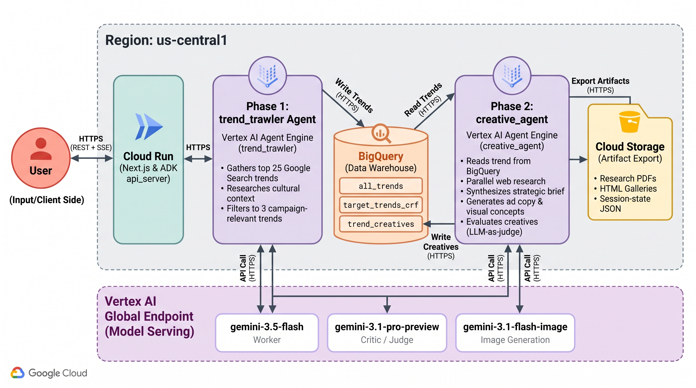
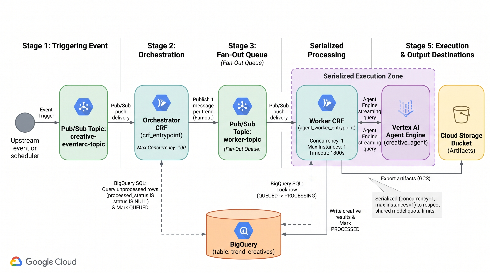

# Deployment

Operational guide for deploying **Trend Trawler**. For what the system does and how to run it locally,
see the [main README](../README.md).

## Contents
- [Prerequisites](#prerequisites)
- [Deploying Agents to Agent Engine](#deploying-agents-to-agent-engine)
- [Cloud Run Functions Fan-out Pattern](#cloud-run-functions-fan-out-pattern)
- [Alternative Deployment: deploy to Cloud Run instances](#alternative-deployment-deploy-to-cloud-run-instances)

## Prerequisites

- A populated `.env` (copy from [.env.example](../.env.example)) — project, `GOOGLE_CLOUD_LOCATION=global`,
  `GCP_REGION=us-central1`, GCS bucket, Pub/Sub topics, Cloud Run Function names, and BigQuery IDs.
- `gcloud` authenticated (`gcloud auth application-default login`) and the project set.
- BigQuery dataset + tables created — see [main README → Quickstart](../README.md#quickstart).

---

## Deploying Agents to Agent Engine

Deploying Agents to separate Agent Engine instances...

> [Agent Engine](https://google.github.io/adk-docs/deploy/agent-engine/) is a fully managed auto-scaling service on Google Cloud specifically designed for deploying, managing, and scaling AI agents built with frameworks such as ADK.

<p align="center">
  
</p>


```bash
# deploy `trend_trawler` agent to Agent Engine
python deployment/deploy_agent.py --version=v1 --agent=trend_trawler --create

# deploy `creative_agent` agent to Agent Engine
python deployment/deploy_agent.py --version=v1 --agent=creative_agent --create

# deploy `interactive_creative` agent (human-in-the-loop variant) to Agent Engine
python deployment/deploy_agent.py --version=v1 --agent=interactive_creative --create

# list existing Agent Engine instances
python deployment/deploy_agent.py --list

# delete an Agent Engine Runtime
python deployment/deploy_agent.py --resource_id=890256972824182784 --delete
```

> The local packages bundled into each engine are derived from a single
> `AGENT_EXTRA_PACKAGES` map in `deployment/deploy_agent.py` (from the real import
> graph — e.g. `creative_agent` → `creative_eval` + `agent_common`), so a
> cross-package dependency can't be silently left out of a deploy.

* Once agent is deployed to Agent Engine, the agent's resource ID will be added to your `.env` file. And this will be used later in the `test_deployment.py` script

### Test deployment

**Interact with the deployed agents using the `test_deployment.py` script...**

*Note: the `test_deployment.py` script will source the `BRAND`, `TARGET_AUDIENCE`, `TARGET_PRODUCT`, `KEY_SELLING_POINT`, and `TARGET_SEARCH_TREND` from your `.env` file.*

**[1] Kickoff the `trend_trawler` agent workflow.**  

> *This will insert a row into your BigQuery table for each recommended trend*

```bash
export USER_ID='ima_user'
python deployment/test_deployment.py --agent=trend_trawler --user_id=$USER_ID

Found agent with resource ID: ...
Created session for user ID: ...
...

INFO - Deleted session for user ID: ima_user
```

**[2] Next, invoke the deployed `creative_agent` workflow:**

> *This will insert a row into your BigQuery table with the Cloud Storage location of all trend and creative assets*

```bash
export USER_ID='ima_user'
python deployment/test_deployment.py --agent=creative_agent --user_id=$USER_ID

Found agent with resource ID: ...
Created session for user ID: ...
...

INFO - Deleted session for user ID: ima_user
```

* [deploy-to-agent-engine.ipynb](../deploy-to-agent-engine.ipynb) notebook
    * *WIP: migrating code to the refactored client-based `Agent Engine` SDK... see [migration guide](https://cloud.google.com/vertex-ai/generative-ai/docs/deprecations/agent-engine-migration)*


**View logs for an agent**

To view log entries in the [Logs Explorer](https://cloud.google.com/logging/docs/view/logs-explorer-interface), run the query below

```bash
resource.type="aiplatform.googleapis.com/ReasoningEngine"
resource.labels.location="GOOGLE_CLOUD_LOCATION"
resource.labels.reasoning_engine_id="YOUR_AGENT_ENGINE_ID"
```

---

## Cloud Run Functions Fan-out Pattern

Event-based triggers dispatch one creative run per recommended trend.

<p align="center">
  
</p>

**objectives**
* create `Agent Orchestrator` to check BQ for trends recommended by the `trawler agent`; dispatch PubSub message for each recommendation
* create `Agent Worker` to process each PubSub message dispatched by the `Orchestrator`, invoking the Agent Engine Runtime to generate ad copy and creatives for each `<trend, campaign>` pair (i.e., row in BQ table)
* handle Pub/Sub's [at-least-once message delivery](https://cloud.google.com/pubsub/docs/subscription-overview#default_properties)
* implement high concurrency orchestration to dispatch parallel workers
* avoid duplicate executions for **long-running tasks** (i.e., the worker)


<details>
  <summary>Why two deployments?</summary>

*The need for two separate deployments stems from the fact that the `Orchestrator` and the `Worker` respond to two different event sources (Pub/Sub topics):*

1. Orchestrator Deployment: Listens to the `$CREATIVE_TRIGGER_NAME` (the one that signals "start the job"). It executes the `crf_entrypoint` function.
2. Worker Deployment: Listens to the `$CREATIVE_WORKER_TOPIC_NAME` (the one that contains single-row payloads). It executes the `agent_worker_entrypoint` function.


This is because when deploying a service triggered by a Pub/Sub topic, we must specify exactly one entry point function to be executed when a message arrives on that topic

Therefore, you must **deploy the code twice**, with each deployment configured to listen to its unique trigger topic and execute the appropriate handler function.

</details>


### 1. Grant service account required permissions


*Grant Eventarc Event Receiver role (`roles/eventarc.eventReceiver`) to the service account associated with the Eventarc*


```bash
export SERVICE_ACCOUNT=$GOOGLE_CLOUD_PROJECT_NUMBER-compute@developer.gserviceaccount.com

# grant Eventarc Event Receiver role allows trigger to receive events from event providers
gcloud projects add-iam-policy-binding $GOOGLE_CLOUD_PROJECT \
  --member serviceAccount:$SERVICE_ACCOUNT \
  --role=roles/eventarc.eventReceiver


# Cloud Run invoker role allows it to invoke the function
gcloud projects add-iam-policy-binding $GOOGLE_CLOUD_PROJECT \
  --member serviceAccount:$SERVICE_ACCOUNT \
  --role=roles/run.invoker
```

<details>
  <summary> Optional: grant yourself admin access to ignore IAM best practices</summary>

```bash
gcloud projects add-iam-policy-binding $GOOGLE_CLOUD_PROJECT \
    --member="user:YOUR_EMAIL_ADDRESS" \
    --role="roles/pubsub.admin"
```
</details>


### 2. Create PubSub topics for the Creative Agent's orchestrator and worker


```bash
gcloud pubsub topics create $CREATIVE_TOPIC_NAME

gcloud pubsub topics create $CREATIVE_WORKER_TOPIC_NAME
```


### 3. Create [event-driven functions](https://cloud.google.com/run/docs/tutorials/pubsub-eventdriven#deploy-function) and [eventarc triggers](https://cloud.google.com/run/docs/tutorials/pubsub-eventdriven#pubsub-trigger)


* `CRF_ENTRYPOINT`: the entry point to the function in your source code. This is the code Cloud Run executes when your function runs. The value of **this flag must be a function name or fully-qualified class name** that exists in your source code.
* `BASE_IMAGE`: base image environment for your function e.g., `python313`. For more details about base images and their packages, see [Supported language runtimes and base images](https://cloud.google.com/run/docs/configuring/services/runtime-base-images#how_to_obtain_runtime_base_images)
* [optional] if `--min-instances=1`, service **always on**
* see [gcloud reference doc](https://cloud.google.com/sdk/gcloud/reference/run/deploy)


**3.1 Creative Agent Orchestrator:** cloud run function

```bash
cd cloud_functions/creative_fanout

gcloud run deploy $CREATIVE_CRF_NAME \
  --source . \
  --function $CRF_ENTRYPOINT \
  --base-image $BASE_IMAGE \
  --region $GOOGLE_CLOUD_LOCATION \
  --memory 8Gi \
  --cpu 4 \
  --min-instances 0 \
  --concurrency=100 \
  --timeout=600s \
  --no-allow-unauthenticated \
  --labels agent-workflow=trend-trawler,function=creative-orchestrator

  # High concurrency since it's just dispatching
```

**3.2 Creative Agent Orchestrator:** eventarc trigger

```bash
gcloud eventarc triggers create $CREATIVE_TRIGGER_NAME  \
  --location=$GOOGLE_CLOUD_LOCATION \
  --destination-run-service=$CREATIVE_CRF_NAME \
  --destination-run-region=$GOOGLE_CLOUD_LOCATION \
  --event-filters="type=google.cloud.pubsub.topic.v1.messagePublished" \
  --transport-topic=$CREATIVE_TOPIC_NAME \
  --service-account=$SERVICE_ACCOUNT
```


**3.3 Creative Agent Worker:** cloud run function

```bash
gcloud run deploy $CREATIVE_WORKER_CRF_NAME \
  --source . \
  --function $CREATIVE_WORKER_ENTRYPOINT \
  --base-image $BASE_IMAGE \
  --region $GCP_REGION \
  --max-instances 1 \
  --timeout 1800s \
  --concurrency=1 \
  --memory 8Gi \
  --cpu 4 \
  --no-allow-unauthenticated \
  --labels agent-workflow=trend-trawler,function=creative-worker
  
  # Note:
  # region=$GCP_REGION (us-central1) — Cloud Run is regional; GOOGLE_CLOUD_LOCATION
  #   is `global` for the gemini-3.x models and is NOT a valid Cloud Run region.
  # concurrency=1 # ensures only one row is processed per instance
  # max-instances=1 # SERIALIZE runs: gemini-3.1-pro-preview (5 RPM) and
  #   flash-image (2 RPM) quotas are project-wide, so parallel runs 503. One run
  #   at a time keeps the fan-out under quota. Raise only if quota is raised.
  # timeout=1800s # a quota-paced single run (throttled eval + image backoff) is
  #   slower than before; 900s risked killing it mid-run.
```

<details>
  <summary>Limiting Cloud Function/Cloud Run Concurrency</summary>

Effect of setting `concurrency=1`

* Only one instance of your function will be running at any given time. This means if Pub/Sub delivers a message, the next message (or a redelivery attempt of the first message) must wait until the first instance finishes and shuts down.

* If your function takes 30 seconds to run and update BQ, the subsequent message/redelivery will not execute until that 30 seconds is over. This gives the first execution time to complete the BQ update (PROCESSED), making the BQ query in the second execution return zero data.

</details>

**3.4 Creative Agent Worker:** eventarc trigger

```bash
gcloud eventarc triggers create $CREATIVE_WORKER_TRIGGER_NAME  \
  --location=$GOOGLE_CLOUD_LOCATION \
  --destination-run-service=$CREATIVE_WORKER_CRF_NAME \
  --destination-run-region=$GOOGLE_CLOUD_LOCATION \
  --event-filters="type=google.cloud.pubsub.topic.v1.messagePublished" \
  --transport-topic=$CREATIVE_WORKER_TOPIC_NAME \
  --service-account=$SERVICE_ACCOUNT
```


### 4. Confirm triggers and topics


*4.1 confirm triggers successfully created:*

```bash
gcloud eventarc triggers list --location=$GOOGLE_CLOUD_LOCATION
```

*4.2 assign each trigger's PubSub topic to variable:*

```bash
CREATIVE_PUB_TOPIC=$(gcloud eventarc triggers describe $CREATIVE_TRIGGER_NAME --location $GOOGLE_CLOUD_LOCATION --format='value(transport.pubsub.topic)')
echo $CREATIVE_PUB_TOPIC

CREATIVE_WORKER_PUB_TOPIC=$(gcloud eventarc triggers describe $CREATIVE_WORKER_TRIGGER_NAME --location $GOOGLE_CLOUD_LOCATION --format='value(transport.pubsub.topic)')
echo $CREATIVE_WORKER_PUB_TOPIC
```


### 5. Invoke the Creative Agent Orchestrator function

*5.1 insert sample rows to test the `crf_entrypoint` function*

<details>
  <summary>run this SQL in the BigQuery console</summary>

*edit these values as needed*

```sql
# =========== #
# Insert rows
# =========== #

INSERT INTO 
  `GOOGLE_CLOUD_PROJECT.trend_trawler.target_trends_crf` (uuid, 
    target_trend,
    refresh_date,
    trawler_date,
    entry_timestamp,
    trawler_gcs,
    brand,
    target_audience,
    target_product,
    key_selling_point)
VALUES 
(
    "test_inserts", --uuid
    "olive garden", --target_trend "macho man randy savage"
    PARSE_DATE('%m/%d/%Y', '11/11/2025'), --refresh_date
    PARSE_DATE('%m/%d/%Y', '11/12/2025'), --trawler_date
    CURRENT_TIMESTAMP(), --entry_timestamp
    "https://console.cloud.google.com/storage/browser/trend-trawler-deploy-ae", --trawler_gcs
    "Paul Reed Smith (PRS)", -- brand
    "millennials who follow jam bands (e.g., Widespread Panic and Phish), respond positively to nostalgic messages", -- target_audience
    "PRS SE CE24 Electric Guitar", -- target_product
    "The 85/15 S Humbucker pickups deliver a wide tonal range, from thick humbucker tones to clear single-coil sounds, making the guitar suitable for various genres." -- key_selling_point
);
```
</details>


*5.2 edit [../cloud_functions/creative_fanout/message.json](../cloud_functions/creative_fanout/message.json) to match your `.env` file:*

```json
{
    "bq_dataset": "trend_trawler",
    "bq_table": "target_trends_crf",
    "agent_resource_id": "<CREATIVE_AGENT_ENGINE_ID>" # e.g., 4622783949466447488
}
```

*5.3  Publish message to the Creative Orchestrator's topic:*

```bash
gcloud pubsub topics publish $CREATIVE_PUB_TOPIC --message "$(cat message.json | jq -c)"
```

* monitor logging: `Cloud Run Function >> Observability >> Logs`
* inspect the `target_trends_crf` BQ table to ensure `processed_status` is updated properly
* the last task of the Creative Agent job inserts rows in the `trend_creatives` BQ table; see Cloud Storage location for research and creative artifacts

---

## Alternative Deployment: deploy to Cloud Run instances

> [Cloud Run](https://cloud.google.com/run) is a managed auto-scaling compute platform on Google Cloud that enables you to run your agent as a container-based application.

copy `.env` file to each agent directory..

```bash
cp .env trend_trawler/.env
cp .env creative_agent/.env
```


**1. Deploy `trend trawler agent`...**

* set the path to your agent code directory
* avoid permission issues in Cloud Run
* set name for the Cloud Run service

```bash
export AGENT_DIR_NAME=trend_trawler

export AGENT_PATH=$AGENT_DIR_NAME/

chmod -R 777 $AGENT_PATH

export SERVICE_NAME="trend-trawler-cr"

adk deploy cloud_run \
  --project=$GOOGLE_CLOUD_PROJECT \
  --region=$GOOGLE_CLOUD_LOCATION \
  --port 8000 \
  --service_name=$SERVICE_NAME \
  --with_ui \
  --trace_to_cloud \
  $AGENT_PATH
```

*when prompted with the following, select `y`...*
> `Allow unauthenticated invocations to [your-service-name] (y/N)?.`

*update deployment:*

```bash
gcloud run services update $SERVICE_NAME \
  --region=$GOOGLE_CLOUD_LOCATION \
  --timeout=600
```


**2. Deploy `creative agent`...**

```bash
export AGENT_DIR_NAME=creative_agent

export AGENT_PATH=$AGENT_DIR_NAME/

chmod -R 777 $AGENT_PATH

export SERVICE_NAME="trend-creative-cr"

adk deploy cloud_run \
  --project=$GOOGLE_CLOUD_PROJECT \
  --region=$GOOGLE_CLOUD_LOCATION \
  --port 8000 \
  --service_name=$SERVICE_NAME \
  --with_ui \
  --trace_to_cloud \
  $AGENT_PATH
```

*if prompted with the following, select `y`...*
> `Allow unauthenticated invocations to [your-service-name] (y/N)?.`

*update deployment:*

```bash
gcloud run services update $SERVICE_NAME \
  --region=$GOOGLE_CLOUD_LOCATION \
  --timeout=600
```
