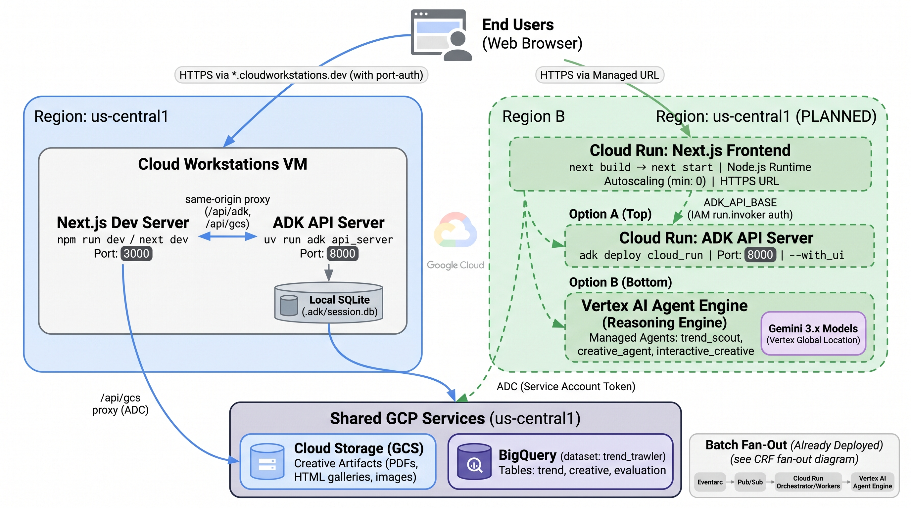

# Deployment

Operational guide for deploying **Trend Trawler**. For what the system does and how to run it locally,
see the [main README](../README.md).

## Contents
- [Prerequisites](#prerequisites)
- [Deploying Agents to Agent Engine](#deploying-agents-to-agent-engine)
- [Cloud Run Functions Fan-out Pattern](#cloud-run-functions-fan-out-pattern)
- [Frontend + api_server on Cloud Run](#frontend--api_server-on-cloud-run)
- [Alternative Deployment: deploy to Cloud Run instances](#alternative-deployment-deploy-to-cloud-run-instances)

## Prerequisites

- A populated `.env` (copy from [.env.example](../.env.example)) — project, `GOOGLE_CLOUD_LOCATION=global`,
  `GCP_REGION=us-central1`, GCS bucket, Pub/Sub topics, Cloud Run Function names, and BigQuery IDs.
- `gcloud` authenticated (`gcloud auth application-default login`) and the project set.
- BigQuery dataset + tables created — see [main README → Quickstart](../README.md#quickstart).

---

## Deploying Agents to Agent Engine

Deploying Agents to separate Agent Engine instances...

> [Agent Engine](https://google.github.io/adk-docs/deploy/agent-engine/) is a fully managed auto-scaling service on Google Cloud specifically designed for deploying, managing, and scaling AI agents built with frameworks such as ADK.

<p align="center">
  
</p>


```bash
# deploy `trend_scout` agent to Agent Engine
python deployment/deploy_agent.py --version=v1 --agent=trend_scout --create

# deploy `creative_agent` agent to Agent Engine
python deployment/deploy_agent.py --version=v1 --agent=creative_agent --create

# deploy `interactive_creative` agent (human-in-the-loop variant) to Agent Engine
python deployment/deploy_agent.py --version=v1 --agent=interactive_creative --create

# list existing Agent Engine instances
python deployment/deploy_agent.py --list

# delete an Agent Engine Runtime
python deployment/deploy_agent.py --resource_id=890256972824182784 --delete
```

> The local packages bundled into each engine are derived from a single
> `AGENT_EXTRA_PACKAGES` map in `deployment/deploy_agent.py` (from the real import
> graph — e.g. `creative_agent` → `creative_eval` + `agent_common`), so a
> cross-package dependency can't be silently left out of a deploy.

* Once agent is deployed to Agent Engine, the agent's resource ID will be added to your `.env` file. And this will be used later in the `test_deployment.py` script

### Test deployment

**Interact with the deployed agents using the `test_deployment.py` script...**

*Note: the `test_deployment.py` script will source the `BRAND`, `TARGET_AUDIENCE`, `TARGET_PRODUCT`, `KEY_SELLING_POINT`, and `TARGET_SEARCH_TREND` from your `.env` file.*

**[1] Kickoff the `trend_scout` agent workflow.**  

> *This will insert a row into your BigQuery table for each recommended trend*

```bash
export USER_ID='ima_user'
python deployment/test_deployment.py --agent=trend_scout --user_id=$USER_ID

Found agent with resource ID: ...
Created session for user ID: ...
...

INFO - Deleted session for user ID: ima_user
```

**[2] Next, invoke the deployed `creative_agent` workflow:**

> *This will insert a row into your BigQuery table with the Cloud Storage location of all trend and creative assets*

```bash
export USER_ID='ima_user'
python deployment/test_deployment.py --agent=creative_agent --user_id=$USER_ID

Found agent with resource ID: ...
Created session for user ID: ...
...

INFO - Deleted session for user ID: ima_user
```

* [deploy-to-agent-engine.ipynb](../deploy-to-agent-engine.ipynb) notebook
    * *WIP: migrating code to the refactored client-based `Agent Engine` SDK... see [migration guide](https://cloud.google.com/vertex-ai/generative-ai/docs/deprecations/agent-engine-migration)*


**View logs for an agent**

To view log entries in the [Logs Explorer](https://cloud.google.com/logging/docs/view/logs-explorer-interface), run the query below

```bash
resource.type="aiplatform.googleapis.com/ReasoningEngine"
resource.labels.location="GOOGLE_CLOUD_LOCATION"
resource.labels.reasoning_engine_id="YOUR_AGENT_ENGINE_ID"
```

---

## Cloud Run Functions Fan-out Pattern

Event-based triggers dispatch one creative run per recommended trend.

<p align="center">
  
</p>

**objectives**
* create `Agent Orchestrator` to check BQ for trends recommended by the `trawler agent`; dispatch PubSub message for each recommendation
* create `Agent Worker` to process each PubSub message dispatched by the `Orchestrator`, invoking the Agent Engine Runtime to generate ad copy and creatives for each `<trend, campaign>` pair (i.e., row in BQ table)
* handle Pub/Sub's [at-least-once message delivery](https://cloud.google.com/pubsub/docs/subscription-overview#default_properties)
* implement high concurrency orchestration to dispatch parallel workers
* avoid duplicate executions for **long-running tasks** (i.e., the worker)


<details>
  <summary>Why two deployments?</summary>

*The need for two separate deployments stems from the fact that the `Orchestrator` and the `Worker` respond to two different event sources (Pub/Sub topics):*

1. Orchestrator Deployment: Listens to the `$CREATIVE_TRIGGER_NAME` (the one that signals "start the job"). It executes the `crf_entrypoint` function.
2. Worker Deployment: Listens to the `$CREATIVE_WORKER_TOPIC_NAME` (the one that contains single-row payloads). It executes the `agent_worker_entrypoint` function.


This is because when deploying a service triggered by a Pub/Sub topic, we must specify exactly one entry point function to be executed when a message arrives on that topic

Therefore, you must **deploy the code twice**, with each deployment configured to listen to its unique trigger topic and execute the appropriate handler function.

</details>


### 1. Grant service account required permissions


*Grant Eventarc Event Receiver role (`roles/eventarc.eventReceiver`) to the service account associated with the Eventarc*


```bash
export SERVICE_ACCOUNT=$GOOGLE_CLOUD_PROJECT_NUMBER-compute@developer.gserviceaccount.com

# grant Eventarc Event Receiver role allows trigger to receive events from event providers
gcloud projects add-iam-policy-binding $GOOGLE_CLOUD_PROJECT \
  --member serviceAccount:$SERVICE_ACCOUNT \
  --role=roles/eventarc.eventReceiver


# Cloud Run invoker role allows it to invoke the function
gcloud projects add-iam-policy-binding $GOOGLE_CLOUD_PROJECT \
  --member serviceAccount:$SERVICE_ACCOUNT \
  --role=roles/run.invoker
```

<details>
  <summary> Optional: grant yourself admin access to ignore IAM best practices</summary>

```bash
gcloud projects add-iam-policy-binding $GOOGLE_CLOUD_PROJECT \
    --member="user:YOUR_EMAIL_ADDRESS" \
    --role="roles/pubsub.admin"
```
</details>


### 2. Create PubSub topics for the Creative Agent's orchestrator and worker


```bash
gcloud pubsub topics create $CREATIVE_TOPIC_NAME

gcloud pubsub topics create $CREATIVE_WORKER_TOPIC_NAME
```


### 3. Create [event-driven functions](https://cloud.google.com/run/docs/tutorials/pubsub-eventdriven#deploy-function) and [eventarc triggers](https://cloud.google.com/run/docs/tutorials/pubsub-eventdriven#pubsub-trigger)


* `CRF_ENTRYPOINT`: the entry point to the function in your source code. This is the code Cloud Run executes when your function runs. The value of **this flag must be a function name or fully-qualified class name** that exists in your source code.
* `BASE_IMAGE`: base image environment for your function e.g., `python313`. For more details about base images and their packages, see [Supported language runtimes and base images](https://cloud.google.com/run/docs/configuring/services/runtime-base-images#how_to_obtain_runtime_base_images)
* [optional] if `--min-instances=1`, service **always on**
* see [gcloud reference doc](https://cloud.google.com/sdk/gcloud/reference/run/deploy)


**3.1 Creative Agent Orchestrator:** cloud run function

```bash
cd cloud_functions/creative_fanout

gcloud run deploy $CREATIVE_CRF_NAME \
  --source . \
  --function $CRF_ENTRYPOINT \
  --base-image $BASE_IMAGE \
  --region $GOOGLE_CLOUD_LOCATION \
  --memory 8Gi \
  --cpu 4 \
  --min-instances 0 \
  --concurrency=100 \
  --timeout=600s \
  --no-allow-unauthenticated \
  --labels agent-workflow=trend-trawler,function=creative-orchestrator

  # High concurrency since it's just dispatching
```

**3.2 Creative Agent Orchestrator:** eventarc trigger

```bash
gcloud eventarc triggers create $CREATIVE_TRIGGER_NAME  \
  --location=$GOOGLE_CLOUD_LOCATION \
  --destination-run-service=$CREATIVE_CRF_NAME \
  --destination-run-region=$GOOGLE_CLOUD_LOCATION \
  --event-filters="type=google.cloud.pubsub.topic.v1.messagePublished" \
  --transport-topic=$CREATIVE_TOPIC_NAME \
  --service-account=$SERVICE_ACCOUNT
```


**3.3 Creative Agent Worker:** cloud run function

```bash
gcloud run deploy $CREATIVE_WORKER_CRF_NAME \
  --source . \
  --function $CREATIVE_WORKER_ENTRYPOINT \
  --base-image $BASE_IMAGE \
  --region $GCP_REGION \
  --max-instances 1 \
  --timeout 1800s \
  --concurrency=1 \
  --memory 8Gi \
  --cpu 4 \
  --no-allow-unauthenticated \
  --labels agent-workflow=trend-trawler,function=creative-worker
  
  # Note:
  # region=$GCP_REGION (us-central1) — Cloud Run is regional; GOOGLE_CLOUD_LOCATION
  #   is `global` for the gemini-3.x models and is NOT a valid Cloud Run region.
  # concurrency=1 # ensures only one row is processed per instance
  # max-instances=1 # SERIALIZE runs: gemini-3.1-pro-preview (5 RPM) and
  #   flash-image (2 RPM) quotas are project-wide, so parallel runs 503. One run
  #   at a time keeps the fan-out under quota. Raise only if quota is raised.
  # timeout=1800s # a quota-paced single run (throttled eval + image backoff) is
  #   slower than before; 900s risked killing it mid-run.
```

<details>
  <summary>Limiting Cloud Function/Cloud Run Concurrency</summary>

Effect of setting `concurrency=1`

* Only one instance of your function will be running at any given time. This means if Pub/Sub delivers a message, the next message (or a redelivery attempt of the first message) must wait until the first instance finishes and shuts down.

* If your function takes 30 seconds to run and update BQ, the subsequent message/redelivery will not execute until that 30 seconds is over. This gives the first execution time to complete the BQ update (PROCESSED), making the BQ query in the second execution return zero data.

</details>

**3.4 Creative Agent Worker:** eventarc trigger

```bash
gcloud eventarc triggers create $CREATIVE_WORKER_TRIGGER_NAME  \
  --location=$GOOGLE_CLOUD_LOCATION \
  --destination-run-service=$CREATIVE_WORKER_CRF_NAME \
  --destination-run-region=$GOOGLE_CLOUD_LOCATION \
  --event-filters="type=google.cloud.pubsub.topic.v1.messagePublished" \
  --transport-topic=$CREATIVE_WORKER_TOPIC_NAME \
  --service-account=$SERVICE_ACCOUNT
```


### 4. Confirm triggers and topics


*4.1 confirm triggers successfully created:*

```bash
gcloud eventarc triggers list --location=$GOOGLE_CLOUD_LOCATION
```

*4.2 assign each trigger's PubSub topic to variable:*

```bash
CREATIVE_PUB_TOPIC=$(gcloud eventarc triggers describe $CREATIVE_TRIGGER_NAME --location $GOOGLE_CLOUD_LOCATION --format='value(transport.pubsub.topic)')
echo $CREATIVE_PUB_TOPIC

CREATIVE_WORKER_PUB_TOPIC=$(gcloud eventarc triggers describe $CREATIVE_WORKER_TRIGGER_NAME --location $GOOGLE_CLOUD_LOCATION --format='value(transport.pubsub.topic)')
echo $CREATIVE_WORKER_PUB_TOPIC
```


### 5. Invoke the Creative Agent Orchestrator function

*5.1 insert sample rows to test the `crf_entrypoint` function*

<details>
  <summary>run this SQL in the BigQuery console</summary>

*edit these values as needed*

```sql
# =========== #
# Insert rows
# =========== #

INSERT INTO 
  `GOOGLE_CLOUD_PROJECT.trend_trawler.target_trends_crf` (uuid, 
    target_trend,
    refresh_date,
    trawler_date,
    entry_timestamp,
    trawler_gcs,
    brand,
    target_audience,
    target_product,
    key_selling_point)
VALUES 
(
    "test_inserts", --uuid
    "olive garden", --target_trend "macho man randy savage"
    PARSE_DATE('%m/%d/%Y', '11/11/2025'), --refresh_date
    PARSE_DATE('%m/%d/%Y', '11/12/2025'), --trawler_date
    CURRENT_TIMESTAMP(), --entry_timestamp
    "https://console.cloud.google.com/storage/browser/trend-trawler-deploy-ae", --trawler_gcs
    "Paul Reed Smith (PRS)", -- brand
    "millennials who follow jam bands (e.g., Widespread Panic and Phish), respond positively to nostalgic messages", -- target_audience
    "PRS SE CE24 Electric Guitar", -- target_product
    "The 85/15 S Humbucker pickups deliver a wide tonal range, from thick humbucker tones to clear single-coil sounds, making the guitar suitable for various genres." -- key_selling_point
);
```
</details>


*5.2 edit [../cloud_functions/creative_fanout/message.json](../cloud_functions/creative_fanout/message.json) to match your `.env` file:*

```json
{
    "bq_dataset": "trend_trawler",
    "bq_table": "target_trends_crf",
    "agent_resource_id": "<CREATIVE_AGENT_ENGINE_ID>" # e.g., 4622783949466447488
}
```

*5.3  Publish message to the Creative Orchestrator's topic:*

```bash
gcloud pubsub topics publish $CREATIVE_PUB_TOPIC --message "$(cat message.json | jq -c)"
```

* monitor logging: `Cloud Run Function >> Observability >> Logs`
* inspect the `target_trends_crf` BQ table to ensure `processed_status` is updated properly
* the last task of the Creative Agent job inserts rows in the `trend_creatives` BQ table; see Cloud Storage location for research and creative artifacts

---

## Frontend + api_server on Cloud Run

Serve the Next.js frontend and the ADK `api_server` as **two independent Cloud Run
services** in `us-central1`. This turns the "planned/target" box in the deployment
diagram into real, reproducible infrastructure.

<p align="center">
  
</p>

### Architecture

- **Backend** — `trend-trawler-api` runs **uvicorn on `deployment/async_app.py`** (the ADK
  FastAPI app from `get_fast_api_app` + our async-job `/runs` router), not the canned
  `adk api_server`. It loads the three runnable agent packages (`trend_scout`,
  `creative_agent`, `interactive_creative`) and calls Vertex/BigQuery/GCS in-process. It is
  **private** — deployed with `--no-allow-unauthenticated`. It serves from the `agents/`
  directory (relative symlinks to the flat packages) so `GET /list-apps` returns exactly
  those three instead of every top-level dir; the root `Dockerfile` sets `PYTHONPATH=/app`
  so cross-package imports (`creative_eval`, `agent_common`) still resolve. See
  `agents/README.md`. The canned session/artifact CRUD (`createSession`, `getSession`,
  `list-apps`, artifacts) still comes free from `get_fast_api_app`; the `/runs` router
  shares its exact session-service instance so both see one store. **Runs are async**
  (fire-and-forget + poll) — see [Async-job run model](#async-job-run-model) below.
- **Frontend** — `trend-trawler-web` runs the Next.js 16 standalone server
  (`output: "standalone"` → `server.js`). Its existing same-origin Route Handlers proxy
  to the backend (`/api/adk/*` → `ADK_API_BASE`) and to Cloud Storage (`/api/gcs`).
- **Auth model** — the `/api/adk` proxy runs server-side in the frontend container and
  mints a Google-signed **ID token** (audience = backend URL) from the Cloud Run metadata
  server, attaching it as `Authorization: Bearer …`. The frontend service account holds
  `roles/run.invoker` on the backend. `/api/gcs` uses an **access token** from the same
  metadata server. The **browser only ever calls same-origin** route handlers, so there
  is **no CORS** and no direct backend exposure (`NEXT_PUBLIC_API_BASE` defaults to
  `/api/adk`).

Each service has its own service account: `tt-api-sa` (backend) and `tt-web-sa`
(frontend).

### Local image smokes (optional, pre-deploy)

Each service has a `Dockerfile` (`frontend/Dockerfile` and the repo-root `Dockerfile`).
Build them locally to catch Dockerfile errors before the Cloud Run source build:

```bash
# Frontend (multi-stage, Debian slim, standalone server)
cd frontend && docker build -t tt-web:local .

# Backend (uv-based ADK api_server), from repo root
docker build -t tt-api:local .
```

> **Docker may be unavailable** on this workstation. If so, rely on the frontend
> standalone smoke (`cd frontend && npm run build`, then run
> `.next/standalone/server.js` with `public/` + `.next/static/` copied in — expect
> `200`) and let Cloud Run's own source build (`gcloud run deploy --source`) build the
> images. The backend build may also hit the `uv.lock` private-mirror issue locally
> (see the `adk-pipe-dep-mirror-workaround` note); Cloud Build inside the project can
> reach the mirror.

### 0. Prerequisites + shared vars

The two `Dockerfile`s and this runbook live on the `feat/frontend-cloud-run-deploy`
branch — run the deploy from a checkout (or git worktree) of **that** branch, since a
`gcloud run deploy --source` build needs the Dockerfile at the build-context root.

```bash
gcloud auth login                                   # if not already authenticated
gcloud config set project hybrid-vertex

# APIs the --source build (Cloud Build + Artifact Registry) and Cloud Run need:
gcloud services enable run.googleapis.com cloudbuild.googleapis.com artifactregistry.googleapis.com

# Shared vars (values sourced from .env / deploy_agent.py:ENV_VAR_DICT):
PROJECT=hybrid-vertex
PROJECT_NUMBER=934903580331
REGION=us-central1
GCS_BUCKET=trend-trawler-deploy-ae   # = GOOGLE_CLOUD_STORAGE_BUCKET (NO gs:// prefix).
                                     # BUCKET is gs://$GCS_BUCKET (WITH prefix) — the two vars
                                     # hold DIFFERENT values; do not collapse them.
```

### 1. IAM — service accounts + role bindings

Run where GCP creds exist (vars from Step 0).

**Create the two service accounts:**

```bash
gcloud iam service-accounts create tt-api-sa  --display-name="trend-trawler api_server"
gcloud iam service-accounts create tt-web-sa  --display-name="trend-trawler web frontend"
API_SA=tt-api-sa@$PROJECT.iam.gserviceaccount.com
WEB_SA=tt-web-sa@$PROJECT.iam.gserviceaccount.com
```

**Grant the backend SA the roles the agents need:**

```bash
for ROLE in roles/aiplatform.user roles/bigquery.dataEditor roles/bigquery.jobUser \
            roles/storage.objectAdmin roles/logging.logWriter; do
  gcloud projects add-iam-policy-binding $PROJECT \
    --member="serviceAccount:$API_SA" --role="$ROLE" --condition=None
done
```

**Grant the frontend SA GCS read (for `/api/gcs`) + logging:**

```bash
for ROLE in roles/storage.objectViewer roles/logging.logWriter; do
  gcloud projects add-iam-policy-binding $PROJECT \
    --member="serviceAccount:$WEB_SA" --role="$ROLE" --condition=None
done
```

> `roles/run.invoker` on the backend service is granted in Step 2 **after** the backend
> exists — it is a per-service binding, not project-wide.

Verify: `gcloud projects get-iam-policy $PROJECT --flatten=bindings
--filter="bindings.members:tt-*-sa" --format="table(bindings.role)"` shows the expected
roles.

### 2. Deploy the backend (private)

```bash
API_SA=tt-api-sa@$PROJECT.iam.gserviceaccount.com
# From the repo root of a feat/frontend-cloud-run-deploy checkout (uses the root Dockerfile):
gcloud run deploy trend-trawler-api \
  --source . --region $REGION --no-allow-unauthenticated \
  --service-account $API_SA \
  --memory 8Gi --cpu 4 --min-instances 1 --timeout 900 --no-cpu-throttling \
  --set-env-vars "GOOGLE_GENAI_USE_VERTEXAI=1,GOOGLE_CLOUD_PROJECT=$PROJECT,GCP_REGION=$REGION,GOOGLE_CLOUD_PROJECT_NUMBER=$PROJECT_NUMBER,GOOGLE_CLOUD_STORAGE_BUCKET=$GCS_BUCKET,BUCKET=gs://$GCS_BUCKET,BQ_PROJECT_ID=$PROJECT,BQ_DATASET_ID=trend_trawler,BQ_TABLE_TARGETS=target_trends_crf,BQ_TABLE_CREATIVES=trend_creatives,BQ_TABLE_ALL_TRENDS=all_trends,BQ_TABLE_EVALS=creative_evals"
```

> **`--no-cpu-throttling` is required, not optional.** The async-job model drives each run
> in a detached `asyncio` task that outlives the kick-off HTTP response. With the Cloud Run
> default (CPU throttled between requests) that task would **stall the instant `POST /runs`
> returns** — CPU is only allocated during a request. `--no-cpu-throttling` (instance-based
> billing) keeps CPU allocated so the background run proceeds. Pair it with
> `--min-instances 1` so an idle scale-to-zero doesn't kill an in-flight run; the tradeoff
> is being billed for the always-warm instance (acceptable for this internal tool). See
> [Async-job run model](#async-job-run-model).

> Env-var values must match `.env` / `deployment/deploy_agent.py:ENV_VAR_DICT`. Note
> `GOOGLE_CLOUD_STORAGE_BUCKET` (bare bucket name) and `BUCKET` (`gs://`-prefixed) hold
> **different** values — the code reads both, so ship both distinctly.
> `GOOGLE_CLOUD_LOCATION` is intentionally **omitted** — models are pinned to `global` in
> code (`agent_common` `MODEL_LOCATION` / `build_gemini`), and setting it would push
> model calls to a regional endpoint. Confirm the actual table names against `.env`
> before running.

Capture the URL:

```bash
API_URL=$(gcloud run services describe trend-trawler-api --region $REGION --format='value(status.url)')
```

### 3. Let the frontend SA invoke the backend (`run.invoker`)

```bash
gcloud run services add-iam-policy-binding trend-trawler-api --region $REGION \
  --member="serviceAccount:$WEB_SA" --role=roles/run.invoker
```

### 4. Deploy the frontend

MVP uses `--allow-unauthenticated` so users can reach it directly (see the follow-ups
below for IAP).

```bash
gcloud run deploy trend-trawler-web \
  --source ./frontend --region $REGION --allow-unauthenticated \
  --service-account $WEB_SA \
  --memory 1Gi --cpu 1 --min-instances 0 \
  --set-env-vars "ADK_API_BASE=$API_URL"
```

### 5. End-to-end verification (live)

```bash
curl -sS -o /dev/null -w "%{http_code}" \
  $(gcloud run services describe trend-trawler-web --region $REGION --format='value(status.url)')/
```

- The web URL returns `200`.
- Open the web URL, submit a campaign for `trend_scout`, confirm the **run view polls
  and renders events** — proves the ID-token'd `/api/adk` → private backend path.
- Open a completed run's results page, confirm an **artifact loads** — proves `/api/gcs`
  + `roles/storage.objectViewer`.
- Negative check: `curl $API_URL/list-apps` **without** a token returns `403` (the
  backend is private).

The frontend's `ADK_API_BASE` wiring is documented in
[`frontend/.env.example`](../frontend/.env.example).

### 6. Persistent sessions (Agent Engine)

By default the backend uses **in-memory** ADK sessions, so a run must stay on the same
warm instance — a cold start or scale-out drops in-flight state. The backend reads an
optional `SESSION_SERVICE_URI`; when set, `deployment/async_app.py` passes it to
`get_fast_api_app(session_service_uri=…)`, which builds the persistent session store used
by **both** the canned CRUD endpoints and the `/runs` async-job router. When unset,
behaviour is unchanged (in-memory). Note: the URI is now consumed **inside `async_app.py`**
— it is no longer a CLI flag on the entrypoint
(see [`deployment/backend_entrypoint.sh`](backend_entrypoint.sh), which now execs
`uvicorn deployment.async_app:app`, wired as the `Dockerfile` `CMD`).

> **Persistent sessions are what make the async-job model durable.** With
> `SESSION_SERVICE_URI` set (the Agent Engine store), the run's event log survives instance
> recycling and is readable by any instance a poll lands on. In-memory sessions bind a run
> to one instance and defeat the poll-from-anywhere property — set the URI in production.

We back sessions with a **dedicated** Agent Engine (Reasoning Engine) that serves no
agent — its only job is to be the session store, so its lifetime is decoupled from any
served-agent deploy. Create (or reuse) it with:

```bash
uv run python deployment/create_session_engine.py
# prints: SESSION_SERVICE_URI=agentengine://projects/<num>/locations/us-central1/reasoningEngines/<id>
```

The URI is **fully qualified** on purpose: it encodes project + `us-central1`, so the
session store pins to the region while models stay pinned to `global`
(`GOOGLE_CLOUD_LOCATION` stays **unset** — verified: the client does not require it). The
backend SA (`tt-api-sa`) needs `roles/aiplatform.user` (already granted in Step 1).

Deploy the backend with the store (a plain redeploy of the already-private service — no
auth change):

```bash
gcloud run deploy trend-trawler-api --source . --region $REGION \
  --update-env-vars "SESSION_SERVICE_URI=agentengine://projects/$PROJECT_NUMBER/locations/$REGION/reasoningEngines/<id>"
```

Verify: POST a session with `{"state":{"brand":"X"}}`, restart / redeploy, then GET the
same id — it returns the state (in-memory would `404`). Backend stays `403` unauth.

### Async-job run model

Runs are **fire-and-forget + poll**, not browser-held SSE. This fixes the class of failures
where any client disconnect (network blip, IAP re-auth, tab sleep, proxy recycle, a model
`429`) silently dropped a multi-minute run — the canned ADK `/run` and `/run_sse` are
request-bound and **cancel the run when the client goes away**.

The `/runs` router (`runserver/async_runs.py`, mounted by `deployment/async_app.py`) adds:

| Route | Purpose |
|---|---|
| `POST /runs/{app_name}` — `{userId, sessionId, message}` | Ensures the session, spawns a **detached `asyncio` task** driving `Runner.run_async` to completion, returns `{runId, status:"running"}` immediately. |
| `GET /runs/{app_name}/{user_id}/{session_id}?since=N` | Returns `{status, events: events[N:], nextCursor, state, error}`. The frontend polls this, advancing `since` by `nextCursor`. |
| `POST /runs/{app_name}/{user_id}/{session_id}/resume` — `{functionCallId, functionName, response}` | Resumes an interactive checkpoint, also detached. |

The run's durable log **already exists**: `Runner.run_async` appends every final event to
the (persistent) session as it runs, and the poll just reads `session.events`. When the run
finishes, `_drive_run` appends a **terminal marker** event (`author="__runserver__"`,
`state_delta={"__run_status":"done"}`); on failure it appends `{"__run_status":"error",
"__run_error":…}` instead of re-raising. The poll derives `status` from that marker (or from
an in-pipeline error event), so a client can disconnect and reconnect — or reload — and the
run keeps going server-side; re-polling from `since=0` replays the whole timeline.

**Requirements / caveats:**
- **`--no-cpu-throttling` + `--min-instances 1`** (see Step 2) — the detached task needs CPU
  allocated outside requests, and a warm instance so scale-to-zero can't kill an in-flight
  run.
- **Instance recycling can still orphan a run.** If the instance running the task is
  redeployed / scaled down / OOM-killed mid-run, no terminal marker is written and the poll
  would report `running` forever. Mitigations: the frontend **stall-timeout** surfaces it to
  the user, and you should avoid mid-run redeploys. The durable escalation (only if this
  bites under real load) is **Variant 2**: hand UI runs to the existing PubSub worker
  (`cloud_functions/creative_fanout` pattern) so PubSub redelivery + a BQ status lock
  survive an instance crash.
- **`partial` (token-streaming) chunks are not persisted**, so the poll renders **final**
  events only — text appears per-final-event rather than token-by-token. Acceptable; pause
  detection already ignores `partial`.

### 7. IAP on the frontend (domain-restricted)

The frontend is fronted by **Identity-Aware Proxy** directly on the Cloud Run service
(GA — no manual load balancer / serverless NEG), so only signed-in
`jordantotten.altostrat.com` users reach it. **No frontend code change**: IAP
authenticates the user at the edge *before* requests reach the container; the same-origin
`/api/adk` + `/api/gcs` handlers keep using the container SA to reach the private backend
and GCS.

```bash
gcloud services enable iap.googleapis.com

# Enable IAP on the web service (also provisions the IAP service agent).
# NB: `--allow-unauthenticated` is a deploy-only flag; on `update` the public/private
# switch is the allUsers IAM binding, removed below.
gcloud run services update trend-trawler-web --region $REGION --iap

# Let IAP invoke the (now private) service:
gcloud run services add-iam-policy-binding trend-trawler-web --region $REGION \
  --member="serviceAccount:service-$PROJECT_NUMBER@gcp-sa-iap.iam.gserviceaccount.com" \
  --role="roles/run.invoker"

# Grant the whole domain the IAP accessor role — this is on the IAP resource
# (`gcloud iap web`, resource-type cloud-run), NOT `run services`:
gcloud iap web add-iam-policy-binding --resource-type=cloud-run \
  --service=trend-trawler-web --region=$REGION \
  --member="domain:jordantotten.altostrat.com" --role="roles/iap.httpsResourceAccessor"

# Remove public access — this is what makes it private:
gcloud run services remove-iam-policy-binding trend-trawler-web --region $REGION \
  --member="allUsers" --role="roles/run.invoker"
```

Verify: `curl -sI $WEB_URL/` returns **`HTTP/2 302`** to `accounts.google.com`
(`x-goog-iap-generated-response: true`), not `200`. A `jordantotten.altostrat.com` user
loads the app in a browser, a run progresses via polling, and an artifact loads via `/api/gcs`.
Never re-add `allUsers`; add non-domain viewers individually with
`roles/iap.httpsResourceAccessor`.

---

## Alternative Deployment: deploy to Cloud Run instances

> [Cloud Run](https://cloud.google.com/run) is a managed auto-scaling compute platform on Google Cloud that enables you to run your agent as a container-based application.

copy `.env` file to each agent directory..

```bash
cp .env trend_scout/.env
cp .env creative_agent/.env
```


**1. Deploy `trend trawler agent`...**

* set the path to your agent code directory
* avoid permission issues in Cloud Run
* set name for the Cloud Run service

```bash
export AGENT_DIR_NAME=trend_scout

export AGENT_PATH=$AGENT_DIR_NAME/

chmod -R 777 $AGENT_PATH

export SERVICE_NAME="trend-trawler-cr"

adk deploy cloud_run \
  --project=$GOOGLE_CLOUD_PROJECT \
  --region=$GOOGLE_CLOUD_LOCATION \
  --port 8000 \
  --service_name=$SERVICE_NAME \
  --with_ui \
  --trace_to_cloud \
  $AGENT_PATH
```

*when prompted with the following, select `y`...*
> `Allow unauthenticated invocations to [your-service-name] (y/N)?.`

*update deployment:*

```bash
gcloud run services update $SERVICE_NAME \
  --region=$GOOGLE_CLOUD_LOCATION \
  --timeout=600
```


**2. Deploy `creative agent`...**

```bash
export AGENT_DIR_NAME=creative_agent

export AGENT_PATH=$AGENT_DIR_NAME/

chmod -R 777 $AGENT_PATH

export SERVICE_NAME="trend-creative-cr"

adk deploy cloud_run \
  --project=$GOOGLE_CLOUD_PROJECT \
  --region=$GOOGLE_CLOUD_LOCATION \
  --port 8000 \
  --service_name=$SERVICE_NAME \
  --with_ui \
  --trace_to_cloud \
  $AGENT_PATH
```

*if prompted with the following, select `y`...*
> `Allow unauthenticated invocations to [your-service-name] (y/N)?.`

*update deployment:*

```bash
gcloud run services update $SERVICE_NAME \
  --region=$GOOGLE_CLOUD_LOCATION \
  --timeout=600
```
