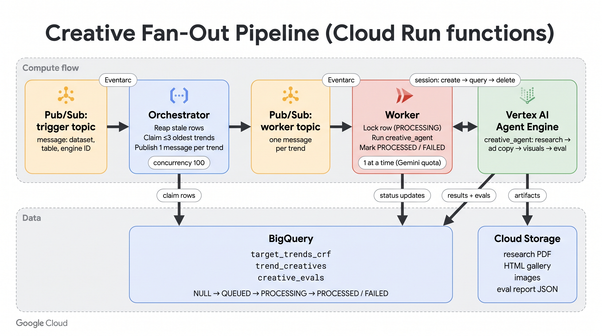
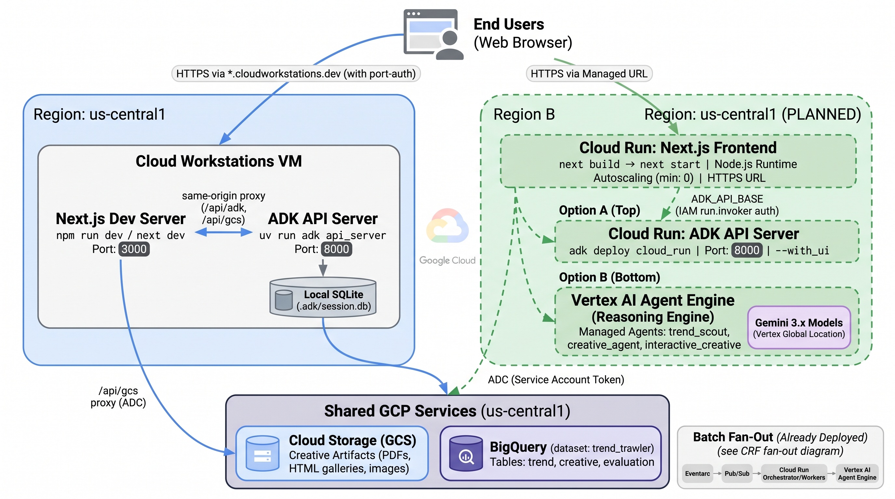

# Deployment

Operational guide for deploying **Trend Trawler**. For what the system does and how to run it locally,
see the [main README](../README.md).

## Contents
- [Prerequisites](#prerequisites)
- [Required environment](#required-environment)
- [Create BigQuery tables](#create-bigquery-tables)
- [Deploying Agents to Agent Engine](#deploying-agents-to-agent-engine)
- [Cloud Run Functions Fan-out Pattern](#cloud-run-functions-fan-out-pattern)
- [Frontend + api_server on Cloud Run](#frontend--api_server-on-cloud-run)
- [Bandit experiments](#bandit-experiments)
- [Eval CI (WIF)](#eval-ci-wif)
- [Alternative Deployment: deploy to Cloud Run instances](#alternative-deployment-deploy-to-cloud-run-instances)

## Prerequisites

- A populated `.env` (copy from [.env.example](../.env.example)) — project, `GOOGLE_CLOUD_LOCATION=global`,
  `GCP_REGION=us-central1`, GCS bucket, Pub/Sub topics, Cloud Run Function names, and BigQuery IDs.
- `gcloud` authenticated (`gcloud auth application-default login`) and the project set.
- BigQuery dataset + tables created — see [Create BigQuery tables](#create-bigquery-tables) below.

## Required environment

Nothing in the code hardcodes a GCP project: every identifier comes from the
environment (the repo `.env` for local scripts; `--set-env-vars` for deployed
Cloud Run Functions, which do **not** read `.env`). All vars are documented in
[.env.example](../.env.example).

| Variable | Used by | Required? | Default |
|---|---|---|---|
| `GOOGLE_CLOUD_PROJECT` | CRF orchestrator + worker, `deploy_agent.py`, `test_deployment.py`, `integration_test.py`, `create_session_engine.py` | **Yes** — the CRFs raise `RuntimeError` at first use if unset (imports stay side-effect-free) | none |
| `GOOGLE_CLOUD_PROJECT_NUMBER` | CRF orchestrator (worker topic path) + worker (Reasoning Engine path); `deploy_agent.py --delete` | CRFs: optional; deploy scripts: yes | CRFs fall back to `GOOGLE_CLOUD_PROJECT` (both APIs accept the ID) |
| `GCP_REGION` | CRFs (Agent Engine client), all deploy scripts | No | `us-central1` |
| `CREATIVE_WORKER_TOPIC_NAME` | CRF orchestrator (publishes to it) | No | `creative-worker-queue-topic` |
| `AGENT_WORKER_USER_ID` | CRF worker (Agent Engine session owner, `<id>_<row index>`) | No | `crf_worker` |
| `BQ_DATASET_ID` / `BQ_TABLE_TARGETS` | CRFs (SQL identifier allow-list) | No | `trend_trawler` / `target_trends_crf` |
| `CRF_EXTRA_ALLOWED_TABLES` | CRFs (extra allow-listed tables) | No | empty |
| `REAP_STALE_PROCESSING_MINUTES` / `MAX_PROCESSING_ATTEMPTS` | CRF orchestrator (stale-PROCESSING reaper) | No | `45` / `3` |
| `CRF_MAX_ROWS_PER_RUN` | CRF orchestrator (max rows one trigger dispatches, oldest first; a message's `max_rows` can only lower it) | No | `3` |
| `<PREFIX>_AGENT_ENGINE_ID` (`SCOUT_`, `CREATIVE_`, `INTERACTIVE_`) | `test_deployment.py`, `integration_test.py` (written by `deploy_agent.py --create`) | Yes, per tested agent | none |

`create_session_engine.py` also accepts `--project` / `--region` flags, which
override the env vars. Agent Engine resource IDs are never constants: pass them via
`--resource_id` (`deploy_agent.py --delete`), the `*_AGENT_ENGINE_ID` env vars, or
the `agent_resource_id` field of the orchestrator's Pub/Sub message.

---

## Create BigQuery tables

Trend Trawler uses one BigQuery dataset (`BQ_DATASET_ID`) with three tables. Create them once,
before running `trend_scout` (which writes the target trends), `creative_agent` /
`interactive_creative` (which write a creative row and an evaluation row per run), or the
fan-out (which reads and locks the target trends).

| Table (env var) | Written by | Contents |
|---|---|---|
| `target_trends_crf` (`BQ_TABLE_TARGETS`) | `trend_scout` (`trend_scout/tools.py`); the CRF worker sets `processed_status` / `processing_*` | The selected trends plus campaign metadata; the fan-out queue |
| `trend_creatives` (`BQ_TABLE_CREATIVES`) | `creative_agent` / `interactive_creative` (`creative_agent/bq_tools.py`) | One row per creative run: campaign metadata, trend and the `creative_gcs` folder |
| `creative_evals` (`BQ_TABLE_EVALS`) | same (`EVAL_COLUMN_TYPES` in `creative_agent/bq_tools.py`) | One evaluation summary per run; `creative_uuid` joins `trend_creatives.uuid` |

The idempotent helper script skips anything that already exists:

```bash
set -a && source .env && set +a
bash deployment/create_bq_tables.sh     # BQ_LOCATION defaults to US
```

Or run the commands yourself:

```bash
bq --location=US mk --dataset $BQ_PROJECT_ID:$BQ_DATASET_ID

# selected search trends
bq mk \
 -t \
 $BQ_PROJECT_ID:$BQ_DATASET_ID.$BQ_TABLE_TARGETS \
 uuid:STRING,processed_status:STRING,target_trend:STRING,refresh_date:DATE,trawler_date:DATE,entry_timestamp:TIMESTAMP,trawler_gcs:STRING,brand:STRING,target_audience:STRING,target_product:STRING,key_selling_point:STRING,research_gaps:STRING,processing_started_at:TIMESTAMP,processing_attempts:INTEGER

# target-trend creatives
bq mk \
 -t \
 $BQ_PROJECT_ID:$BQ_DATASET_ID.$BQ_TABLE_CREATIVES \
 uuid:STRING,target_trend:STRING,datetime:DATETIME,creative_gcs:STRING,brand:STRING,target_audience:STRING,target_product:STRING,key_selling_point:STRING

# creative evaluation summaries (one row per run; links to trend_creatives.uuid)
bq mk \
 -t \
 $BQ_PROJECT_ID:$BQ_DATASET_ID.$BQ_TABLE_EVALS \
 uuid:STRING,creative_uuid:STRING,datetime:DATETIME,target_trend:STRING,brand:STRING,target_product:STRING,overall_pass_rate:FLOAT,total_ad_copies:INTEGER,ad_copies_passed:INTEGER,avg_ad_copy_score:FLOAT,total_visual_concepts:INTEGER,visual_concepts_passed:INTEGER,avg_visual_score:FLOAT,weakest_dimensions:STRING,eval_report_gcs_uri:STRING,research_gaps:STRING,weakest_dimension_labels:STRING
```

These schemas already include every later column. Tables created before those columns
existed need the additive migrations instead: `processing_started_at` /
`processing_attempts` and `weakest_dimension_labels`, both under
[3. Create event-driven functions and eventarc triggers](#3-create-event-driven-functions-and-eventarc-triggers).
The nightly eval CI uses an isolated dataset cloned from these schemas (see
[Eval CI (WIF)](#eval-ci-wif)). The script also creates the three `bandit_*` tables used by
deployed-creative experiments; see [Bandit experiments](#bandit-experiments).

---

## Deploying Agents to Agent Engine

Deploying Agents to separate Agent Engine instances...

> [Agent Engine](https://google.github.io/adk-docs/deploy/agent-engine/) is a fully managed auto-scaling service on Google Cloud specifically designed for deploying, managing, and scaling AI agents built with frameworks such as ADK.

<p align="center">
  
</p>


```bash
# deploy `trend_scout` agent to Agent Engine
python deployment/deploy_agent.py --version=v1 --agent=trend_scout --create

# deploy `creative_agent` agent to Agent Engine
python deployment/deploy_agent.py --version=v1 --agent=creative_agent --create

# deploy `interactive_creative` agent (human-in-the-loop variant) to Agent Engine
python deployment/deploy_agent.py --version=v1 --agent=interactive_creative --create

# list existing Agent Engine instances
python deployment/deploy_agent.py --list

# delete an Agent Engine Runtime
python deployment/deploy_agent.py --resource_id=<RESOURCE_ID> --delete

# opt-in Cloud Trace for a new engine (off by default)
python deployment/deploy_agent.py --version=v1 --agent=creative_agent --create --enable_tracing
```

> **Cloud Trace (opt-in).** `--enable_tracing` ships
> `GOOGLE_CLOUD_AGENT_ENGINE_ENABLE_TELEMETRY=true` in the engine's env vars, which turns
> on span export to Cloud Trace. `AdkApp(enable_tracing=...)` is deliberately left unset:
> passing `True` would also force prompt/response content capture into the spans. The flag
> also ships `ADK_CAPTURE_MESSAGE_CONTENT_IN_SPANS=false`, because ADK's own spans otherwise
> carry the full `gcp.vertex.agent.llm_request`/`llm_response`. The
> Reasoning Engine service agent
> (`service-$PROJECT_NUMBER@gcp-sa-aiplatform-re.iam.gserviceaccount.com`) needs
> `roles/cloudtrace.agent`, and `cloudtrace.googleapis.com` must be enabled.

> The local packages bundled into each engine are derived from a single
> `AGENT_EXTRA_PACKAGES` map in `deployment/deploy_agent.py` (from the real import
> graph — e.g. `creative_agent` → `creative_eval` + `agent_common`), so a
> cross-package dependency can't be silently left out of a deploy.

* Once agent is deployed to Agent Engine, the agent's resource ID will be added to your `.env` file (`SCOUT_AGENT_ENGINE_ID`, `CREATIVE_AGENT_ENGINE_ID` or `INTERACTIVE_AGENT_ENGINE_ID`). And this will be used later by the `test_deployment.py` / `integration_test.py` scripts
* The deploy/test scripts use the AgentPlatform SDK: `agentplatform.Client().runtimes` and `agentplatform.frameworks.AdkApp` (google-cloud-aiplatform 2.x, via the `[tool.uv]` override in `pyproject.toml`)

### Test deployment

**Interact with the deployed agents using the `test_deployment.py` script...**

*Note: the `test_deployment.py` script will source the `BRAND`, `TARGET_AUDIENCE`, `TARGET_PRODUCT`, `KEY_SELLING_POINT`, and `TARGET_SEARCH_TREND` from your `.env` file.*

**[1] Kickoff the `trend_scout` agent workflow.**  

> *This will insert a row into your BigQuery table for each recommended trend*

```bash
export USER_ID='ima_user'
python deployment/test_deployment.py --agent=trend_scout --user_id=$USER_ID

Found agent with resource ID: ...
Created session for user ID: ...
...

INFO - Deleted session for user ID: ima_user
```

**[2] Next, invoke the deployed `creative_agent` workflow:**

> *This will insert a row into your BigQuery table with the Cloud Storage location of all trend and creative assets*

```bash
export USER_ID='ima_user'
python deployment/test_deployment.py --agent=creative_agent --user_id=$USER_ID

Found agent with resource ID: ...
Created session for user ID: ...
...

INFO - Deleted session for user ID: ima_user
```


**View logs for an agent**

To view log entries in the [Logs Explorer](https://cloud.google.com/logging/docs/view/logs-explorer-interface), run the query below

```bash
resource.type="aiplatform.googleapis.com/ReasoningEngine"
resource.labels.location="GCP_REGION"
resource.labels.reasoning_engine_id="YOUR_AGENT_ENGINE_ID"
```

---

## Cloud Run Functions Fan-out Pattern

Event-based triggers dispatch one creative run per recommended trend.

<p align="center">
  
</p>

**objectives**
* create `Agent Orchestrator` to check BQ for trends recommended by the `trawler agent`; dispatch PubSub message for each recommendation
* create `Agent Worker` to process each PubSub message dispatched by the `Orchestrator`, invoking the Agent Engine Runtime to generate ad copy and creatives for each `<trend, campaign>` pair (i.e., row in BQ table)
* handle Pub/Sub's [at-least-once message delivery](https://cloud.google.com/pubsub/docs/subscription-overview#default_properties)
* implement high concurrency orchestration to dispatch parallel workers
* avoid duplicate executions for **long-running tasks** (i.e., the worker)


<details>
  <summary>Why two deployments?</summary>

*The need for two separate deployments stems from the fact that the `Orchestrator` and the `Worker` respond to two different event sources (Pub/Sub topics):*

1. Orchestrator Deployment: Listens to the `$CREATIVE_TRIGGER_NAME` (the one that signals "start the job"). It executes the `crf_entrypoint` function.
2. Worker Deployment: Listens to the `$CREATIVE_WORKER_TOPIC_NAME` (the one that contains single-row payloads). It executes the `agent_worker_entrypoint` function.


This is because when deploying a service triggered by a Pub/Sub topic, we must specify exactly one entry point function to be executed when a message arrives on that topic

Therefore, you must **deploy the code twice**, with each deployment configured to listen to its unique trigger topic and execute the appropriate handler function.

</details>


### 1. Grant service account required permissions


*Grant Eventarc Event Receiver role (`roles/eventarc.eventReceiver`) to the service account associated with the Eventarc*


```bash
export SERVICE_ACCOUNT=$GOOGLE_CLOUD_PROJECT_NUMBER-compute@developer.gserviceaccount.com

# grant Eventarc Event Receiver role allows trigger to receive events from event providers
gcloud projects add-iam-policy-binding $GOOGLE_CLOUD_PROJECT \
  --member serviceAccount:$SERVICE_ACCOUNT \
  --role=roles/eventarc.eventReceiver


# Cloud Run invoker role allows it to invoke the function
gcloud projects add-iam-policy-binding $GOOGLE_CLOUD_PROJECT \
  --member serviceAccount:$SERVICE_ACCOUNT \
  --role=roles/run.invoker
```

<details>
  <summary> Optional: grant yourself admin access to ignore IAM best practices</summary>

```bash
gcloud projects add-iam-policy-binding $GOOGLE_CLOUD_PROJECT \
    --member="user:YOUR_EMAIL_ADDRESS" \
    --role="roles/pubsub.admin"
```
</details>


### 2. Create PubSub topics for the Creative Agent's orchestrator and worker


```bash
gcloud pubsub topics create $CREATIVE_TOPIC_NAME

gcloud pubsub topics create $CREATIVE_WORKER_TOPIC_NAME
```


### 3. Create [event-driven functions](https://cloud.google.com/run/docs/tutorials/pubsub-eventdriven#deploy-function) and [eventarc triggers](https://cloud.google.com/run/docs/tutorials/pubsub-eventdriven#pubsub-trigger)


* `CRF_ENTRYPOINT`: the entry point to the function in your source code. This is the code Cloud Run executes when your function runs. The value of **this flag must be a function name or fully-qualified class name** that exists in your source code.
* `BASE_IMAGE`: base image environment for your function e.g., `python313`. For more details about base images and their packages, see [Supported language runtimes and base images](https://cloud.google.com/run/docs/configuring/services/runtime-base-images#how_to_obtain_runtime_base_images)
* [optional] if `--min-instances=1`, service **always on**
* see [gcloud reference doc](https://cloud.google.com/sdk/gcloud/reference/run/deploy)


**3.0 Schema migration — `processing_started_at` + `processing_attempts`** (stale-PROCESSING reaper)

*Only for tables created before these columns existed; fresh tables from
[Create BigQuery tables](#create-bigquery-tables) already have them (and `weakest_dimension_labels`).*

The orchestrator reaps rows a worker stranded in `PROCESSING` by hard-crashing
after acquiring its lock (OOM / the 1800s Cloud Run timeout kill / segfault).
The worker's lock stamps `processing_started_at` + bumps `processing_attempts`;
the orchestrator re-queues rows older than `REAP_STALE_PROCESSING_MINUTES`
(default 45, > the worker's 30-min timeout) under `MAX_PROCESSING_ATTEMPTS`
(default 3), failing them over the cap. Both are env-configurable.

Run the additive migration **FIRST, before deploying the code that writes these
columns** — a DML naming a missing column fails (same ordering rule as the
`research_gaps` migration in `docs/plans/archive/2026-07-15-trend-scout-degradation-surfacing.md`):

```sql
-- 1. Additive migration (idempotent; preserves all rows):
ALTER TABLE `<BQ_PROJECT_ID>.<BQ_DATASET_ID>.target_trends_crf`
  ADD COLUMN IF NOT EXISTS processing_started_at TIMESTAMP,
  ADD COLUMN IF NOT EXISTS processing_attempts INT64;

-- 2. One-time cleanup of any PRE-EXISTING stranded rows. Their
--    processing_started_at is NULL, so the recurring reaper (which compares
--    `< TIMESTAMP_SUB(...)`) will never catch them. Run ONLY when no run is in
--    flight (serialized single worker + no live users makes this trivial):
UPDATE `<BQ_PROJECT_ID>.<BQ_DATASET_ID>.target_trends_crf`
  SET processed_status = 'QUEUED'
  WHERE processed_status = 'PROCESSING' AND processing_started_at IS NULL;
```

**Redeploy order (the reaper spans both functions):** migration → **worker**
`$CREATIVE_WORKER_CRF_NAME` (3.3 — ships the timestamp/attempt-stamping lock) →
**orchestrator** `$CREATIVE_CRF_NAME` (3.1 — ships the reap call). CRF functions
auto-route to LATEST and the Eventarc triggers bind by service name, so triggers
survive a redeploy and are **not** re-created.

**weakest_dimension_labels migration (2026-10-02)** — `creative_evals` gains a
readable `weakest_dimension_labels` column ("Trend connection, Copy quality",
from `creative_eval/dimensions.py`) next to the snake_case `weakest_dimensions`.
Same ordering rule: run the ALTER on **both** datasets **BEFORE deploying** the
code that writes it (the `creative_agent` / `interactive_creative` engines and
the `trend-trawler-api` backend), since the eval-row MERGE names every column:

```sql
ALTER TABLE `<BQ_PROJECT_ID>.trend_trawler.creative_evals`
  ADD COLUMN IF NOT EXISTS weakest_dimension_labels STRING;
ALTER TABLE `<BQ_PROJECT_ID>.trend_trawler_eval.creative_evals`
  ADD COLUMN IF NOT EXISTS weakest_dimension_labels STRING;
```

Then backfill pre-existing rows (only `IS NULL` rows are touched, so it is
idempotent). Without `--execute` it prints the SQL, a dry-run byte estimate, and
the count of rows to update; re-run with `--execute` to apply (repeat per dataset):

```bash
uv run python deployment/backfill_eval_dimension_labels.py \
  --table=<BQ_PROJECT_ID>.trend_trawler.creative_evals
uv run python deployment/backfill_eval_dimension_labels.py \
  --table=<BQ_PROJECT_ID>.trend_trawler.creative_evals --execute
```

**3.1 Creative Agent Orchestrator:** cloud run function

```bash
cd cloud_functions/creative_fanout

gcloud run deploy $CREATIVE_CRF_NAME \
  --source . \
  --function $CRF_ENTRYPOINT \
  --base-image $BASE_IMAGE \
  --region $GCP_REGION \
  --memory 8Gi \
  --cpu 4 \
  --min-instances 0 \
  --concurrency=100 \
  --timeout=600s \
  --no-allow-unauthenticated \
  --set-env-vars "GOOGLE_CLOUD_PROJECT=$GOOGLE_CLOUD_PROJECT,GOOGLE_CLOUD_PROJECT_NUMBER=$GOOGLE_CLOUD_PROJECT_NUMBER,GCP_REGION=$GCP_REGION,CREATIVE_WORKER_TOPIC_NAME=$CREATIVE_WORKER_TOPIC_NAME" \
  --labels agent-workflow=trend-trawler,function=creative-orchestrator

  # High concurrency since it's just dispatching
  # --set-env-vars: GOOGLE_CLOUD_PROJECT is REQUIRED (the function reads no .env);
  #   see "Required environment" above. --set-env-vars REPLACES the env, so any
  #   other overrides (e.g. CRF_EXTRA_ALLOWED_TABLES) must be in the same list.
```

**3.2 Creative Agent Orchestrator:** eventarc trigger

```bash
gcloud eventarc triggers create $CREATIVE_TRIGGER_NAME  \
  --location=$GCP_REGION \
  --destination-run-service=$CREATIVE_CRF_NAME \
  --destination-run-region=$GCP_REGION \
  --event-filters="type=google.cloud.pubsub.topic.v1.messagePublished" \
  --transport-topic=$CREATIVE_TOPIC_NAME \
  --service-account=$SERVICE_ACCOUNT
```

Raise the trigger subscription's ack deadline from the Eventarc default (10s).
Otherwise a cold start longer than 10s gets the message redelivered, and the
orchestrator re-dispatches the rows it just marked QUEUED:

```bash
ORCH_SUB=$(gcloud eventarc triggers describe $CREATIVE_TRIGGER_NAME --location=$GCP_REGION \
  --format='value(transport.pubsub.subscription)')
gcloud pubsub subscriptions update $ORCH_SUB --ack-deadline=60
```


**3.3 Creative Agent Worker:** cloud run function

```bash
gcloud run deploy $CREATIVE_WORKER_CRF_NAME \
  --source . \
  --function $CREATIVE_WORKER_ENTRYPOINT \
  --base-image $BASE_IMAGE \
  --region $GCP_REGION \
  --max-instances 1 \
  --timeout 1800s \
  --concurrency=1 \
  --memory 8Gi \
  --cpu 4 \
  --no-allow-unauthenticated \
  --set-env-vars "GOOGLE_CLOUD_PROJECT=$GOOGLE_CLOUD_PROJECT,GOOGLE_CLOUD_PROJECT_NUMBER=$GOOGLE_CLOUD_PROJECT_NUMBER,GCP_REGION=$GCP_REGION,AGENT_WORKER_USER_ID=${AGENT_WORKER_USER_ID:-crf_worker}" \
  --labels agent-workflow=trend-trawler,function=creative-worker
  
  # Note:
  # --set-env-vars: GOOGLE_CLOUD_PROJECT is REQUIRED (the function reads no .env);
  #   see "Required environment" above. --set-env-vars REPLACES the env, so any
  #   other overrides (e.g. CRF_EXTRA_ALLOWED_TABLES) must be in the same list.
  # region=$GCP_REGION (us-central1) — Cloud Run is regional; GOOGLE_CLOUD_LOCATION
  #   is `global` for the gemini-3.x models and is NOT a valid Cloud Run region.
  # concurrency=1 # ensures only one row is processed per instance
  # max-instances=1 # SERIALIZE runs: gemini-3.1-pro-preview (5 RPM) and
  #   flash-image (2 RPM) quotas are project-wide, so parallel runs 503. One run
  #   at a time keeps the fan-out under quota. Raise only if quota is raised.
  # timeout=1800s # a quota-paced single run (throttled eval + image backoff) is
  #   slower than before; 900s risked killing it mid-run.
```

<details>
  <summary>Limiting Cloud Function/Cloud Run Concurrency</summary>

Effect of setting `concurrency=1`

* Only one instance of your function will be running at any given time. This means if Pub/Sub delivers a message, the next message (or a redelivery attempt of the first message) must wait until the first instance finishes and shuts down.

* If your function takes 30 seconds to run and update BQ, the subsequent message/redelivery will not execute until that 30 seconds is over. This gives the first execution time to complete the BQ update (PROCESSED), making the BQ query in the second execution return zero data.

</details>

**3.4 Creative Agent Worker:** eventarc trigger

```bash
gcloud eventarc triggers create $CREATIVE_WORKER_TRIGGER_NAME  \
  --location=$GCP_REGION \
  --destination-run-service=$CREATIVE_WORKER_CRF_NAME \
  --destination-run-region=$GCP_REGION \
  --event-filters="type=google.cloud.pubsub.topic.v1.messagePublished" \
  --transport-topic=$CREATIVE_WORKER_TOPIC_NAME \
  --service-account=$SERVICE_ACCOUNT
```

Worker runs take ~500s, so set the maximum ack deadline (600s). With the 10s
default, Pub/Sub redelivers mid-run; the QUEUED->PROCESSING lock turns each
redelivery into a no-op, but they still occupy the single worker instance:

```bash
WORKER_SUB=$(gcloud eventarc triggers describe $CREATIVE_WORKER_TRIGGER_NAME --location=$GCP_REGION \
  --format='value(transport.pubsub.subscription)')
gcloud pubsub subscriptions update $WORKER_SUB --ack-deadline=600
```


### 4. Confirm triggers and topics


*4.1 confirm triggers successfully created:*

```bash
gcloud eventarc triggers list --location=$GCP_REGION
```

*4.2 assign each trigger's PubSub topic to variable:*

```bash
CREATIVE_PUB_TOPIC=$(gcloud eventarc triggers describe $CREATIVE_TRIGGER_NAME --location $GCP_REGION --format='value(transport.pubsub.topic)')
echo $CREATIVE_PUB_TOPIC

CREATIVE_WORKER_PUB_TOPIC=$(gcloud eventarc triggers describe $CREATIVE_WORKER_TRIGGER_NAME --location $GCP_REGION --format='value(transport.pubsub.topic)')
echo $CREATIVE_WORKER_PUB_TOPIC
```


### 5. Invoke the Creative Agent Orchestrator function

*5.1 insert sample rows to test the `crf_entrypoint` function*

<details>
  <summary>run this SQL in the BigQuery console</summary>

*edit these values as needed*

```sql
# =========== #
# Insert rows
# =========== #

INSERT INTO 
  `GOOGLE_CLOUD_PROJECT.trend_trawler.target_trends_crf` (uuid, 
    target_trend,
    refresh_date,
    trawler_date,
    entry_timestamp,
    trawler_gcs,
    brand,
    target_audience,
    target_product,
    key_selling_point)
VALUES 
(
    "test_inserts", --uuid
    "olive garden", --target_trend "macho man randy savage"
    PARSE_DATE('%m/%d/%Y', '11/11/2025'), --refresh_date
    PARSE_DATE('%m/%d/%Y', '11/12/2025'), --trawler_date
    CURRENT_TIMESTAMP(), --entry_timestamp
    "https://console.cloud.google.com/storage/browser/<GOOGLE_CLOUD_STORAGE_BUCKET>", --trawler_gcs
    "Paul Reed Smith (PRS)", -- brand
    "millennials who follow jam bands (e.g., Widespread Panic and Phish), respond positively to nostalgic messages", -- target_audience
    "PRS SE CE24 Electric Guitar", -- target_product
    "The 85/15 S Humbucker pickups deliver a wide tonal range, from thick humbucker tones to clear single-coil sounds, making the guitar suitable for various genres." -- key_selling_point
);
```
</details>


*5.2 create `cloud_functions/creative_fanout/message.json` (gitignored, so not in a fresh clone) to match your `.env` file:*

```json
{
    "bq_dataset": "trend_trawler",
    "bq_table": "target_trends_crf",
    "agent_resource_id": "<CREATIVE_AGENT_ENGINE_ID>" # e.g., 4622783949466447488
}
```

`bq_dataset`/`bq_table` become SQL identifiers, so both functions only accept
the config allow-list (`BQ_DATASET_ID` / `BQ_TABLE_TARGETS`, defaults
`trend_trawler` / `target_trends_crf`, in `cloud_functions/creative_fanout/config.py`).
A message naming any other dataset/table is logged and dropped (ACKed). To target
an extra table (e.g. a `_p95` load-test copy), deploy **both** functions with
`CRF_EXTRA_ALLOWED_TABLES=<table>[,<table>...]` added to their `--set-env-vars` list
(or `--update-env-vars` to add it without dropping the required vars).

Row limit: one trigger dispatches at most `CRF_MAX_ROWS_PER_RUN` rows (default
3, oldest `entry_timestamp` first); the rest stay unclaimed until the next
trigger, so publishing a message can't accidentally fan out the whole backlog.
Add an optional `"max_rows": N` to the message to dispatch fewer (e.g. `1` for a
smoke test). Values above the cap are clamped, and invalid values fall back to it.
To raise the cap, add `CRF_MAX_ROWS_PER_RUN=<n>` to the orchestrator's
`--set-env-vars`.

Worker failure semantics: if the agent run fails, the worker marks the row
`FAILED` and **ACKs** (no Pub/Sub retry — a redelivery can't re-lock a `FAILED`
row). Only an error before/while writing that status NACKs for redelivery; rows
stranded in `PROCESSING` are recovered by the orchestrator's stale-PROCESSING reaper.

*5.3  Publish message to the Creative Orchestrator's topic:*

```bash
gcloud pubsub topics publish $CREATIVE_PUB_TOPIC --message "$(cat message.json | jq -c)"
```

* monitor logging: `Cloud Run Function >> Observability >> Logs`
* inspect the `target_trends_crf` BQ table to ensure `processed_status` is updated properly
* the last task of the Creative Agent job inserts rows in the `trend_creatives` BQ table; see Cloud Storage location for research and creative artifacts

---

## Frontend + api_server on Cloud Run

Serve the Next.js frontend and the ADK `api_server` as **two independent Cloud Run
services** in `us-central1`. This turns the "planned/target" box in the deployment
diagram into real, reproducible infrastructure.

<p align="center">
  
</p>

### Architecture

- **Backend** — `trend-trawler-api` runs **uvicorn on `deployment/async_app.py`** (the ADK
  FastAPI app from `get_fast_api_app` + our async-job `/runs` router), not the canned
  `adk api_server`. It loads the three runnable agent packages (`trend_scout`,
  `creative_agent`, `interactive_creative`) and calls Vertex/BigQuery/GCS in-process. It is
  **private** — deployed with `--no-allow-unauthenticated`. It serves from the `agents/`
  directory (relative symlinks to the flat packages) so `GET /list-apps` returns exactly
  those three instead of every top-level dir; the root `Dockerfile` sets `PYTHONPATH=/app`
  so cross-package imports (`creative_eval`, `agent_common`) still resolve. See
  `agents/README.md`. The canned session/artifact CRUD (`createSession`, `getSession`,
  `list-apps`, artifacts) still comes free from `get_fast_api_app`; the `/runs` router
  shares its exact session-service instance so both see one store. **Runs are async**
  (fire-and-forget + poll) — see [Async-job run model](#async-job-run-model) below.
- **Frontend** — `trend-trawler-web` runs the Next.js 16 standalone server
  (`output: "standalone"` → `server.js`). Its existing same-origin Route Handlers proxy
  to the backend (`/api/adk/*` → `ADK_API_BASE`) and to Cloud Storage (`/api/gcs`).
- **Auth model** — the `/api/adk` proxy runs server-side in the frontend container and
  mints a Google-signed **ID token** (audience = backend URL) from the Cloud Run metadata
  server, attaching it as `Authorization: Bearer …`. The frontend service account holds
  `roles/run.invoker` on the backend. `/api/gcs` uses an **access token** from the same
  metadata server. The **browser only ever calls same-origin** route handlers, so there
  is **no CORS** and no direct backend exposure (`NEXT_PUBLIC_API_BASE` defaults to
  `/api/adk`).
- **Per-user authz (P3)** — the proxy also verifies the IAP JWT, rewrites every `userId` to
  the caller's normalized email, allowlists routes, and asserts the user via `X-TT-User`;
  the backend trusts that header only alongside a verified `tt-web-sa` ID token. Env vars
  and runbook: [9. Per-user authz](#9-per-user-authz-p3-env-vars--verification).

Each service has its own service account: `tt-api-sa` (backend) and `tt-web-sa`
(frontend).

### Local image smokes (optional, pre-deploy)

Each service has a `Dockerfile` (`frontend/Dockerfile` and the repo-root `Dockerfile`).
Build them locally to catch Dockerfile errors before the Cloud Run source build:

```bash
# Frontend (multi-stage, Debian slim, standalone server)
cd frontend && docker build -t tt-web:local .

# Backend (uv-based ADK api_server), from repo root
docker build -t tt-api:local .
```

> **Docker may be unavailable** on this workstation. If so, rely on the frontend
> standalone smoke (`cd frontend && npm run build`, then run
> `.next/standalone/server.js` with `public/` + `.next/static/` copied in — expect
> `200`) and let Cloud Run's own source build (`gcloud run deploy --source`) build the
> images. The backend build may also hit the `uv.lock` private-mirror issue locally
> (see the `adk-pipe-dep-mirror-workaround` note); Cloud Build inside the project can
> reach the mirror.

### 0. Prerequisites + shared vars

The two `Dockerfile`s and this runbook live on the `feat/frontend-cloud-run-deploy`
branch — run the deploy from a checkout (or git worktree) of **that** branch, since a
`gcloud run deploy --source` build needs the Dockerfile at the build-context root.

```bash
gcloud auth login                                   # if not already authenticated
gcloud config set project "$GOOGLE_CLOUD_PROJECT"   # e.g. from `set -a; source .env; set +a`

# APIs the --source build (Cloud Build + Artifact Registry) and Cloud Run need:
gcloud services enable run.googleapis.com cloudbuild.googleapis.com artifactregistry.googleapis.com

# Shared vars (values sourced from .env / deploy_agent.py:ENV_VAR_DICT):
PROJECT=$GOOGLE_CLOUD_PROJECT                 # <PROJECT_ID>
PROJECT_NUMBER=$(gcloud projects describe "$PROJECT" --format='value(projectNumber)')
REGION=${GCP_REGION:-us-central1}
GCS_BUCKET=$GOOGLE_CLOUD_STORAGE_BUCKET      # NO gs:// prefix; the gs:// form is derived in code.
```

### 1. IAM — service accounts + role bindings

Run where GCP creds exist (vars from Step 0).

**Create the two service accounts:**

```bash
gcloud iam service-accounts create tt-api-sa  --display-name="trend-trawler api_server"
gcloud iam service-accounts create tt-web-sa  --display-name="trend-trawler web frontend"
API_SA=tt-api-sa@$PROJECT.iam.gserviceaccount.com
WEB_SA=tt-web-sa@$PROJECT.iam.gserviceaccount.com
```

**Grant the backend SA the roles the agents need:**

```bash
for ROLE in roles/aiplatform.user roles/bigquery.dataEditor roles/bigquery.jobUser \
            roles/storage.objectAdmin roles/logging.logWriter; do
  gcloud projects add-iam-policy-binding $PROJECT \
    --member="serviceAccount:$API_SA" --role="$ROLE" --condition=None
done
```

**Grant the frontend SA GCS read (for `/api/gcs`) + logging:**

```bash
for ROLE in roles/storage.objectViewer roles/logging.logWriter; do
  gcloud projects add-iam-policy-binding $PROJECT \
    --member="serviceAccount:$WEB_SA" --role="$ROLE" --condition=None
done
```

> `roles/run.invoker` on the backend service is granted in Step 2 **after** the backend
> exists — it is a per-service binding, not project-wide.

Verify: `gcloud projects get-iam-policy $PROJECT --flatten=bindings
--filter="bindings.members:tt-*-sa" --format="table(bindings.role)"` shows the expected
roles.

### 2. Deploy the backend (private)

```bash
API_SA=tt-api-sa@$PROJECT.iam.gserviceaccount.com
# From the repo root of a feat/frontend-cloud-run-deploy checkout (uses the root Dockerfile):
gcloud run deploy trend-trawler-api \
  --source . --region $REGION --no-allow-unauthenticated \
  --service-account $API_SA \
  --memory 8Gi --cpu 4 --min-instances 1 --timeout 900 --no-cpu-throttling \
  --set-env-vars "GOOGLE_GENAI_USE_ENTERPRISE=1,GOOGLE_CLOUD_PROJECT=$PROJECT,GCP_REGION=$REGION,GOOGLE_CLOUD_PROJECT_NUMBER=$PROJECT_NUMBER,GOOGLE_CLOUD_STORAGE_BUCKET=$GCS_BUCKET,BQ_PROJECT_ID=$PROJECT,BQ_DATASET_ID=trend_trawler,BQ_TABLE_TARGETS=target_trends_crf,BQ_TABLE_CREATIVES=trend_creatives,BQ_TABLE_EVALS=creative_evals"
```

> **`--no-cpu-throttling` is required, not optional.** The async-job model drives each run
> in a detached `asyncio` task that outlives the kick-off HTTP response. With the Cloud Run
> default (CPU throttled between requests) that task would **stall the instant `POST /runs`
> returns** — CPU is only allocated during a request. `--no-cpu-throttling` (instance-based
> billing) keeps CPU allocated so the background run proceeds. Pair it with
> `--min-instances 1` so an idle scale-to-zero doesn't kill an in-flight run; the tradeoff
> is being billed for the always-warm instance (acceptable for this internal tool). See
> [Async-job run model](#async-job-run-model).

> Env-var values must match `.env` / `deployment/deploy_agent.py:ENV_VAR_DICT`.
> `GOOGLE_CLOUD_STORAGE_BUCKET` is the bare bucket name (no `gs://`); the `gs://` form is
> derived from it in code (`agent_common` `GCS_BUCKET`), so there is no separate `BUCKET` var.
> `GOOGLE_CLOUD_LOCATION` is intentionally **omitted** — models are pinned to `global` in
> code (`agent_common` `MODEL_LOCATION` / `build_gemini`), and setting it would push
> model calls to a regional endpoint. Confirm the actual table names against `.env`
> before running.

> **Post-P3:** the api defaults to `USER_AUTHZ_MODE=enforce` and **refuses to boot**
> without `TRUSTED_PROXY_SA` + `TRUSTED_PROXY_AUDIENCES` — add them to this
> `--set-env-vars` list (see [Step 9](#9-per-user-authz-p3-env-vars--verification)).

Capture the URL:

```bash
API_URL=$(gcloud run services describe trend-trawler-api --region $REGION --format='value(status.url)')
```

### 3. Let the frontend SA invoke the backend (`run.invoker`)

```bash
gcloud run services add-iam-policy-binding trend-trawler-api --region $REGION \
  --member="serviceAccount:$WEB_SA" --role=roles/run.invoker
```

### 4. Deploy the frontend

MVP uses `--allow-unauthenticated` so users can reach it directly (see the follow-ups
below for IAP).

```bash
gcloud run deploy trend-trawler-web \
  --source ./frontend --region $REGION --allow-unauthenticated \
  --service-account $WEB_SA \
  --memory 1Gi --cpu 1 --min-instances 0 \
  --set-env-vars "ADK_API_BASE=$API_URL"
```

> Historical first deploy only. Once IAP is on (Step 7) the web service must **never** be
> redeployed with `--allow-unauthenticated` or `--set-env-vars` (which would drop
> `IAP_ALLOWED_HD` and make every proxied call 401) — use `--update-env-vars`.

### 5. End-to-end verification (live)

```bash
curl -sS -o /dev/null -w "%{http_code}" \
  $(gcloud run services describe trend-trawler-web --region $REGION --format='value(status.url)')/
```

- The web URL returns `200`.
- Open the web URL, submit a campaign for `trend_scout`, confirm the **run view polls
  and renders events** — proves the ID-token'd `/api/adk` → private backend path.
- Open a completed run's results page, confirm an **artifact loads** — proves `/api/gcs`
  + `roles/storage.objectViewer`.
- Negative check: `curl $API_URL/list-apps` **without** a token returns `403` (the
  backend is private).

The frontend's `ADK_API_BASE` wiring is documented in
[`frontend/.env.example`](../frontend/.env.example).

### 6. Persistent sessions (Agent Engine)

By default the backend uses **in-memory** ADK sessions, so a run must stay on the same
warm instance — a cold start or scale-out drops in-flight state. The backend reads an
optional `SESSION_SERVICE_URI`; when set, `deployment/async_app.py` passes it to
`get_fast_api_app(session_service_uri=…)`, which builds the persistent session store used
by **both** the canned CRUD endpoints and the `/runs` async-job router. When unset,
behaviour is unchanged (in-memory). Note: the URI is now consumed **inside `async_app.py`**
— it is no longer a CLI flag on the entrypoint
(see [`deployment/backend_entrypoint.sh`](backend_entrypoint.sh), which now execs
`uvicorn deployment.async_app:app`, wired as the `Dockerfile` `CMD`).

> **Persistent sessions are what make the async-job model durable.** With
> `SESSION_SERVICE_URI` set (the Agent Engine store), the run's event log survives instance
> recycling and is readable by any instance a poll lands on. In-memory sessions bind a run
> to one instance and defeat the poll-from-anywhere property — set the URI in production.

We back sessions with a **dedicated** Agent Engine (Reasoning Engine) that serves no
agent — its only job is to be the session store, so its lifetime is decoupled from any
served-agent deploy. Create (or reuse) it with:

```bash
uv run python deployment/create_session_engine.py
# prints: SESSION_SERVICE_URI=agentengine://projects/<num>/locations/us-central1/reasoningEngines/<id>
```

The URI is **fully qualified** on purpose: it encodes project + `us-central1`, so the
session store pins to the region while models stay pinned to `global`
(`GOOGLE_CLOUD_LOCATION` stays **unset** — verified: the client does not require it). The
backend SA (`tt-api-sa`) needs `roles/aiplatform.user` (already granted in Step 1).

Deploy the backend with the store (a plain redeploy of the already-private service — no
auth change):

```bash
gcloud run deploy trend-trawler-api --source . --region $REGION \
  --update-env-vars "SESSION_SERVICE_URI=agentengine://projects/$PROJECT_NUMBER/locations/$REGION/reasoningEngines/<id>"
```

Verify: POST a session with `{"state":{"brand":"X"}}`, restart / redeploy, then GET the
same id — it returns the state (in-memory would `404`). Backend stays `403` unauth.

### Async-job run model

Runs are **fire-and-forget + poll**, not browser-held SSE. This fixes the class of failures
where any client disconnect (network blip, IAP re-auth, tab sleep, proxy recycle, a model
`429`) silently dropped a multi-minute run — the canned ADK `/run` and `/run_sse` are
request-bound and **cancel the run when the client goes away**.

The `/runs` router (`runserver/async_runs.py`, mounted by `deployment/async_app.py`) adds:

| Route | Purpose |
|---|---|
| `POST /runs/{app_name}` — `{userId, sessionId, message}` | Ensures the session, spawns a **detached `asyncio` task** driving `Runner.run_async` to completion, returns `{runId, status:"running"}` immediately. |
| `GET /runs/{app_name}/{user_id}/{session_id}?since=N` | Returns `{status, events: events[N:], nextCursor, state, error}`. The frontend polls this, advancing `since` by `nextCursor`. |
| `POST /runs/{app_name}/{user_id}/{session_id}/resume` — `{functionCallId, functionName, response}` | Resumes an interactive checkpoint, also detached. |

The run's durable log **already exists**: `Runner.run_async` appends every final event to
the (persistent) session as it runs, and the poll just reads `session.events`. When the run
finishes, `_drive_run` appends a **terminal marker** event (`author="__runserver__"`,
`state_delta={"__run_status":"done"}`); on failure it appends `{"__run_status":"error",
"__run_error":…}` instead of re-raising. The poll derives `status` from that marker (or from
an in-pipeline error event), so a client can disconnect and reconnect — or reload — and the
run keeps going server-side; re-polling from `since=0` replays the whole timeline.

**Auto-continue after an empty root turn.** A Pro root model occasionally returns an
empty final turn (STOP, no text, no function call) right after a long NodeTool
response; ADK ends the invocation there, so the segment would finish `done` with the workflow
unfinished. For example, `interactive_creative` never calls `review_visual_concepts`. Before
writing `done`, `_drive_run` checks `should_auto_continue`. It re-prompts the same session
with "Continue the WORKFLOW from where it stopped…" only when all of these hold: the app's
completion key is unset (`finalize_done` for the creative apps, or
`select_trends_markdown_gcs_uri` for `trend_scout`); the segment did not pause at an unanswered long-running checkpoint call; and
the root agent's last event is empty. The re-prompt runs inside the same detached task, so
the run stays claimed and `running`. It also counts against the same `RUN_MAX_SECONDS`
budget. Each re-prompt logs `auto-continue after empty root turn: app=… session=… attempt=n`
and records the cumulative count as the `__auto_continues` state key. The number of
re-prompts per kick-off/resume segment is capped by `RUN_MAX_AUTO_CONTINUES` (default `2`,
clamped `0`–`3`; `0` disables it). The creative apps count as finished only once
`finalize_pipeline` (the deterministic evaluate + persist step) reaches its terminal node,
which sets `finalize_done` on every path (also with no evaluation report or a failed eval
BigQuery write, so a finished finalize — incl. its ~70 s judge — is never re-run), so an
empty turn anywhere before it is still re-prompted. The research PDF is saved inside `combined_research_pipeline`, so the
creative_agent root makes only four workflow calls after `memorize`.

**Requirements / caveats:**
- **`--no-cpu-throttling` + `--min-instances 1`** (see Step 2) — the detached task needs CPU
  allocated outside requests, and a warm instance so scale-to-zero can't kill an in-flight
  run.
- **Instance recycling can still orphan a run.** If the instance running the task is
  redeployed / scaled down / OOM-killed mid-run, no terminal marker is written and the poll
  would report `running` forever. Mitigations: the frontend **stall-timeout** surfaces it to
  the user, and you should avoid mid-run redeploys. Any api revision change (a
  deploy **or** a `services update --update-env-vars`, followed by the traffic pin) shuts the
  old revision's instance down within about a minute. Before one, confirm nothing is running:
  check that no `run start:` line in the recent api logs lacks a matching terminal
  `__run_status`, and ask the user. The durable escalation (only if this bites under real load) is **Variant 2**: hand UI runs to the existing PubSub worker
  (`cloud_functions/creative_fanout` pattern) so PubSub redelivery + a BQ status lock
  survive an instance crash.
- **`partial` (token-streaming) chunks are not persisted**, so the poll renders **final**
  events only — text appears per-final-event rather than token-by-token. Acceptable; pause
  detection already ignores `partial`.

### 7. IAP on the frontend (domain-restricted)

The frontend is fronted by **Identity-Aware Proxy** directly on the Cloud Run service
(GA — no manual load balancer / serverless NEG), so only signed-in
`jordantotten.altostrat.com` users reach it. **No frontend code change**: IAP
authenticates the user at the edge *before* requests reach the container; the same-origin
`/api/adk` + `/api/gcs` handlers keep using the container SA to reach the private backend
and GCS.

```bash
gcloud services enable iap.googleapis.com

# Enable IAP on the web service (also provisions the IAP service agent).
# NB: `--allow-unauthenticated` is a deploy-only flag; on `update` the public/private
# switch is the allUsers IAM binding, removed below.
gcloud run services update trend-trawler-web --region $REGION --iap

# Let IAP invoke the (now private) service:
gcloud run services add-iam-policy-binding trend-trawler-web --region $REGION \
  --member="serviceAccount:service-$PROJECT_NUMBER@gcp-sa-iap.iam.gserviceaccount.com" \
  --role="roles/run.invoker"

# Grant the whole domain the IAP accessor role — this is on the IAP resource
# (`gcloud iap web`, resource-type cloud-run), NOT `run services`:
gcloud iap web add-iam-policy-binding --resource-type=cloud-run \
  --service=trend-trawler-web --region=$REGION \
  --member="domain:jordantotten.altostrat.com" --role="roles/iap.httpsResourceAccessor"

# Remove public access — this is what makes it private:
gcloud run services remove-iam-policy-binding trend-trawler-web --region $REGION \
  --member="allUsers" --role="roles/run.invoker"
```

Verify: `curl -sI $WEB_URL/` returns **`HTTP/2 302`** to `accounts.google.com`
(`x-goog-iap-generated-response: true`), not `200`. A `jordantotten.altostrat.com` user
loads the app in a browser, a run progresses via polling, and an artifact loads via `/api/gcs`.
Never re-add `allUsers`; add non-domain viewers individually with
`roles/iap.httpsResourceAccessor`.

### 8. Redeploying a new build + rollback (traffic tags)

Both services now **follow `LATEST`** (`status.traffic.latestRevision: true`), so a
`gcloud run deploy` of either one **auto-routes 100% to the revision it just created** — no
manual traffic flip needed. (This was not always true: traffic used to be pinned to a
specific revision, so deploys created a new revision at 0% and required an explicit
`update-traffic --to-latest`. If you ever see the deploy's final log line naming an *old*
revision, that pin has returned — verify and re-point as below.)

**Redeploy (from a `main` checkout):**

```bash
# Backend — MUST re-pass --no-cpu-throttling --min-instances 1 AND all env vars incl.
# SESSION_SERVICE_URI (a bare --set-env-vars drops anything omitted); see Steps 2 + 6.
gcloud run deploy trend-trawler-api  --source .        --region $REGION ...   # (Step 2 flags)
# Frontend — do NOT pass --allow-unauthenticated; IAP + its IAM bindings are service-level
# and are preserved across new revisions (see Step 7).
gcloud run deploy trend-trawler-web  --source ./frontend --region $REGION ...  # (Step 4 flags)
```

**Confirm what's actually live** (a green check in the console = the revision is *healthy*,
NOT that it serves traffic — read the traffic %, not the checkmark):

```bash
gcloud run services describe trend-trawler-api --region $REGION --format='value(status.traffic)'
gcloud run revisions list --service trend-trawler-api --region $REGION \
  --sort-by="~metadata.creationTimestamp"   # suffixes are NOT monotonic — sort by time
```

**Rollback.** The previous known-good revision of each service is kept at **0% traffic**
and reachable by a stable **tag** — a named alias URL pinned to one revision
(`https://<tag>---<service>-<hash>.run.app`). These are the rollback anchors:

| Service | Rollback tag | (revision at time of writing) |
|---|---|---|
| `trend-trawler-api` | `main-clean` | `trend-trawler-api-00034-hzv` |
| `trend-trawler-web` | `main-current` | `trend-trawler-web-00011-giv` |

```bash
# Instant rollback: send 100% of traffic to the tagged known-good revision.
gcloud run services update-traffic trend-trawler-api --region $REGION --to-tags main-clean=100
gcloud run services update-traffic trend-trawler-web --region $REGION --to-tags main-current=100

# ...then to return to the newest revision:
gcloud run services update-traffic trend-trawler-api --region $REGION --to-latest
```

**After a deploy is confirmed good,** move the rollback tag onto the new revision so the
anchor tracks "last known-good" (tags don't move on their own):

```bash
NEW_REV=$(gcloud run services describe trend-trawler-api --region $REGION \
  --format='value(status.latestReadyRevisionName)')
gcloud run services update-traffic trend-trawler-api --region $REGION \
  --set-tags main-clean=$NEW_REV        # re-point the tag; traffic split is unchanged
```

Old, untagged, 0%-traffic revisions are safe to leave (they cost nothing idle) or prune with
`gcloud run revisions delete <rev> --region $REGION`. Keep at least the current
`main-clean` / `main-current` pair as your safety net.

**api: don't keep tagged old revisions around.** A tagged api revision isn't idle: with
`--min-instances 1` it keeps an instance up that runs the background loops (the bandit TTL
reaper, which also resumes `deploying` experiments, finishes traffic runs and tears down
expired ones). On
2026-10-05 an old revision behind a rollback tag resumed a bandit deploy the live revision
was already running and uploaded a duplicate Vertex model. So after a new api revision is
verified **and** traffic is pinned to it, remove the api's rollback tag (for example `prev`,
or `main-clean` while it points at an old revision), and roll back by **revision name**:

```bash
gcloud run services update-traffic trend-trawler-api --region $REGION --remove-tags prev
# Rollback without a tag: name the known-good revision (note it before deploying).
gcloud run services update-traffic trend-trawler-api --region $REGION \
  --to-revisions trend-trawler-api-000NN-xyz=100
```

The web service has no background loops, so its `main-current` tag is harmless.

### 9. Per-user authz (P3): env vars + verification

Trust model: the `/api/adk` proxy is authoritative (verifies the IAP JWT, pins the `hd`
domain, rewrites every path/body `userId` to the caller's normalized email, forwards only
allowlisted routes + `since`/`version` query params, and sets `X-TT-User`); the api
(`runserver/authz.py`) trusts `X-TT-User` only when the request also carries a valid Google
ID token for `TRUSTED_PROXY_SA` (the proxy mints it via the metadata server with
`format=full`, so it includes `email`). Backend responses: **403** path/body `userId` ≠
`X-TT-User`, **401** missing/untrusted `X-TT-User` on a user-scoped route, **404** blocked
canned routes (`/run`, `/run_sse`, `/run_live`, memory, agent-identity) and foreign
sessions. Design: `docs/plans/2026-09-29-p3-per-user-runs-authz.md`.

| Service | Env var | Value / behavior |
|---|---|---|
| api | `USER_AUTHZ_MODE` | `enforce` (default) or `observe` (log `authz observe: would deny …` instead of 401/403; blocked routes still 404). Used for rollout/rollback. |
| api | `TRUSTED_PROXY_SA` | `tt-web-sa@$PROJECT.iam.gserviceaccount.com` — the only identity whose `X-TT-User` is trusted. |
| api | `TRUSTED_PROXY_AUDIENCES` | Comma-separated accepted ID-token audiences: **both** Cloud Run URL forms of the api (`https://trend-trawler-api-<hash>-uc.a.run.app,https://trend-trawler-api-$PROJECT_NUMBER.$REGION.run.app`). |
| api | `TRUST_CLIENT_USER_ID` | `1` = trust the client `userId` (local dev only). The api **refuses to boot** with it when `K_SERVICE` is set — never set it on Cloud Run. |
| web | `IAP_ALLOWED_HD` | Required Workspace domain (`jordantotten.altostrat.com`). Unset on Cloud Run → every proxied call 401s (fail closed). |
| web | `IAP_AUDIENCE` | Optional override of the JWT audience (default `/projects/N/locations/R/services/$K_SERVICE` from the metadata server). Set only if the proxy logs an audience mismatch. |

The api **refuses to boot in `enforce`** without both `TRUSTED_PROXY_*` vars. Set/change
them without dropping the rest of the env:

```bash
API_URLS="$(gcloud run services describe trend-trawler-api --region $REGION --format='value(status.url)'),https://trend-trawler-api-$PROJECT_NUMBER.$REGION.run.app"
gcloud run services update trend-trawler-api --region $REGION \
  --update-env-vars "^;^USER_AUTHZ_MODE=enforce;TRUSTED_PROXY_SA=$WEB_SA;TRUSTED_PROXY_AUDIENCES=$API_URLS"
# (the ^;^ prefix switches gcloud's list delimiter so the comma-separated value survives)

# Web: ALWAYS --update-env-vars (never --set-env-vars, never --allow-unauthenticated —
# either would wipe ADK_API_BASE/IAP_ALLOWED_HD or re-open the IAP-gated service).
gcloud run services update trend-trawler-web --region $REGION \
  --update-env-vars IAP_ALLOWED_HD=jordantotten.altostrat.com
```

After any api env change, re-check traffic (see Step 8 — pin to the new revision if needed).

**Cloud Trace (opt-in, api).** Tracing on the backend is off by default:

| Service | Env var | Value / behavior |
|---|---|---|
| api | `ADK_OTEL_TO_CLOUD` | `true`/`1`/`yes` → `get_fast_api_app(otel_to_cloud=True)` (ADK, experimental): OTLP export to `telemetry.googleapis.com` (`runserver/otel.py`). Unset/other = off. (`trace_to_cloud` is not used — its exporter isn't installed.) |
| api | `ADK_CAPTURE_MESSAGE_CONTENT_IN_SPANS` | Set `false` whenever tracing is on — ADK defaults it to `true`, which writes prompt/response content into spans. |

Prereqs: enable `telemetry.googleapis.com` + `cloudtrace.googleapis.com`, and grant
`tt-api-sa` `roles/cloudtrace.agent`, `roles/telemetry.tracesWriter`,
`roles/monitoring.metricWriter`, and `roles/logging.logWriter`. Then:

```bash
gcloud run services update trend-trawler-api --region $REGION \
  --update-env-vars ADK_OTEL_TO_CLOUD=true,ADK_CAPTURE_MESSAGE_CONTENT_IN_SPANS=false
```

(A revision change kills in-flight runs, and re-check the traffic pin afterwards — Step 8.)

**Model Armor (opt-in, api + Agent Engine).** Off by default. When
`MODEL_ARMOR_TEMPLATE` is set, `agent_common/safety.py` adds a Model Armor plugin to every
agent's `App`, screening the user prompt and the model response of the **root
orchestrator's turns only** (sub-agent research/drafter/critic calls are not screened —
`AgentTool`/`NodeTool` would otherwise propagate the plugin into all of them). A blocked
turn is replaced with a canned refusal. It is **fail-closed** by default: if the Model
Armor call itself fails, the turn is blocked (`MODEL_ARMOR_FAIL_CLOSED=false` to let it
through instead). Input screening runs only on a *fresh* user message (the root's first
model call of a turn); later root calls in the same turn, whose newest content is a tool
result, are not re-screened.

Known gaps: interactive checkpoint edits / revision notes arrive at the root as
`function_response` data on resume and are not screened; `NodeTool` pipeline (sub-branch)
outputs are not screened, only what the root model says back. ADK's Model Armor client
binds to the first event loop that uses it, so agents must be driven through the async
path (`Runner.run_async` / Agent Engine `async_stream_query`); every caller in this repo
does.

| Env var | Value / behavior |
|---|---|
| `MODEL_ARMOR_TEMPLATE` | `projects/$PROJECT/locations/us-central1/templates/tt-demo`. Unset/blank = off. |
| `MODEL_ARMOR_RESPONSE_TEMPLATE` | Optional separate response template (same location). Defaults to `MODEL_ARMOR_TEMPLATE`. |
| `MODEL_ARMOR_FAIL_CLOSED` | Default `true`; `false`/`0`/`no`/`off` = fail-open. |

```bash
gcloud services enable modelarmor.googleapis.com
# Model Armor is regional: point gcloud at the regional endpoint for template admin.
gcloud config set api_endpoint_overrides/modelarmor https://modelarmor.us-central1.rep.googleapis.com/
gcloud model-armor templates create tt-demo --location=us-central1 \
  --rai-settings-filters='[{"filterType":"HATE_SPEECH","confidenceLevel":"MEDIUM_AND_ABOVE"},{"filterType":"DANGEROUS","confidenceLevel":"MEDIUM_AND_ABOVE"},{"filterType":"HARASSMENT","confidenceLevel":"MEDIUM_AND_ABOVE"},{"filterType":"SEXUALLY_EXPLICIT","confidenceLevel":"MEDIUM_AND_ABOVE"}]' \
  --pi-and-jailbreak-filter-settings-enforcement=enabled \
  --pi-and-jailbreak-filter-settings-confidence-level=medium-and-above \
  --malicious-uri-filter-settings-enforcement=enabled

# The screening callers need roles/modelarmor.user: the api SA and the Agent Engine
# (Reasoning Engine) service agent.
for M in serviceAccount:$API_SA \
         serviceAccount:service-$PROJECT_NUMBER@gcp-sa-aiplatform-re.iam.gserviceaccount.com; do
  gcloud projects add-iam-policy-binding $PROJECT --member=$M --role=roles/modelarmor.user
done

# api: try it on a tagged, 0%-traffic revision first (then pin traffic — Step 8).
gcloud run services update trend-trawler-api --region $REGION --tag armor \
  --update-env-vars MODEL_ARMOR_TEMPLATE=projects/$PROJECT/locations/us-central1/templates/tt-demo
```

For **Agent Engine**, the plugin list is built when the agent module is imported and is
pickled into the deployed `App`, so set `MODEL_ARMOR_TEMPLATE` in the shell that runs
`deploy_agent.py` (it is not read from the engine's env vars). On the api, a revision
change kills in-flight runs, as with any env change.

**Authed verification (bypassing the proxy).** The impersonated token must carry `email`,
so pass `--include-email` — without it the api rejects it as untrusted (401):

```bash
TOK=$(gcloud auth print-identity-token --impersonate-service-account=$WEB_SA \
  --audiences=$API_URL --include-email)
curl -s -o /dev/null -w '%{http_code}\n' -H "Authorization: Bearer $TOK" -H "X-TT-User: you@jordantotten.altostrat.com" \
  "$API_URL/apps/trend_scout/users/you@jordantotten.altostrat.com/sessions"   # 200
curl -s -o /dev/null -w '%{http_code}\n' -H "Authorization: Bearer $TOK" -H "X-TT-User: you@jordantotten.altostrat.com" \
  "$API_URL/apps/trend_scout/users/someone-else@jordantotten.altostrat.com/sessions"   # 403
curl -s -o /dev/null -w '%{http_code}\n' -H "Authorization: Bearer $TOK" \
  "$API_URL/apps/trend_scout/users/you@jordantotten.altostrat.com/sessions"   # 401 (no X-TT-User)
```

**Never log the proxy's `Authorization` header** (or `$TOK`) — it is a live `tt-web-sa`
credential; `runserver/authz.py` logs only the rejection reason, rate-limited.

**Rollback:** `--update-env-vars USER_AUTHZ_MODE=observe` on the api (keeps the new code,
stops enforcing). Always move the api to `observe` *before* rolling back web alone —
an old proxy sends no `X-TT-User`, so an enforcing api would 401 every UI call.

---

## Bandit experiments

The api can deploy a run's selected creatives as the arms of a contextual bandit (a
Linear Thompson Sampling CPR container on a Vertex AI endpoint), drive synthetic traffic at
it with a Cloud Run Job, and chart the results. Contracts: [`docs/bandit/contracts.md`](../docs/bandit/contracts.md);
plan: [`docs/plans/2026-10-02-bandit-experiments.md`](../docs/plans/2026-10-02-bandit-experiments.md).

**Backend pieces (`runserver/`):** `experiments.py` (REST routes under `/experiments`, status
machine, arm snapshot, TTL reconcile), `experiments_store.py` (BigQuery MERGE upsert into
`bandit_experiments`), `experiments_deploy.py` (`VertexDeployer` over
`deployment/bandit/endpoint.py`), `experiments_jobs.py` (`CloudRunJobsRunner`, which runs the
traffic job with env overrides `EXPERIMENT_ID`, `CONFIG_URI`, `ENDPOINT_ID`, `EPISODES`,
`HORIZON`) and `experiments_metrics.py` (pure aggregation of `bandit_episode_metrics`).
`deployment/async_app.py` wires them up and runs a TTL reaper every 5 minutes that tears down
endpoints past `ttl_expires_at` (status `expired`). At most one active experiment
(`deploying`, `ready`, `running_traffic`, `stopping`) per user, because each one holds a
dedicated `n2-standard-2` replica.

### Tables

Created by `deployment/create_bq_tables.sh` (idempotent; schemas exactly per contracts §3,
JSON payloads as `STRING`):

| Table (env var, default) | Written by | Contents |
|---|---|---|
| `bandit_experiments` (`BQ_TABLE_BANDIT_EXPERIMENTS`) | the api (MERGE on `experiment_id`); the traffic job updates `progress` | One row per experiment: owner, session, status, arms JSON, config URI, model/endpoint/deployed-model ids, TTL, traffic execution, error, scenario overrides JSON |
| `bandit_events` (`BQ_TABLE_BANDIT_EVENTS`) | the traffic job (`insertId = request_id`) | One row per endpoint-policy round; partitioned by `DATE(ts)`, clustered on `experiment_id` |
| `bandit_episode_metrics` (`BQ_TABLE_BANDIT_METRICS`) | the traffic job | One row per (episode, policy): totals, regret, % optimal, and the `curve` / `arm_share` / `per_segment` / `arm_stats` JSON |

```bash
bq mk -t --time_partitioning_field ts --time_partitioning_type DAY \
  --clustering_fields experiment_id \
  $BQ_PROJECT_ID:$BQ_DATASET_ID.bandit_events \
  experiment_id:STRING,episode:INTEGER,round:INTEGER,batch:INTEGER,request_id:STRING,ts:TIMESTAMP,policy:STRING,segment:STRING,context:STRING,arm:STRING,propensity:FLOAT,reward:FLOAT,clicked:INTEGER,dwell_s:FLOAT,p_chosen:FLOAT,p_optimal:FLOAT,optimal_arm:STRING,regret:FLOAT,model_version:STRING,latency_ms:FLOAT
```

(The other two tables are plain `bq mk -t`; see the script for their column lists.)

**Migration: `scenario_overrides` (contracts §9, 2026-10-04).** `bandit_experiments` gained a
`scenario_overrides STRING` column (the snake_case JSON of a request's `scenarioOverrides`).
`create_bq_tables.sh` only creates missing tables, so add the column to existing ones on
**both** datasets before deploying the api that writes it. The api only names the column
when an experiment actually has overrides, so default deploys keep working on an unmigrated
table, but a tuned one would fail its MERGE:

```sql
ALTER TABLE `$PROJECT.trend_trawler.bandit_experiments`
  ADD COLUMN IF NOT EXISTS scenario_overrides STRING;
ALTER TABLE `$PROJECT.trend_trawler_eval.bandit_experiments`
  ADD COLUMN IF NOT EXISTS scenario_overrides STRING;
```

**Migration: deploy lease (contracts §6 "Single deployer", 2026-10-05).** `bandit_experiments`
gained `deploy_lease_until TIMESTAMP` and `deploy_lease_owner STRING`, the lease that lets
only one api process run an experiment's deploy. (Incident 2026-10-05: an old revision kept
alive by a rollback tag resumed a deploy the live revision was already running and uploaded
a second Vertex model.) Run this on **both** datasets **before** deploying the api that uses
it. Against an unmigrated table the api logs an error and deploys without the lease (the old
unguarded behaviour), so don't leave it unmigrated:

```sql
ALTER TABLE `$PROJECT.trend_trawler.bandit_experiments`
  ADD COLUMN IF NOT EXISTS deploy_lease_until TIMESTAMP,
  ADD COLUMN IF NOT EXISTS deploy_lease_owner STRING;
ALTER TABLE `$PROJECT.trend_trawler_eval.bandit_experiments`
  ADD COLUMN IF NOT EXISTS deploy_lease_until TIMESTAMP,
  ADD COLUMN IF NOT EXISTS deploy_lease_owner STRING;
```

Older api revisions keep working on the migrated table (a partial update ignores columns it
doesn't know), but they don't respect the lease, so remove their tags (below).

**Migration: `policy_discount` (contracts §7 "Discount calibration", 2026-10-05).**
`bandit_experiments` gained `policy_discount FLOAT`, the endpoint's LinTS discount γ. The api
writes it only for experiments whose endpoint forgets (the `drift` scenario), so other
deploys keep working on an unmigrated table, but a **drift** deploy would fail its MERGE. Run
this on **both** datasets before deploying the api that writes it:

```sql
ALTER TABLE `$PROJECT.trend_trawler.bandit_experiments`
  ADD COLUMN IF NOT EXISTS policy_discount FLOAT64;
ALTER TABLE `$PROJECT.trend_trawler_eval.bandit_experiments`
  ADD COLUMN IF NOT EXISTS policy_discount FLOAT64;
```

**Migration: traffic runs + shifts (contracts §3 / §10, 2026-10-05).** The traffic job now
writes `traffic_run INT64` on every `bandit_events` and `bandit_episode_metrics` row, and
`shift_response STRING` / `regimes STRING` (JSON) on metrics rows. Streaming inserts that name
a missing column fail, so run this on **both** datasets **before** deploying the traffic job
image that writes them (the api's own `bandit_experiments.traffic_runs` column comes with the
api change, PR C):

```sql
ALTER TABLE `$PROJECT.trend_trawler.bandit_events`
  ADD COLUMN IF NOT EXISTS traffic_run INT64;
ALTER TABLE `$PROJECT.trend_trawler.bandit_episode_metrics`
  ADD COLUMN IF NOT EXISTS traffic_run INT64,
  ADD COLUMN IF NOT EXISTS shift_response STRING,
  ADD COLUMN IF NOT EXISTS regimes STRING;
ALTER TABLE `$PROJECT.trend_trawler_eval.bandit_events`
  ADD COLUMN IF NOT EXISTS traffic_run INT64;
ALTER TABLE `$PROJECT.trend_trawler_eval.bandit_episode_metrics`
  ADD COLUMN IF NOT EXISTS traffic_run INT64,
  ADD COLUMN IF NOT EXISTS shift_response STRING,
  ADD COLUMN IF NOT EXISTS regimes STRING;
```

Rows written before it keep `traffic_run` NULL (readers count them as run 1). The serving image
also needs a rebuild for the reset `discount` (contracts §2); an older predictor ignores the
field, so a forgetting run against it just keeps the config γ.

**Migration: numbered traffic runs (contracts §10 "Scripted behaviour shifts", 2026-10-05).**
`bandit_experiments` gained `traffic_runs STRING`, the JSON list of an experiment's numbered
traffic runs (each with its shift script and forgetting switch). Run this on **both** datasets
**after** deploying the api that writes it: until then the api logs an error and starts
traffic without recording the run (so run numbers restart), and reads with a `traffic_run`
filter treat every row as run 1. Older api revisions keep working on the migrated table (a
partial update ignores columns it doesn't know). (The `bandit_events` / `bandit_episode_metrics`
columns above must be added **before** the new traffic image runs.)

```sql
ALTER TABLE `$PROJECT.trend_trawler.bandit_experiments`
  ADD COLUMN IF NOT EXISTS traffic_runs STRING;
ALTER TABLE `$PROJECT.trend_trawler_eval.bandit_experiments`
  ADD COLUMN IF NOT EXISTS traffic_runs STRING;
```

**Old revisions run the background loops too.** Every api instance runs the TTL reaper (every
5 minutes), and both the reaper and the detail GET resume `deploying` rows and tear down
expired ones. A revision kept reachable by a traffic tag (such as a rollback anchor) keeps a
min instance running those loops, even at 0% traffic. After a new api revision is verified
and pinned, remove its rollback tag (`--remove-tags`, see "8. Redeploying") and roll back by
revision name instead.

### Environment (api service)

| Variable | Default | Meaning |
|---|---|---|
| `BANDIT_DEPLOY_MODE` | `vertex` | `vertex` = BigQuery store + Vertex endpoint + Cloud Run Job. `fake` = in-memory store, instant fake endpoint and fake job (local dev). `vertex` falls back to `fake` with a warning when `BQ_PROJECT_ID`/`BQ_DATASET_ID` are unset |
| `BANDIT_ARTIFACTS_PREFIX` | `gs://$GOOGLE_CLOUD_STORAGE_BUCKET/bandit` | Where `{experiment_id}/experiment.json` (the model's `artifact_uri`, i.e. `AIP_STORAGE_URI`) is written |
| `BANDIT_SERVING_IMAGE` | (required in `vertex` mode) | The CPR serving image URI |
| `BANDIT_TRAFFIC_JOB` | `trend-trawler-bandit-traffic` | Cloud Run Job name (in `GCP_REGION`) |
| `BANDIT_TTL_MINUTES` | `120` | Default lifetime; a request's `ttlMinutes` overrides it (clamped to 10–480) |
| `BANDIT_ENDPOINT_SA` | (none: Vertex default) | Service account the deployed model runs as (`tt-bandit-endpoint-sa`) |
| `BQ_TABLE_BANDIT_EXPERIMENTS` / `_EVENTS` / `_METRICS` | `bandit_experiments` / `bandit_events` / `bandit_episode_metrics` | Table names in `BQ_DATASET_ID` |

The endpoint and model are created in `GCP_REGION` (default `us-central1`) with labels
`app=trend-trawler,experiment=<id>`, and the container always gets
`VERTEX_CPR_WEB_CONCURRENCY=1` (one worker, one in-memory posterior) on exactly one replica.
Manual lifecycle CLI: `python -m deployment.bandit.endpoint --create|--state|--delete`.

### IAM (documentation only; run where GCP creds exist)

```bash
gcloud iam service-accounts create tt-bandit-endpoint-sa --display-name="trend-trawler bandit endpoint"
gcloud iam service-accounts create tt-bandit-traffic-sa  --display-name="trend-trawler bandit traffic job"
ENDPOINT_SA=tt-bandit-endpoint-sa@$PROJECT.iam.gserviceaccount.com
TRAFFIC_SA=tt-bandit-traffic-sa@$PROJECT.iam.gserviceaccount.com
API_SA=tt-api-sa@$PROJECT.iam.gserviceaccount.com

# Endpoint SA: read/write experiment.json + checkpoints under gs://$GCS_BUCKET/bandit/
gcloud storage buckets add-iam-policy-binding gs://$GCS_BUCKET \
  --member="serviceAccount:$ENDPOINT_SA" --role=roles/storage.objectAdmin
# Traffic SA: call the endpoint, write events/metrics, read the config
for ROLE in roles/aiplatform.user roles/bigquery.dataEditor roles/bigquery.jobUser \
            roles/storage.objectViewer; do
  gcloud projects add-iam-policy-binding $PROJECT \
    --member="serviceAccount:$TRAFFIC_SA" --role="$ROLE" --condition=None
done
# api SA: run the job with env overrides, and act as both SAs (deploy as the endpoint SA;
# the job runs as the traffic SA). aiplatform.user (model upload, endpoint
# create/deploy/undeploy/delete) is already granted in "1. IAM" above.
gcloud run jobs add-iam-policy-binding trend-trawler-bandit-traffic --region=$REGION \
  --member="serviceAccount:$API_SA" --role=roles/run.jobsExecutorWithOverrides
for SA in $ENDPOINT_SA $TRAFFIC_SA; do
  gcloud iam service-accounts add-iam-policy-binding $SA \
    --member="serviceAccount:$API_SA" --role=roles/iam.serviceAccountUser
done
```

`tt-api-sa` also needs `roles/bigquery.dataEditor` + `roles/bigquery.jobUser` (already granted
in "1. IAM") for `bandit_experiments` and to read `bandit_episode_metrics`, and
`roles/storage.objectAdmin` (already granted) to write `experiment.json`.

### Traffic job (`bandit_traffic/`)

The Cloud Run Job `trend-trawler-bandit-traffic` drives synthetic users at the experiment's
endpoint. For each episode it sends `reset`, then for each batch it draws users with the
simulator's own streams (`bandit.simulate.batch_draws`, so the draws are common random
numbers), sends the decisions, reads each chosen arm's outcome from the pre-drawn coin flips,
and sends the rewards. After the episode it replays `ucb1`, `epsilon_greedy`,
`beta_bernoulli_ts`, `uniform` and `oracle` locally on the identical users. It then writes:
- `bandit_events` rows (endpoint policy only; streaming insert, `insertId = request_id`);
- one `bandit_episode_metrics` row per policy;
- `bandit_experiments.progress` (`{episodes_done, episodes_total}`). This is a column-level
  `UPDATE` of `progress` and `updated_at` only. The api moves `running_traffic` back to
  `ready` once `episodes_done >= episodes_total`.

If a decision comes back as a per-instance error, that round is not logged or rewarded. The
episode aborts (exit 1) once more than `ERROR_THRESHOLD` (default 5%) of its decisions fail.
Exit codes: 0 means done, 1 means the run failed (endpoint, BigQuery or error rate), 2 means
a configuration error.

| Variable | Set by | Meaning |
|---|---|---|
| `EXPERIMENT_ID`, `CONFIG_URI`, `ENDPOINT_ID`, `EPISODES`, `HORIZON` | the api (execution overrides) | Row key; `gs://…/experiment.json`; full endpoint resource name; run size |
| `SHIFTS_JSON`, `TRAFFIC_RUN`, `FORGET` | the api (execution overrides, contracts §10) | Scripted shifts (snake_case JSON list); 1-based run number (default 1); send the run's discount on every reset (default: on iff there are shifts). Bad values exit 2 |
| `BATCH_SIZE`, `REWARD_MODE`, `ERROR_THRESHOLD`, `LOG_LEVEL` | optional | Overrides (default: `experiment.json` / 0.05 / INFO) |
| `BQ_PROJECT_ID`, `BQ_DATASET_ID`, `BQ_TABLE_BANDIT_*` | `deploy_traffic_job.sh` | Output tables |

Build, push and deploy (documentation only; run where GCP creds exist):

```bash
# Image -> us-central1-docker.pkg.dev/$PROJECT/cpr/trend-trawler-bandit-traffic:<sha>
gcloud builds submit --config deployment/bandit/cloudbuild.traffic.yaml \
  --substitutions=SHORT_SHA=$(git rev-parse --short HEAD) .
# Job: tt-bandit-traffic-sa, 2 CPU / 2Gi, task timeout 3600 s, no retries
IMAGE_TAG=$(git rev-parse --short HEAD) BQ_DATASET_ID=trend_trawler \
  deployment/bandit/deploy_traffic_job.sh
```

Local run with no GCP: the `--in-process` fake endpoint (`bandit_traffic/fake_endpoint.py`, the
contracts §2 semantics over `bandit.linear_ts`) and JSONL output instead of BigQuery:

```bash
uv run python -m bandit_traffic.main --in-process --config /tmp/experiment.json \
  --episodes 2 --horizon 4000 --dry-run --out /tmp/traffic
# or against a local CPR container: --local-url http://localhost:8080/predict
```

The image installs `bandit_traffic/requirements.txt` (JAX included). The root
`requirements.txt` stays JAX-free.

---

## Eval CI (WIF)

`.github/workflows/adk-eval.yml` runs the end-to-end `adk eval` suites (trend_scout,
creative_agent; serialized) **nightly at 02:17 PT** and on manual dispatch — never on
PRs (each run spends the shared 5-RPM Pro quota). It authenticates with **Workload
Identity Federation** (no SA key) and is **inert until `EVAL_WIF_PROVIDER` is set**
(the job is skipped otherwise).

> **Isolation is mandatory.** trend_scout's eval writes rows into `target_trends_crf`,
> which the CRF orchestrator claims and fans out into paid creative runs. Evals must
> point at the isolated **`trend_trawler_eval`** dataset and a dedicated eval bucket; the
> workflow refuses to run if `EVAL_BQ_DATASET_ID` is empty or equals `trend_trawler`,
> and the CI SA has write access to the eval dataset/bucket **only**.

### One-time setup

```bash
PROJECT=$GOOGLE_CLOUD_PROJECT
PROJECT_NUMBER=$(gcloud projects describe $PROJECT --format='value(projectNumber)')
REPO=tottenjordan/adk_pipe
SA=tt-eval-ci-sa@$PROJECT.iam.gserviceaccount.com
EVAL_BUCKET=$PROJECT-trend-trawler-eval

# 1. WIF pool + GitHub OIDC provider (only main of this repo can mint tokens).
#    Live (hybrid-vertex): the provider `adk-pipe` sits in the pre-existing pool
#    `github-pool`, so skip the pool create and substitute that pool name below.
gcloud iam workload-identity-pools create github \
  --project=$PROJECT --location=global --display-name="GitHub Actions"
gcloud iam workload-identity-pools providers create-oidc adk-pipe \
  --project=$PROJECT --location=global --workload-identity-pool=github \
  --issuer-uri="https://token.actions.githubusercontent.com" \
  --attribute-mapping="google.subject=assertion.sub,attribute.repository=assertion.repository,attribute.ref=assertion.ref" \
  --attribute-condition="assertion.repository=='$REPO' && assertion.ref=='refs/heads/main'"

# 2. CI service account + let the repo's WIF principals impersonate it
gcloud iam service-accounts create tt-eval-ci-sa --project=$PROJECT \
  --display-name="Trend Trawler eval CI"
gcloud iam service-accounts add-iam-policy-binding $SA --project=$PROJECT \
  --role=roles/iam.workloadIdentityUser \
  --member="principalSet://iam.googleapis.com/projects/$PROJECT_NUMBER/locations/global/workloadIdentityPools/github/attribute.repository/$REPO"

# 3. Project roles: Vertex model calls + running BQ jobs (no project-wide data access)
for ROLE in roles/aiplatform.user roles/bigquery.jobUser; do
  gcloud projects add-iam-policy-binding $PROJECT --member="serviceAccount:$SA" --role=$ROLE
done

# 4. Isolated eval dataset, with EMPTY tables cloned from the prod schemas
# (the clone copies the live schema, so it includes later columns such as
# creative_evals.weakest_dimension_labels; an eval dataset cloned BEFORE a prod
# migration needs the same ALTER — see the 3.0 migration notes)
# Same location as the prod dataset (hybrid-vertex: US multi-region).
bq mk --dataset --location=US $PROJECT:trend_trawler_eval
for T in target_trends_crf trend_creatives creative_evals; do
  bq show --schema --format=prettyjson $PROJECT:trend_trawler.$T > /tmp/$T.schema.json
  bq mk --table $PROJECT:trend_trawler_eval.$T /tmp/$T.schema.json
done
# dataEditor on the eval dataset ONLY (dataset-scoped grant)
bq add-iam-policy-binding --member="serviceAccount:$SA" \
  --role=roles/bigquery.dataEditor $PROJECT:trend_trawler_eval

# 5. Eval bucket (30-day auto-delete) — objectAdmin on this bucket ONLY
gcloud storage buckets create gs://$EVAL_BUCKET --project=$PROJECT --location=us-central1 \
  --uniform-bucket-level-access
cat > /tmp/eval-lifecycle.json <<'EOF'
{"rule": [{"action": {"type": "Delete"}, "condition": {"age": 30}}]}
EOF
gcloud storage buckets update gs://$EVAL_BUCKET --lifecycle-file=/tmp/eval-lifecycle.json
gcloud storage buckets add-iam-policy-binding gs://$EVAL_BUCKET \
  --member="serviceAccount:$SA" --role=roles/storage.objectAdmin
```

### Repo variables

```bash
gh variable set EVAL_WIF_PROVIDER --body \
  "projects/$PROJECT_NUMBER/locations/global/workloadIdentityPools/github/providers/adk-pipe"
gh variable set EVAL_SERVICE_ACCOUNT --body "$SA"
gh variable set GOOGLE_CLOUD_PROJECT --body "$PROJECT"
gh variable set EVAL_BQ_DATASET_ID   --body trend_trawler_eval
gh variable set EVAL_GCS_BUCKET      --body "$EVAL_BUCKET"   # bare name, no gs://
```

The workflow derives the rest: `BQ_PROJECT_ID` = `GOOGLE_CLOUD_PROJECT`, the table names
are the prod literals (`target_trends_crf` / `trend_creatives` / `creative_evals` — the
dataset is what isolates them), `GOOGLE_CLOUD_LOCATION=global`, `GCP_REGION=us-central1`,
`GOOGLE_GENAI_USE_ENTERPRISE=1`.

### Running

```bash
gh workflow run adk-eval.yml -f agent=trend_scout     # or creative_agent | all
```

Each matrix leg uploads `<agent>/.adk/eval_history/` as an artifact and writes the gate's
table to the job summary.

### Efficiency gate

**`adk eval` exits 0 even when cases fail**, so the gate step
(`tests/eval/efficiency_gate.py`) is the pass/fail signal. It reads the newest
`<agent>/.adk/eval_history/*.evalset_result.json` and compares ADK's informational
per-invocation metrics against [`docs/baselines/eval_efficiency.json`](../docs/baselines/eval_efficiency.json)
(`{agent: {eval_id: {metric: value}}}`). Per case:

| Check | Result |
|---|---|
| `final_eval_status` != PASSED (with or without a baseline) | **FAIL** |
| `token_usage_v1` > baseline +25% | **FAIL** |
| `inference_call_count_v1` / `tool_call_count_v1` > baseline +30% | **FAIL** |
| `invocation_duration_v1` > baseline +50% | warn only (latency is quota-noisy) |
| no baseline for the case/metric, or a baseline of 0 | noted, not gated |

(These metrics can't be given thresholds in `tests/eval/*.json` — ADK raises — hence the
separate gate.)

**Refreshing the baseline:** run the evals (locally or download a CI artifact into
`<agent>/.adk/eval_history/`), then

```bash
uv run python tests/eval/efficiency_gate.py --agent trend_scout --update-baseline
```

It refuses to write if any case failed, preserves the other agents' entries, and the
resulting diff to `docs/baselines/eval_efficiency.json` lands via a reviewed PR.

---

## Alternative Deployment: deploy to Cloud Run instances

> [Cloud Run](https://cloud.google.com/run) is a managed auto-scaling compute platform on Google Cloud that enables you to run your agent as a container-based application.

copy `.env` file to each agent directory..

```bash
cp .env trend_scout/.env
cp .env creative_agent/.env
```


**1. Deploy `trend trawler agent`...**

* set the path to your agent code directory
* avoid permission issues in Cloud Run
* set name for the Cloud Run service

```bash
export AGENT_DIR_NAME=trend_scout

export AGENT_PATH=$AGENT_DIR_NAME/

chmod -R 777 $AGENT_PATH

export SERVICE_NAME="trend-trawler-cr"

adk deploy cloud_run \
  --project=$GOOGLE_CLOUD_PROJECT \
  --region=$GCP_REGION \
  --port 8000 \
  --service_name=$SERVICE_NAME \
  --with_ui \
  --trace_to_cloud \
  $AGENT_PATH
```

*when prompted with the following, select `y`...*
> `Allow unauthenticated invocations to [your-service-name] (y/N)?.`

*update deployment:*

```bash
gcloud run services update $SERVICE_NAME \
  --region=$GCP_REGION \
  --timeout=600
```


**2. Deploy `creative agent`...**

```bash
export AGENT_DIR_NAME=creative_agent

export AGENT_PATH=$AGENT_DIR_NAME/

chmod -R 777 $AGENT_PATH

export SERVICE_NAME="trend-creative-cr"

adk deploy cloud_run \
  --project=$GOOGLE_CLOUD_PROJECT \
  --region=$GCP_REGION \
  --port 8000 \
  --service_name=$SERVICE_NAME \
  --with_ui \
  --trace_to_cloud \
  $AGENT_PATH
```

*if prompted with the following, select `y`...*
> `Allow unauthenticated invocations to [your-service-name] (y/N)?.`

*update deployment:*

```bash
gcloud run services update $SERVICE_NAME \
  --region=$GCP_REGION \
  --timeout=600
```
