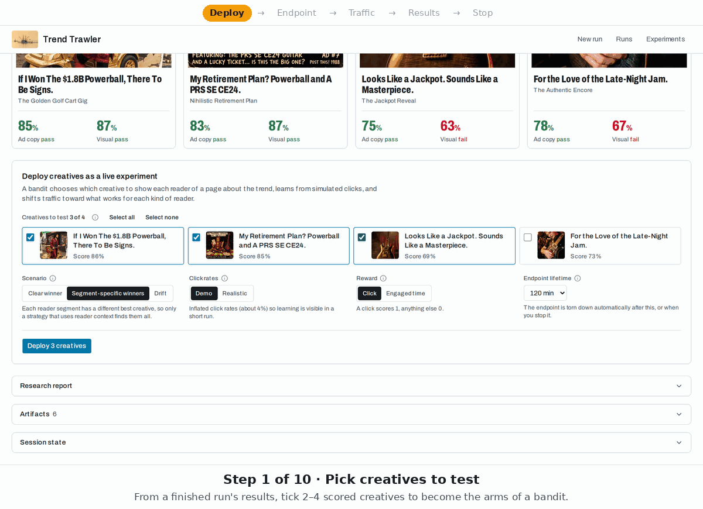
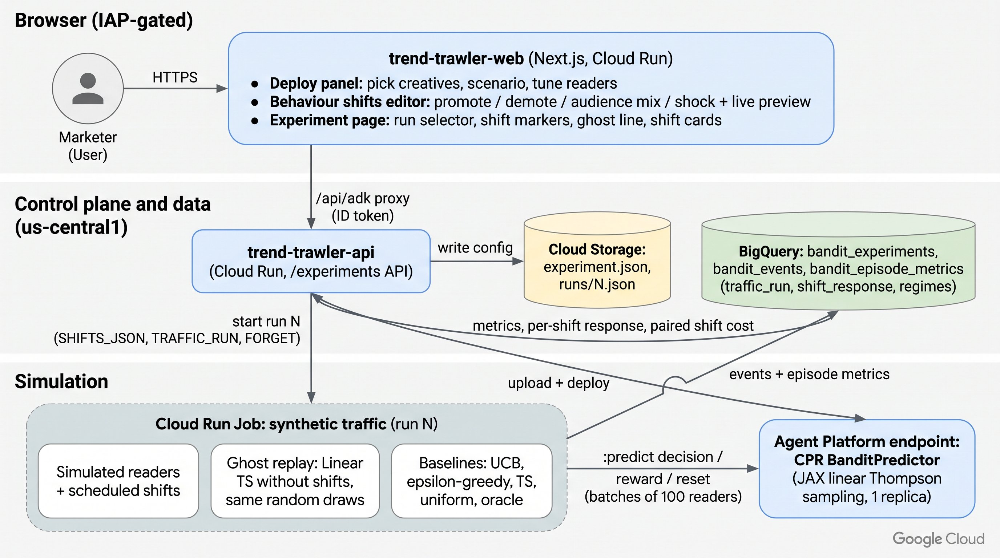
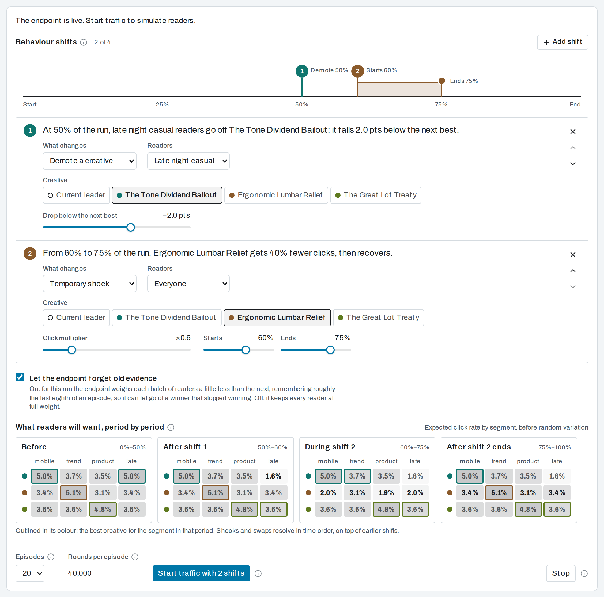
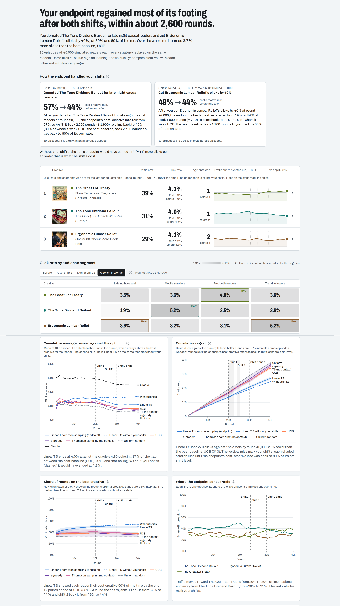

# Bandit creative experiments

A Trend Trawler creative run ends with up to four evaluated ad creatives. This feature adds an
optional step: pick 2–4 of them on the results page and deploy them as the **arms of a
contextual multi-armed bandit**. Synthetic readers then visit the page and the bandit learns
which creative to show to whom.

- **The use case:** a publisher page about the trend, with one display/native ad slot. Each
  impression carries a coarse, synthetic, OpenRTB-style context (device, daypart, region, …).
- **The policy:** disjoint **linear Thompson sampling (LinTS) written in JAX**. Each arm has its
  own Bayesian linear regression of reward on the context features.
- **Serving:** a **Custom Prediction Routine (CPR)** container on a single-replica
  Gemini Enterprise Agent Platform (Vertex AI) online endpoint. It learns online, in memory.
- **Traffic:** a **Cloud Run Job** that drives synthetic episodes at the endpoint, replays five
  baseline policies locally on the identical readers, and logs everything to BigQuery.
- **UI:** a Deploy panel on `/results/[sessionId]`, an `/experiments` list and an
  `/experiments/[experimentId]` page with hand-drawn SVG charts.

Everything is **synthetic**: no real users, real traffic or ad serving are involved. It is a
demo-grade MVP for showing how a contextual bandit behaves on the creatives a run produced, not
a production ad server (see [Limitations](#limitations-not-ha)).

<p align="center">
  
</p>
<p align="center"><em>The first live experiment (<code>0693ea62bb7144ef</code>), from the Deploy panel to Stop; the charts are its real metrics after 20 episodes (see <a href="#live-measurements">Live measurements</a>).</em></p>

**Source of truth for every interface:** [`contracts.md`](contracts.md). Implementation plan:
[`docs/plans/2026-10-02-bandit-experiments.md`](../plans/2026-10-02-bandit-experiments.md).
Offline simulation results: [`docs/experiments/bandit-simulation.md`](../experiments/bandit-simulation.md).
Deployment runbook (tables, env, IAM, traffic job): [deployment/README.md → Bandit experiments](../../deployment/README.md#bandit-experiments).

## Contents

- [Architecture](#architecture)
- [User flow](#user-flow)
- [Components and key files](#components-and-key-files)
- [Endpoint contract](#endpoint-contract)
- [Feature spec and privacy rules](#feature-spec-and-privacy-rules)
- [Synthetic readers (simulated users)](#synthetic-readers-simulated-users)
- [Scenarios](#scenarios)
- [Metrics and terminology](#metrics-and-terminology)
- [Demo vs realistic CTR modes](#demo-vs-realistic-ctr-modes)
- [Simulation results](#simulation-results)
- [Operations](#operations)
- [Live measurements](#live-measurements)
- [Limitations (not HA)](#limitations-not-ha)
- [Future work](#future-work)

## Architecture



```
 /results/[sessionId]  ── Deploy panel (pick 2–4 creatives, scenario, CTR mode, reward mode, TTL)
        │  POST /experiments            (same-origin /api/adk proxy; user-scoped, P3 authz)
        ▼
 trend-trawler-api  (runserver/experiments*.py, mounted by deployment/async_app.py)
   • snapshot arms (creative id, headline, image gs://, 12 judge scores) → experiment.json in GCS
   • bandit_experiments row in BigQuery (status machine; MERGE on experiment_id)
   • detached deploy: Model.upload(CPR image, VERTEX_CPR_WEB_CONCURRENCY=1)
       → Endpoint.create → deploy (1 replica, n2-standard-2, labels app=trend-trawler)
   • POST …/traffic → Cloud Run Job execution (EXPERIMENT_ID, CONFIG_URI, ENDPOINT_ID, EPISODES, HORIZON)
   • POST …/stop → undeploy + delete;  TTL reaper every 5 min → status "expired"
        │                                              │
        ▼                                              ▼
 Agent Platform endpoint (CPR, 1 replica)        Cloud Run Job trend-trawler-bandit-traffic
   BanditPredictor (bandit_serving/)       ◄───   per episode: reset → for each batch:
   JAX LinTS posterior, in memory                   decisions → outcome from pre-drawn coin flips
   instances: decision | reward | reset | state     → rewards; then replay ucb1, epsilon_greedy,
   checkpoints → GCS (AIP_STORAGE_URI)              beta_bernoulli_ts, uniform, oracle locally (CRN)
                                                       │
                                                       ▼
                                  BigQuery: bandit_events, bandit_episode_metrics,
                                            bandit_experiments.progress
                                                       │
        ┌──────────────────────────────────────────────┘
        ▼
 GET /experiments/{user}/{id}/metrics  (runserver/experiments_metrics.py: mean ± 95% CI bands)
        ▼
 /experiments/[experimentId]  ── SVG charts (frontend/src/components/charts/)
```

JAX runs only in the CPR image, the traffic image and the dev/test environment. The api image,
the root `requirements.txt` and the Agent Engine bundles stay JAX-free: `runserver/` never
imports `bandit/`. `runserver/experiments_metrics.py` does its own dependency-free aggregation,
and `runserver/experiments.py` duplicates the noise-variance formula, with a test checking parity.

## User flow

1. **Deploy.** On a finished `creative_agent` / `interactive_creative` run, the results page's
   **Deploy creatives as a live experiment** panel lets you pick 2–4 creatives, a scenario
   (default `segment_winners`), a CTR mode, a reward mode and an endpoint lifetime (60 / 120 /
   240 min, default 120). Submitting `POST /experiments` returns `201 {experimentId, status:
   "deploying"}` and opens the experiment page. Each user can have **one active experiment** at
   a time (`409 active_experiment` otherwise), because each holds a dedicated replica.
2. **Wait for `ready`.** The page polls the experiment. The api reconciles the status against the
   endpoint on each detail GET. Status flow: `deploying → ready → running_traffic → ready →
   stopping → stopped`, plus `failed` and `expired` (TTL).
3. **Start traffic.** Choose the number of episodes (5 / 20 / 50, default 20) and press **Start
   traffic**. The horizon defaults per scenario (`clear_winner` 20k rounds, `segment_winners` and
   `drift` 40k in demo mode; ×10, max 400k, in realistic mode). The api starts one Cloud Run Job
   execution and moves to `running_traffic`; it moves back to `ready` once the job reports
   `episodes_done >= episodes_total` or the execution finishes. That check runs on the detail
   GET, in the background on `/metrics` and `/creatives` GETs, and in the api's reaper loop
   (about every 60 s for the `running_traffic` rows it knows of, plus the 5-minute full pass),
   so the status advances even when no page is polling it.
4. **Read the charts.** Charts fill in as episodes land in `bandit_episode_metrics`
   (see [Metrics](#metrics-and-terminology)). You can start more traffic while the endpoint is `ready`.
5. **Stop or let it expire.** **Stop** undeploys the model and deletes the endpoint (the request
   returns `stopped` if teardown finishes within 2 s, otherwise `stopping`). If you forget, the
   TTL reaper tears it down at `ttl_expires_at` and marks it `expired`. The experiment row and
   its metrics stay in BigQuery, so the page and the charts remain viewable.


Also see [the deploy panel](../screenshots/10-deploy-panel.png) and [the experiments
list](../screenshots/11-experiments.png).

## Components and key files

**Core (`bandit/`, JAX, dev group only):**
- `bandit/config.py`: `ArmSpec`, `LinTSParams`, `ExperimentConfig`, `experiment.json` load/dump, calibrated `default_noise_var`, `reward_scale`.
- `bandit/features.py`: `ctx-v1` context encoding (d = 19), sensitive-key rejection.
- `bandit/linear_ts.py`: pure, jit-able LinTS (`init_state`, `select`, `propensities`, `update` with optional discount).
- `bandit/baselines.py` / `bandit/policies.py`: UCB1, ε-greedy, Beta-Bernoulli TS, uniform, oracle; the `name:key=value` policy-spec registry.
- `bandit/environment.py` + `bandit/scenarios/*.yaml`: synthetic logistic ground truth with latent segments, calibrated to the scenario's target CTR.
- `bandit/simulate.py` / `bandit/metrics.py` / `bandit/aggregate.py`: offline simulator (common random numbers), per-episode metrics, cross-episode aggregation (stdlib only).
- `bandit/cli.py`: `python -m bandit.cli simulate`.

**Serving (`bandit_serving/`):**
- `bandit_serving/predictor.py`: the CPR `BanditPredictor` (contracts §2 / §7). See [`bandit_serving/README.md`](../../bandit_serving/README.md).

**Traffic (`bandit_traffic/`):**
- `bandit_traffic/main.py`: Cloud Run Job entrypoint and local CLI.
- `bandit_traffic/traffic.py`: the episode loop (reset → decision/reward batches → local baseline replay → rows).
- `bandit_traffic/endpoint_client.py` / `bandit_traffic/fake_endpoint.py`: Vertex, local-URL and in-process endpoint clients.
- `bandit_traffic/bq.py`: row builders plus BigQuery and JSONL writers.

**API (`runserver/`):**
- `runserver/experiments.py`: `/experiments` REST routes, status machine, arm snapshot, TTL reconcile/reaper, `BANDIT_DEPLOY_MODE`.
- `runserver/experiments_store.py`: BigQuery MERGE store (and the in-memory store for fake mode).
- `runserver/experiments_deploy.py`: `VertexDeployer` / `FakeDeployer`.
- `runserver/experiments_jobs.py`: `CloudRunJobsRunner` / `FakeJobsRunner`.
- `runserver/experiments_metrics.py`: pure aggregation of `bandit_episode_metrics` into `ExperimentMetrics`.
- `runserver/authz.py`: user-scoping for `/experiments/{user}/…` (plus `authorize_body_user` on the create POST).

**Deployment (`deployment/bandit/`):**
- `deployment/bandit/build_image.py`: build, local-test and push the CPR image.
- `deployment/bandit/endpoint.py`: model upload and endpoint deploy/undeploy/delete (library plus manual CLI).
- `deployment/bandit/cloudbuild.traffic.yaml` / `deployment/bandit/deploy_traffic_job.sh`: build and deploy the traffic job.
- `deployment/create_bq_tables.sh`: also creates the three `bandit_*` tables.

**Frontend (`frontend/src/`):**
- `app/results/[sessionId]/deploy-panel.tsx`: the Deploy panel.
- `app/experiments/page.tsx`: experiments list.
- `app/experiments/[experimentId]/page.tsx` + `experiment-charts.tsx`: controls, arms and charts.
- `lib/experiments.ts`: API client, polling, status/TTL helpers, series shaping.
- `lib/chart.ts`: scales, ticks, paths and downsampling for the SVG charts.
- `components/charts/line-chart.tsx` / `bar-chart.tsx`, `components/experiment-status.tsx`: chart and status components.
- `lib/user-scoping.ts`: proxy allowlist for the experiment routes.

**Tests:** `tests/test_bandit_*.py`, `tests/test_experiment*_*.py`, `tests/test_build_image.py`,
`tests/test_create_bq_tables.py`; Vitest `experiments.test.ts`, `chart.test.ts`,
`deploy-selection.test.ts`, `user-scoping.test.ts`.

## Endpoint contract

Everything goes through the standard `POST …:predict` route as typed instances
(`{"instances": [...], "parameters": {...}}` → `{"predictions": [...]}`, in order, one per
instance; a bad instance returns a per-instance `error` without failing the batch). Custom
routes are not used because `invokeRoutePrefix` is preview-only and disables `:predict`.

| `type` | Purpose | Key fields |
|---|---|---|
| `decision` | Choose a creative for one impression | in: `request_id`, `ts`, `context`, `eligible_arms?`; out: `chosen_arm`, `propensity`, `arm_probabilities`, `explored`, `model_version` |
| `reward` | Report the outcome of a pending decision | in: `request_id`, `arm`, `reward` (unscaled), `clicked`, `dwell_s?`; out: `accepted` |
| `reset` | Start an episode from a fresh prior | in: `episode`, `seed`, `discount?` (per-run forgetting) |
| `state` | Inspect the posterior | out: `pulls`, `posterior_mean`, `feature_spec_version`, `step` |

Full field lists, `parameters` bounds and request-id conventions are in
[contracts §2](contracts.md#2-endpoint-instances-cpr-banditpredictor-pr-2-client-in-pr-3). Validation,
reward acceptance, `model_version`, and checkpoint behaviour are in
[contracts §7](contracts.md#7-pr-1--pr-2-decisions-2026-10-02). The REST API is
[§5](contracts.md#5-rest-api-runserverexperimentspy-pr-4-client-frontendsrclibexperimentsts-pr-5)
and the BigQuery schemas are [§3](contracts.md#3-bigquery-tables-ddl-in-deploymentcreate_bq_tablessh-pr-4-written-by-pr-3-and-pr-4).

## Feature spec and privacy rules

The context ([contracts §4](contracts.md#4-context-object-decision-context-bandit_eventscontext))
has exactly 10 coarse keys, one-hot encoded with the first level of each group dropped, plus a
bias term: **d = 19** (`FEATURE_SPEC_VERSION = "ctx-v1"`).

| Key | Levels |
|---|---|
| `devicetype` | mobile, desktop, tablet |
| `os` | ios, android, other |
| `connectiontype` | wifi, cellular |
| `region` | northeast, midwest, south, west (census region) |
| `age_bucket` | 21-34, 35-54, 55+ |
| `daypart` | morning, afternoon, evening, night |
| `weekend`, `topic_matches_trend`, `interest_matches_product` | true / false |
| `freq_24h` | 0, 1, 2+ (an integer ≥ 2 maps to `2+`) |

Rules, enforced by `bandit.features.encode_context` (missing, unknown or sensitive keys and
unknown levels raise `ValueError`, which the endpoint returns as a per-instance error):

- **Synthetic only.** Every context is drawn from the scenario's segment marginals by the
  traffic job or the simulator. Nothing comes from real users.
- **Coarse only.** No user, device or advertising IDs, cookies, email, phone or names; no IP
  addresses, latitude/longitude, ZIP code or city; no sensitive categories
  (`bandit.features.SENSITIVE_KEYS`).
- **Adults only.** The youngest age bucket is 21-34, so every simulated reader is 21+. That
  covers alcohol brands by construction; there is no under-21 level to opt out of.

## Synthetic readers (simulated users)

Every "user" in a bandit experiment is a **synthetic reader** of the trend's publisher page.
Readers are **defined** in YAML and Python under `bandit/` and **generated** fresh for every
batch by the traffic job (or the offline simulator). From the UI you can change *how many of
each kind* there are and how they behave over time, but not define new kinds of readers or
change their attributes.

### Where readers are defined

| Layer | Where | What it defines |
|---|---|---|
| Attributes every reader has | `bandit/features.py` → `CONTEXT_SPEC` (`ctx-v1`) | The 10 coarse ad-request fields in the table above (device, OS, connection, census region, age band 21+, daypart, weekend, topic-matches-trend, interest-matches-product, ad frequency). Privacy-safe by construction: no IDs, location or IP, and sensitive keys are rejected. |
| Default attribute mix | `bandit/config.py` → `BASE_MARGINALS` | Population-wide probabilities per attribute (e.g. 60% mobile, 32% desktop, 8% tablet; 2/7 weekend). |
| Reader segments, per scenario | `bandit/scenarios/*.yaml` → `segments:` (`bandit.config.SegmentSpec`) | Each segment has a `name`, a `weight` (share of readers), `marginals` that override the defaults (e.g. `mobile_scrollers` are 95% mobile), a `dwell_factor` (engaged-time reward), and in `segment_winners` a `winner_key`: the creative-eval dimension (e.g. `stopping_power`, `trend_authenticity`, `audience_fit`) that picks the segment's best creative. |
| How each reader responds to each creative | `bandit/environment.py` → `build_true_model` | Each reader's click probability per creative: a logistic model built from the creatives' eval-judge scores, the segment's affinity, and attribute × creative interactions, calibrated so the average click rate hits the scenario's `target_ctr`. That is about 4–4.7% in demo mode and about 0.8–0.9% in realistic mode. |

Current segments:

| Scenario | Segments |
|---|---|
| `clear_winner`, `drift` | `commuters`, `desk_researchers`, `evening_browsers` |
| `segment_winners` | `mobile_scrollers`, `trend_followers`, `product_intenders`, `late_night_casual` |

### How readers are generated

`bandit/environment.py` → `sample_contexts()`, called once per batch (100 readers by default)
from `bandit.simulate.batch_draws` inside the traffic job (`bandit_traffic/traffic.py`):

1. **Segment.** Each reader is assigned a hidden segment, drawn from the segment weights (after
   any audience-mix override or mix shift active at that round).
2. **Attributes.** Each of the 10 attributes is drawn from that segment's probabilities (the
   segment's `marginals`, falling back to `BASE_MARGINALS`).
3. **Encoding.** The attributes are encoded into the endpoint's 19 features. The endpoint only
   ever sees the attributes, never the segment.
4. **Response.** Each reader's true click probability for every creative comes from the true
   model (with any shift active at that round applied). Whether they click is a weighted coin
   flip on the probability for the creative shown. In engaged-time mode, a click also earns a
   random dwell time.

All randomness is keyed per episode and batch (`jax.random.fold_in`), with fixed-shape draws.
So the endpoint, every baseline and the "without your shifts" ghost see exactly the same
readers and coin flips. Changing the audience mix or click rates only changes which segment or
click outcome a given draw produces, never which draws happen. That keeps the comparisons
paired (common random numbers).

### What you can configure from the UI

| Where | Control | Effect on readers |
|---|---|---|
| Results page → Deploy panel | **Scenario** | Which segment set is used (above). |
| Deploy panel | **Click rates** (demo / realistic) | Their overall click level (`target_ctr`) and the default run length. |
| Deploy panel | **Reward** (click / engaged time) | Whether dwell time counts; segments' `dwell_factor` scales it. |
| Deploy panel → Advanced | **Audience mix** sliders | Each segment's share of readers (`scenario_overrides.segment_mix`, [contracts §9](contracts.md)). |
| Deploy panel → Advanced | Gap between creatives, judge reliability, random variation, drift point | How strongly segments prefer particular creatives, how much the judge's scores predict real clicks, and how noisy responses are. |
| Experiment page → Behaviour shifts | **Mix shift**, promote / demote for a segment, temporary shock | Changes to the audience mix or a segment's preferences partway through a traffic run ([Scripted behaviour shifts](#scripted-behaviour-shifts), contracts §10). |

### What needs YAML or code changes

- **Segment definitions:** adding, renaming or removing segments, or changing how many a
  scenario has. Edit `bandit/scenarios/<scenario>.yaml`. The api duplicates the per-scenario
  segment names and counts (`runserver/experiments.py` `SCENARIO_SEGMENT_NAMES`,
  `SCENARIO_SEGMENTS`) under parity tests, and the frontend preview reads
  `frontend/src/lib/scenario-presets.generated.json` (regenerate it with
  `uv run python scripts/gen_scenario_presets.py`), so update those in the same PR.
- **A segment's attribute mix** (e.g. "trend followers are 60% desktop, mostly evenings"):
  the segment's `marginals` in the YAML.
- **Dwell behaviour and preferred creative trait:** `dwell_factor` and `winner_key` in the YAML.
- **The attribute set itself** (`ctx-v1`). Adding or changing a field changes the endpoint's
  feature dimension. That needs a new `FEATURE_SPEC_VERSION`, contract updates (§1/§4),
  predictor and traffic image rebuilds, and fresh endpoints.

A UI segment editor (per-segment attribute mix, renaming, one custom segment, with the live
preview) is listed under [Future work](#future-work).

## Scenarios

Each scenario is a YAML preset in `bandit/scenarios/`. Ground truth is a logistic click model
with a latent segment; arm effects come from the creatives' judge scores, and the base rate is
calibrated to the scenario's target CTR.

| Scenario | Ground truth | Default arms / horizon (demo) | What it demonstrates |
|---|---|---|---|
| `clear_winner` | One creative wins everywhere (6.0 / 4.5 / 3.5 % demo CTR, ranked by judge score) | 3 / 20k | The classic convergence curve. Non-contextual policies do best here; LinTS pays for fitting 19 coefficients per arm when context carries no signal |
| `segment_winners` | Four segments (mobile scrollers, trend followers, product intenders, late-night casual), each with a different oracle creative (+1.5 pp demo) picked by a different judge dimension | 4 / 40k | Why context matters: pooled CTRs are nearly equal, so only a contextual policy can beat chance |
| `drift` | `clear_winner` whose best arm becomes the worst at T/2 (abrupt; a `gradual` variant exists in the CLI) | 3 / 40k | Non-stationarity: how quickly each policy notices; why LinTS needs a discount (`linear_ts:discount=0.98`) |

**Scenario overrides** ([contracts §9](contracts.md#9-scenario-overrides-experimentjson-scenario_overrides-2026-10-04)).
An experiment can tune its preset without a new YAML file. `experiment.json` takes an optional
`scenario_overrides` object with any of these fields:
- `segment_mix`: the audience mix;
- `gap_scale`: the gap between creatives;
- `judge_wrong`: how much the judge's scores mislead (0 right, 0.5 uninformative, 1 reversed);
- `noise_scale`: the scenario noise;
- `drift_at_frac`: the drift point (`drift` only).

`bandit.config.resolve_scenario(cfg)` applies the overrides to the preset. The traffic job
simulates that resolved scenario, and its baselines share it. The key is omitted when no override
is set, so default configs serialise exactly as before. The episode keys still come from the
scenario name, so a tuned experiment sees the same random draws as its preset. The CLI exposes the
same knobs with the same bounds: `--segment-mix`, `--gap-scale`, `--judge-wrong`, `--noise-scale`
and `--drift-at`.

### Scripted behaviour shifts

Each **Start traffic** can carry a script of up to four shifts in what the simulated readers want
([contracts §10](contracts.md#10-scripted-behaviour-shifts-per-traffic-run-2026-10-05)): promote a
challenger, demote a creative (or the current leader), change the audience mix, or a temporary
shock to one creative's clicks. The shift editor sits above **Start traffic** on the experiment
page: a timeline of the run with one draggable pin per shift, an **Add shift** menu (the four kinds
plus three ready-made shifts: demote the leader at halfway, a mobile surge at 30%, ad fatigue on
the leader from 60% to 75%), one plain-language sentence per shift, and a live preview of the
expected click rate per creative × segment in every period between shifts (a port of the
simulator's shift resolution, golden-tested against `bandit`). **Let the endpoint forget old
evidence** is on by default when there are shifts.

Shifts apply to the endpoint and every replayed baseline alike. A **ghost line** (dashed, "Linear TS
without your shifts") replays Linear TS on the same readers without them, so the gap is what the
shifts cost. Each traffic run is numbered; the run picker (`?run=N`) switches between them. With
shifts, the charts switch to a linear round axis with a rule at each shift (and a shaded recovery
stretch on regret), the Overview gets one result card per shift (best-creative rate before and
after, rounds until its best-creative rate was back to 80% of the pre-shift level, episodes and a 95% interval, "Too early to
call" under five episodes), and every per-segment view (scoreboard click rate and segments won,
the segment grid, the creative drawer, the winners and click-rate tables) reads one period at a
time instead of blending the whole run.





## Metrics and terminology

**Terminology** (as in [contracts](contracts.md)):
- **round:** one impression and one decision.
- **batch:** the rounds between two posterior updates (default `batch_size` 100).
- **horizon (T):** the number of rounds per episode.
- **episode:** one independent run from a reset posterior, with its own seed. Every policy in an
  episode sees the same readers and the same coin flips (common random numbers), so policy
  differences are paired.

**Metrics** (definitions in `bandit/metrics.py`; aggregation in `bandit/aggregate.py` and
`runserver/experiments_metrics.py`):
- **Cumulative average reward** R(t)/t, plotted on a log x-axis against the oracle.
- **Pseudo-regret** Σ (μ\*ᵢ − μ_{aᵢ,i}): the gap in *true expected* reward between the
  optimal and chosen arm, summed over rounds. Non-decreasing and noise-free; this is the
  `cumulative_regret` everywhere, including the charts.
- **Realized regret** Σ (r\*ᵢ − rᵢ): the same on realized rewards (the optimal arm's outcome
  under the same coin flips). Noisier; recorded in simulator rows only.
- **% optimal:** the fraction of rounds where the chosen arm was that round's optimal arm
  (overall, cumulative in the curve, and per segment).
- **Arm share:** each arm's share of LinTS pulls in each checkpoint window (about 50 log-spaced
  checkpoints shared by all policies and episodes).
- **Per-segment:** each latent segment's optimal arm, plus each policy's % optimal and average
  reward within it.
- **Expected total reward ± std:** total reward per episode, mean ± standard deviation across
  episodes, per policy.
- **Steps to converge:** the first round where a trailing moving average of reward reaches the
  trailing optimum (window `clamp(T/10, 10, 2000)`). Noisy; read it with regret and % optimal.
- **Arm stats:** impressions and estimated vs true CTR per arm.

Curves on the experiment page are mean ± 95% CI bands across episodes. Rewards are `click`
(0/1, default) or `engaged` (click × dwell seconds; policies see it divided by the scenario's
30 s `dwell_base_s`).

## Demo vs realistic CTR modes

| Mode | Mean CTR | Horizons | Use |
|---|---|---|---|
| `demo` (default) | about 4 % (e.g. 6.0 / 4.5 / 3.5 % in `clear_winner`) | 20k–40k | Learning is visible in minutes |
| `realistic` | about 0.8 % (gaps ×0.2) | about 10× longer (200k–400k) | Closer to real display-ad rates |

**Demo CTRs are deliberately inflated** well above real display/native ad rates so that the
bandit learns within a short demo; do not read demo numbers as expected real-world lift. The UI
says so on the Deploy panel and the experiment page. LinTS's noise variance is calibrated to each
mode's target CTR (`p(1−p)` for click; see contracts §7).

## Simulation results

From the exploration sweep in [docs/experiments/bandit-simulation.md](../experiments/bandit-simulation.md#exploration-sweep)
(demo mode, click reward, each scenario's preset arm count, 30 episodes; final pseudo-regret,
LinTS with the endpoint's defaults: `exploration_scale` 0.5, γ = 0.98 in `drift`):

| Scenario | LinTS | LinTS before (s = 1.0) | UCB1 | ε-greedy | BB-TS | uniform |
|---|---|---|---|---|---|---|
| `clear_winner` (3 arms, T = 20k) | 129 | 154 | 39 | 47 | 31 | 273 |
| `segment_winners` (4 arms, T = 40k) | **311** | 325 | 474 | 478 | 478 | 482 |
| `drift` (3 arms, T = 40k) | 422 | 513 (694 with no discount) | 159 | 705 | 466 | 784 |

(Realistic mode, both arm counts, the discount sweep and the variance checks behind
`exploration_scale` 0.5 are on that page.)

- **LinTS wins when context matters.** In `segment_winners` it has 34 % less regret than
  the best non-contextual policy, and 34–53 % less across both ctr modes and arm counts.
- **LinTS over-explores when it doesn't.** In `clear_winner` it has about 4× the regret of
  Beta-Bernoulli TS: 19 coefficients per arm with no contextual signal keep its posterior wide.
  Halving the posterior-draw scale (1.0 → 0.5) cut that regret by 13–26 % without making
  any run lock onto a wrong creative.
- **LinTS is slow on drift without a discount.** Discounting (γ = 0.98 per batch) plus the
  lower exploration cuts drift regret from 694 to 422, level with Beta-Bernoulli TS (466,
  within its wide CI); UCB1's log t bonus still recovers fastest. Drift endpoints are
  deployed with that discount (γ = 0.98 demo, 0.998 realistic; contracts §7), but no tuning
  makes LinTS beat UCB1 there, and the results page says why when the endpoint trails.

Figures: [cumulative average reward](../../experiments/bandit/figures/01_cum_avg_reward.png),
[UCB small multiplier](../../experiments/bandit/figures/02_ucb_small_multiplier.png),
[per-segment users](../../experiments/bandit/figures/03_segment_users.png),
[expected total reward](../../experiments/bandit/figures/04_expected_total_reward.png),
[arm impressions and CTR](../../experiments/bandit/figures/05_arm_impressions_ctr.png),
[cumulative regret](../../experiments/bandit/figures/06_cum_regret.png),
[% optimal](../../experiments/bandit/figures/07_pct_optimal.png),
[drift recovery](../../experiments/bandit/figures/08_drift_recovery.png),
[arm injection](../../experiments/bandit/figures/09_arm_injection.png).

## Operations

### Environment

api service (full table: [deployment/README.md → Bandit experiments](../../deployment/README.md#bandit-experiments)):

| Variable | Default | Meaning |
|---|---|---|
| `BANDIT_DEPLOY_MODE` | `vertex` | `vertex` (BigQuery + Vertex endpoint + Cloud Run Job) or `fake` (in-memory, local dev). `vertex` falls back to `fake` with a warning when `BQ_PROJECT_ID` / `BQ_DATASET_ID` / a bucket are unset |
| `BANDIT_SERVING_IMAGE` | required in `vertex` mode | CPR image URI |
| `BANDIT_ARTIFACTS_PREFIX` | `gs://$GOOGLE_CLOUD_STORAGE_BUCKET/bandit` | Where `{experiment_id}/experiment.json` and `checkpoints/` live |
| `BANDIT_TRAFFIC_JOB` | `trend-trawler-bandit-traffic` | Cloud Run Job name (in `GCP_REGION`) |
| `BANDIT_TTL_MINUTES` | `120` | Default endpoint lifetime (a request's `ttlMinutes` is clamped to 10–480) |
| `BANDIT_ENDPOINT_SA` | Vertex default | Service account the deployed model runs as |
| `BANDIT_FAKE_DEPLOY_SECONDS` | `2` | Fake-mode deploy delay |
| `BQ_TABLE_BANDIT_EXPERIMENTS` / `_EVENTS` / `_METRICS` | `bandit_experiments` / `bandit_events` / `bandit_episode_metrics` | Table names in `BQ_DATASET_ID` |

The CPR container's own variables (`BANDIT_CHECKPOINT_EVERY`, `BANDIT_CHECKPOINT_SECONDS`,
`BANDIT_MAX_PENDING`, `BANDIT_MAX_SEEN`, `BANDIT_WARMUP*`) are in
[`bandit_serving/README.md`](../../bandit_serving/README.md#environment); the traffic job's
(`EXPERIMENT_ID`, `CONFIG_URI`, `ENDPOINT_ID`, `EPISODES`, `HORIZON`, `SHIFTS_JSON`, `TRAFFIC_RUN`,
`FORGET`, `ERROR_THRESHOLD`, …) are
in the [deployment guide](../../deployment/README.md#traffic-job-bandit_traffic).

### IAM

Two service accounts (`tt-bandit-endpoint-sa`, `tt-bandit-traffic-sa`) plus extra grants on
`tt-api-sa`: see [deployment/README.md → IAM](../../deployment/README.md#iam-documentation-only-run-where-gcp-creds-exist).

### CPR image

```bash
uv run python deployment/bandit/build_image.py --local-test   # build + docker round-trip (no GCP)
uv run python deployment/bandit/build_image.py --push         # build + push to Artifact Registry
# tag: us-central1-docker.pkg.dev/$GOOGLE_CLOUD_PROJECT/cpr/trend-trawler-bandit:<git-sha>
```

Set the pushed URI as `BANDIT_SERVING_IMAGE` on the api service.

### Traffic job

```bash
gcloud builds submit --config deployment/bandit/cloudbuild.traffic.yaml \
  --substitutions=SHORT_SHA=$(git rev-parse --short HEAD) .
IMAGE_TAG=$(git rev-parse --short HEAD) BQ_DATASET_ID=trend_trawler \
  deployment/bandit/deploy_traffic_job.sh
```

### Local development without GCP

```bash
# api with fake experiments backend (in-memory store, fake endpoint, fake job)
BANDIT_DEPLOY_MODE=fake TRUST_CLIENT_USER_ID=1 SESSION_SERVICE_URI=memory:// \
  ALLOW_ORIGINS=http://localhost:3000 uv run uvicorn deployment.async_app:app --port 8000
cd frontend && npm run dev

# traffic loop end to end against an in-process fake endpoint, JSONL instead of BigQuery
uv run python -m bandit_traffic.main --in-process --config /tmp/experiment.json \
  --episodes 2 --horizon 4000 --dry-run --out /tmp/traffic

# offline simulator
uv run python -m bandit.cli simulate --scenario segment_winners --episodes 10 --out /tmp/sim.json
```

Fake mode exercises the whole lifecycle (deploy → ready → traffic → ready → stop) but its job
runner writes no metrics, so the charts stay empty; use the traffic dry-run or the simulator to
see numbers. You still need a finished creative run in the session store to deploy from.

### Cost and teardown

- While an experiment is `ready` or `running_traffic`, its endpoint holds **one always-on
  `n2-standard-2` replica**, billed whether or not traffic is running. The traffic job is billed
  only while an execution runs.
- Every endpoint has a TTL (default **120 minutes**; 60 / 120 / 240 in the UI). **Stop** tears it
  down immediately; the reaper (every 5 minutes) tears down anything past its TTL.
- Every model and endpoint is labelled `app=trend-trawler,experiment=<id>`. Find strays with:

  ```bash
  gcloud ai endpoints list --region us-central1 --filter=labels.app=trend-trawler
  gcloud ai models list --region us-central1 --filter=labels.app=trend-trawler
  ```

  and remove one with `python -m deployment.bandit.endpoint --delete --endpoint=<resource name>`
  (idempotent: undeploys everything, deletes the endpoint and its deployed models; add
  `--model=<resource name>` for a model that was uploaded but never deployed).

## Live measurements

<!-- LIVE-MEASUREMENTS -->
Measured on the first live rollout, 2026-10-02 (experiment `0693ea62bb7144ef`: 3 PRS creatives,
`segment_winners`, demo click rates, click reward; serving image `trend-trawler-bandit:06f4717`).

| Measurement | Value |
|---|---|
| Deploy time (POST → `ready`) | **~11 min**: model upload ~3 min, endpoint create a few seconds, model deploy ~7.5 min |
| Decision latency, server side (`latency_ms`, per batch of 100) | **p50 13.5 ms / p95 26.3 ms** (mean 15.2 ms over 800,000 decisions) |
| Client round trip (`:predict`, small request) | ~85–100 ms warm, ~235 ms cold |
| Traffic job wall time (20 episodes × 40,000 rounds) | **~23 min**: ~3.5 min to provision the first execution, then ~1 min per episode |
| Endpoint cost | One n2-standard-2 replica, billed while deployed. That was ~35 min of deployed time for this run; see [Vertex AI pricing](https://cloud.google.com/vertex-ai/pricing) for the current hourly rate |
| Teardown time (Stop → endpoint and model deleted) | **~2 s** (UndeployModel → DeleteEndpoint → DeleteModel) |

**Result** (mean over 20 episodes): Linear TS on the endpoint had cumulative regret **257** and chose
each reader's optimal creative **56%** of the time (1,760 clicks per episode). The best baseline,
ε-greedy, had regret 335 and 42% optimal; non-contextual TS 345 / 41%; UCB 351 / 40%; uniform 403 / 33%;
the oracle collected 2,028 clicks. Linear TS had the lowest regret in every episode.
<!-- /LIVE-MEASUREMENTS -->

## Limitations (not HA)

- **Single replica, single worker.** The posterior lives in one process's memory, so the
  container must run with **`VERTEX_CPR_WEB_CONCURRENCY=1`** (CPR otherwise starts
  `max(cores, 2)` workers, each learning from its own slice of rewards) on exactly one replica.
  There is no autoscaling and no failover.
- **Checkpoints, not durability.** The posterior is checkpointed to GCS every 50 reward batches or
  120 s and on every reset, and restored on restart. **Pending decisions and seen reward IDs are
  not checkpointed**, so a restart loses up to one checkpoint interval of learning and rejects
  rewards for decisions made before it (`accepted:false`).
- **Online learning on the serving path.** Decisions and updates share one process; a slow update
  delays decisions.
- **Immediate rewards.** Rewards arrive once per batch, right after that batch's decisions; there
  is no attribution delay.
- **Model misspecification by design.** The truth is logistic with a latent segment; LinTS fits a
  linear-Gaussian model on observable context only.
- **Propensities are approximate.** Logged propensities are Monte Carlo estimates, floored at
  `min_propensity` (0.02); the selection itself isn't floored.

## Future work

- **Segment editor in the UI:** edit each segment's attribute mix, rename segments or add one custom segment from the Deploy panel, carried as a scenario override with the live preview (see [Synthetic readers](#synthetic-readers-simulated-users)).

- **Reward delay and attribution windows:** delayed clicks and conversions, and how the
  attribution window trades bias for latency.
- **Production pattern:** a stateless decision endpoint that reads a published posterior, plus a
  separate learner job that consumes logged rewards and publishes new versions, which removes
  the single-replica constraint.
- **Off-policy evaluation:** IPS, SNIPS and doubly robust estimators from the logged
  `bandit_events.propensity`, to evaluate new policies without deploying them.
- **Logistic Thompson sampling:** a model that matches the click likelihood.
- **Creative fatigue:** a `freq_24h`-dependent decay in the ground truth and policy.
- **Experiments from the internal reference notebooks:** reward-delay sweeps and
  steps-to-converge vs the number of arms K.
