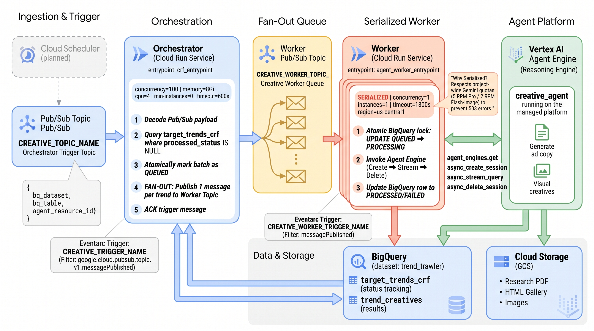
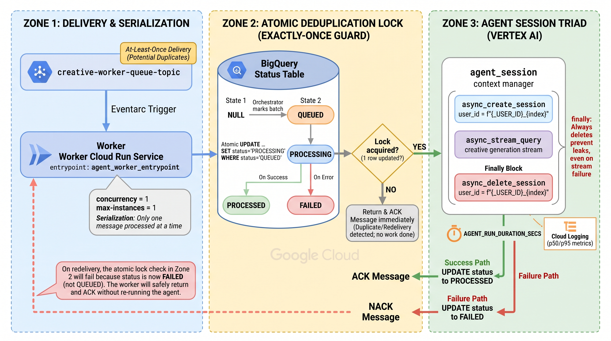
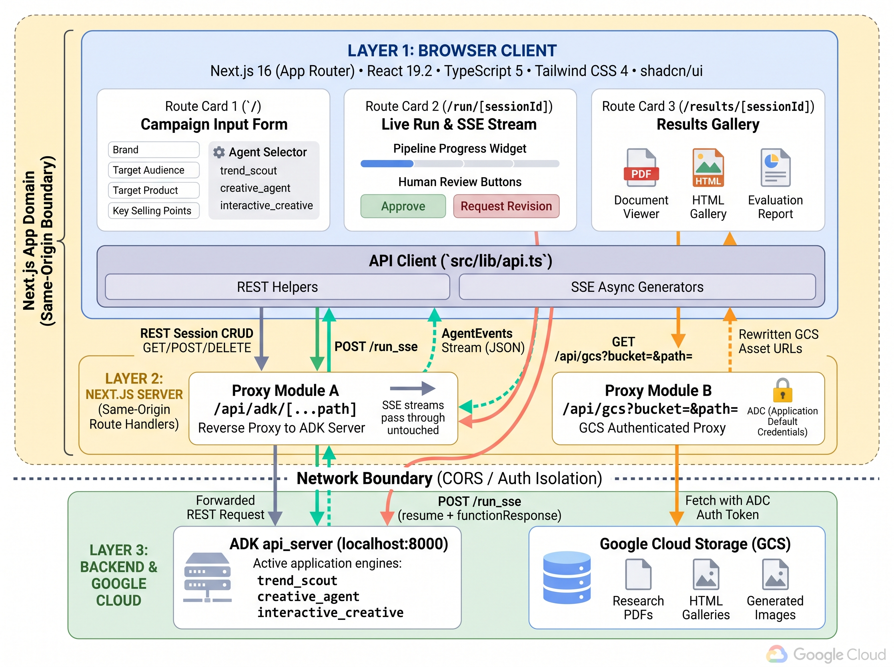
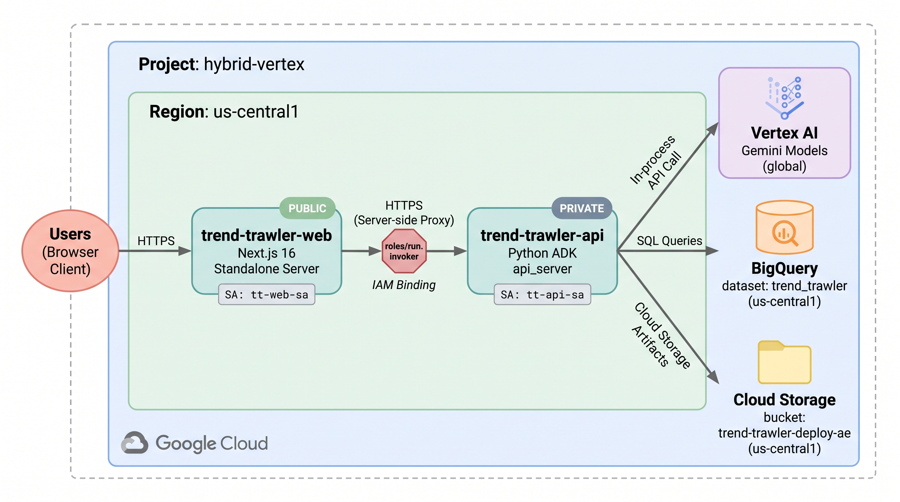
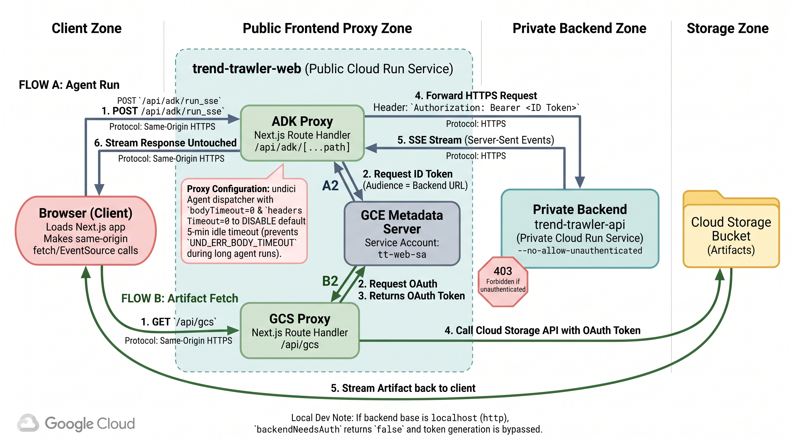
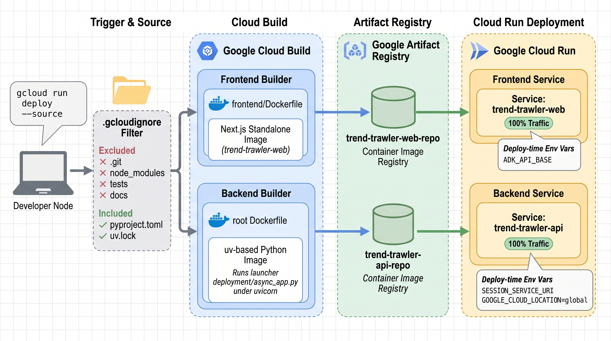

# Agent Architecture Diagrams

Per-agent ADK architecture diagrams generated with the PaperBanana MCP pipeline
(`gemini-3.1-flash-image`), in the style of official Google Cloud documentation.
Each shows the multi-agent tree (Sequential/Parallel composition, `AgentTool`
wrapping) and the per-agent tooling.

| Diagram | Agent | Highlights |
|---|---|---|
|  | `trend_scout/` | Root orchestrator → 3 `AgentTool` sub-agents (gather → understand → pick) → flat persistence tools; shared session state; BigQuery + GCS sinks |
|  | `creative_agent/` | Nested `SequentialAgent` research pipeline with a `ParallelAgent` fan-out (trend + campaign branches → merge); ad-copy pipeline; visual pipeline (art_director → drafter → critic → finalizer → image gen); LLM-judge; all sinks |
|  | `creative_eval/` | LLM-as-judge: `evaluate_all_creatives` → `ThreadPoolExecutor` concurrent fan-out to N Gemini judges → 6 ad-copy + 6 visual dims → `EvaluationSummary` → `CreativeEvaluationReport` → GCS JSON + BigQuery `creative_evals` (join on `creative_uuid`) |

## Infrastructure Diagrams

Event-driven orchestration diagrams for the Cloud Run functions + Eventarc
triggers (`cloud_functions/creative_fanout/`) and how they interact with the
Vertex AI Agent Engine.

| Diagram | Scope | Highlights |
|---|---|---|
|  | System (breadth) | Pub/Sub trigger → **Eventarc** → Orchestrator (`crf_entrypoint`, concurrency=100) queries BigQuery + marks `QUEUED` → **fans out** one worker message per trend → **Eventarc** → serialized Worker (`agent_worker_entrypoint`, concurrency=1 / max-instances=1 for project-wide Gemini quota) → **Vertex AI Agent Engine** (`creative_agent`) → BigQuery + GCS |
|  | Worker (depth) | How one worker turns Pub/Sub **at-least-once** delivery into **exactly-once** processing: atomic BigQuery lock (`NULL→QUEUED→PROCESSING→PROCESSED/FAILED`), duplicate-redelivery short-circuit (return + ACK), the `agent_session` create→stream→delete triad (same `user_id`, delete always in `finally`), and the ACK-success / NACK-retry semantics |

## Frontend Diagrams

The Next.js web app (`frontend/`), how it connects to the ADK backend, and how it is served.

| Diagram | Scope | Highlights |
|---|---|---|
|  | App architecture + request flow | Next.js 16 App Router client (React 19, Tailwind 4, shadcn/ui) — form `/`, live run view `/run/[sessionId]` that **polls** the async-job `/runs` API, results `/results/[sessionId]` — talks only to same-origin Route Handlers: `/api/adk/[...path]` reverse-proxies REST session CRUD and the async-job `/runs` kick-off/poll/resume endpoints to the backend launcher `deployment/async_app.py` (serving `trend_scout`, `creative_agent`, `interactive_creative`); `/api/gcs` uses **ADC** to proxy Cloud Storage artifacts. Same-origin boundary avoids CORS + Cloud Workstations port-auth |
|  | Serving + Cloud Run deployment | **Current (dev):** one Cloud Workstations VM runs `next dev` (:3000) + the `deployment/async_app.py` launcher under uvicorn (:8000) side by side, bridged by the same-origin proxy. **Target (Cloud Run, implemented):** two Cloud Run services — a containerized Next.js frontend (`trend-trawler-web`) whose `ADK_API_BASE` points at a private backend (`trend-trawler-api`, the `async_app` launcher), reached via a metadata-server ID token (IAM `run.invoker`); `/api/gcs` uses ADC; shared GCS + BigQuery in `us-central1`. The backend runs `--no-cpu-throttling --min-instances 1` so detached runs keep CPU. Runbook in [`deployment/README.md`](../../deployment/README.md#frontend--api_server-on-cloud-run). The frontend is **IAP-gated** (domain-restricted). Includes a cross-reference to the batch fan-out (CRF) diagrams |

### Live Cloud Run Deployment

The as-built two-service Cloud Run deployment (project `hybrid-vertex`, `us-central1`),
captured from three angles. Complements `frontend_cloudrun_deployment.png` above (which
contrasts the dev workstation vs. the Cloud Run target) with the detail of the live system.

| Diagram | Scope | Highlights |
|---|---|---|
|  | Deployment topology (what runs where) | **IAP-gated** public `trend-trawler-web` (Next.js standalone, SA `tt-web-sa`) → `roles/run.invoker` → private `trend-trawler-api` (the `deployment/async_app.py` launcher, SA `tt-api-sa`, `--no-cpu-throttling --min-instances 1`); the backend calls **Vertex AI** (Gemini, `global`), **BigQuery** (dataset `trend_trawler`), and **Cloud Storage** (`trend-trawler-deploy-ae`) in-process, all in `us-central1`; sessions persist in a dedicated Agent Engine (`SESSION_SERVICE_URI`) |
|  | Request & auth flow | IAP admits the browser to `trend-trawler-web`; same-origin calls → the `/api/adk` proxy mints a metadata-server **ID token** (audience = backend URL) and forwards `Bearer`-authed HTTPS to the private backend, which serves the async-job `/runs` **poll** responses (detached `asyncio` run survives client disconnect); `/api/gcs` uses an **OAuth access token** to stream artifacts; unauthenticated backend calls get `403` |
|  | Build & deploy pipeline | `gcloud run deploy --source` uploads source (filtered by **`.gcloudignore`** — excludes `.git`/`node_modules`/`tests`/`docs`, keeps `pyproject.toml`+`uv.lock`) → **Cloud Build** builds each image (`frontend/Dockerfile` → Next.js standalone; root `Dockerfile` → `uv` + the `deployment/async_app.py` launcher under uvicorn) → **Artifact Registry** → new 100%-traffic **Cloud Run** revision, with per-service deploy-time env vars |

Runbook: [`deployment/README.md` → Frontend + api_server on Cloud Run](../../deployment/README.md#frontend--api_server-on-cloud-run).

## Regenerating

Diagrams are generated one at a time (respecting the shared 2 RPM
`gemini-3.1-flash-image` cap) via the `paperbanana-figures` skill. To tweak a
label without a full regenerate, use `continue_diagram(run_id=..., feedback=...)`.
