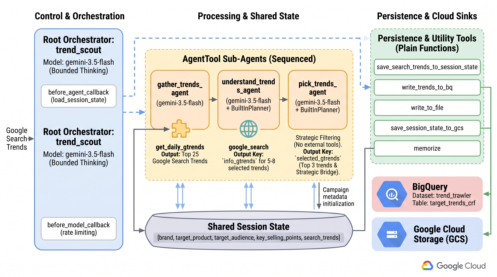
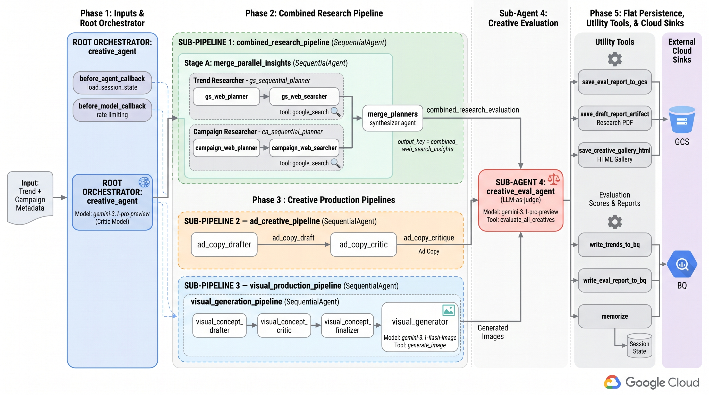
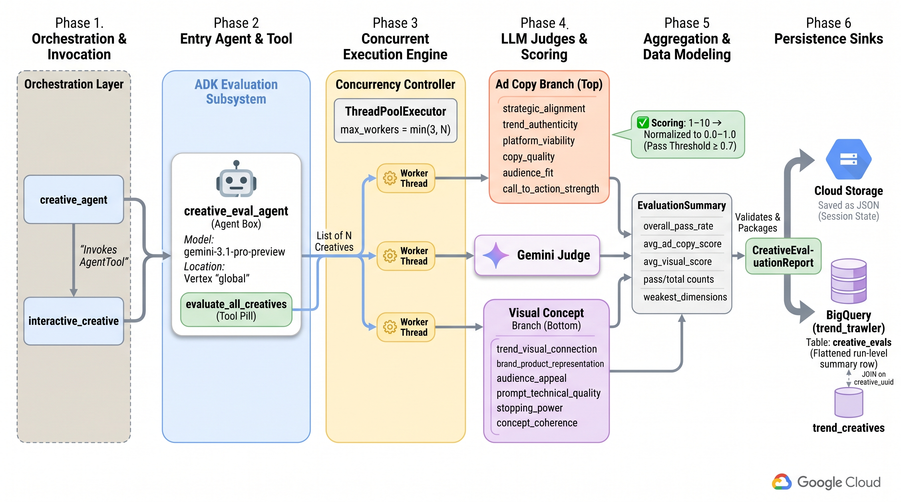

# Agent Architecture Diagrams

Per-agent ADK architecture diagrams generated with the PaperBanana MCP pipeline
(`gemini-3.1-flash-image`), in the style of official Google Cloud documentation.
Each shows the multi-agent tree (Sequential/Parallel composition, `AgentTool`
wrapping) and the per-agent tooling.

| Diagram | Agent | Highlights |
|---|---|---|
|  | `trend_scout/` | Root orchestrator → 3 `AgentTool` sub-agents (gather → understand → pick) → flat persistence tools; shared session state; BigQuery + GCS sinks |
|  | `creative_agent/` | Nested `SequentialAgent` research pipeline with a `ParallelAgent` fan-out (trend + campaign branches → merge); ad-copy pipeline; visual pipeline (drafter → critic → finalizer → image gen); LLM-judge; all sinks |
|  | `creative_eval/` | LLM-as-judge: `evaluate_all_creatives` → `ThreadPoolExecutor` concurrent fan-out to N Gemini judges → 6 ad-copy + 6 visual dims → `EvaluationSummary` → `CreativeEvaluationReport` → GCS JSON + BigQuery `creative_evals` (join on `creative_uuid`) |

## Regenerating

Diagrams are generated one at a time (respecting the shared 2 RPM
`gemini-3.1-flash-image` cap) via the `paperbanana-figures` skill. To tweak a
label without a full regenerate, use `continue_diagram(run_id=..., feedback=...)`.
