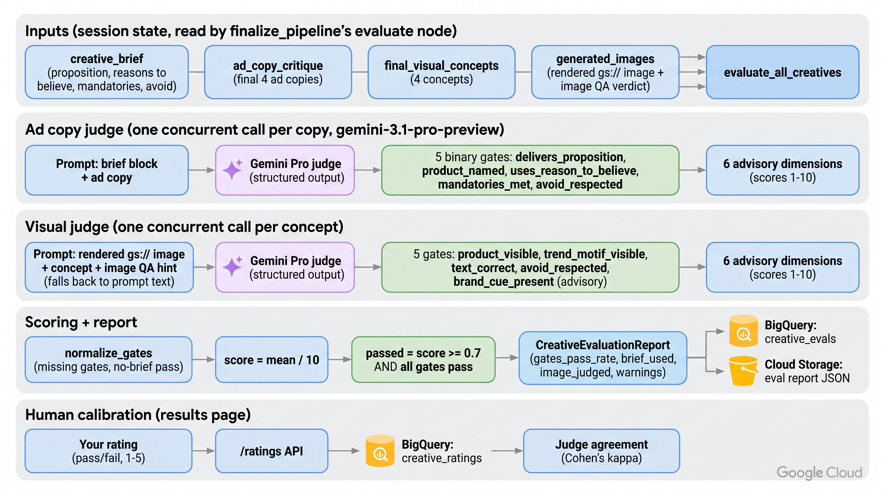
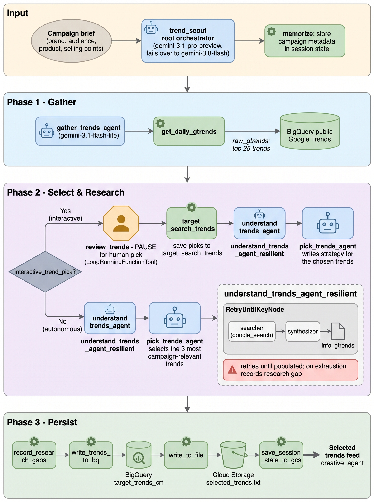
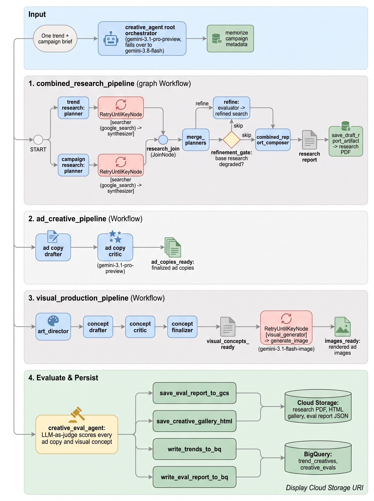
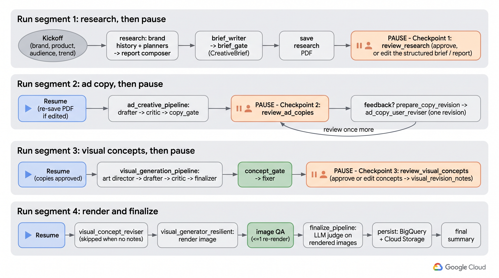
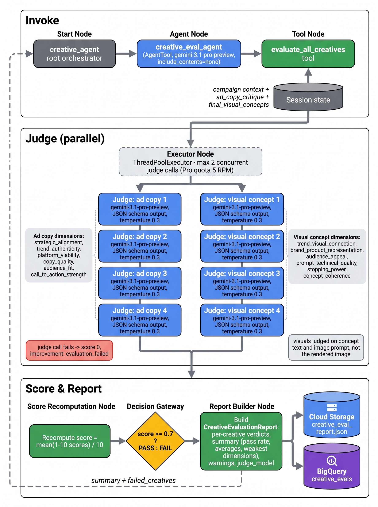
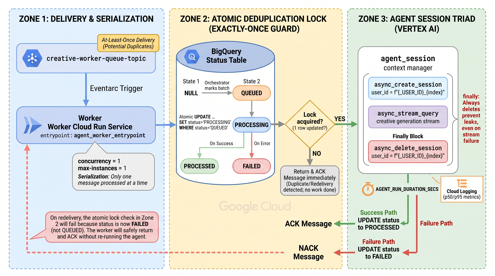
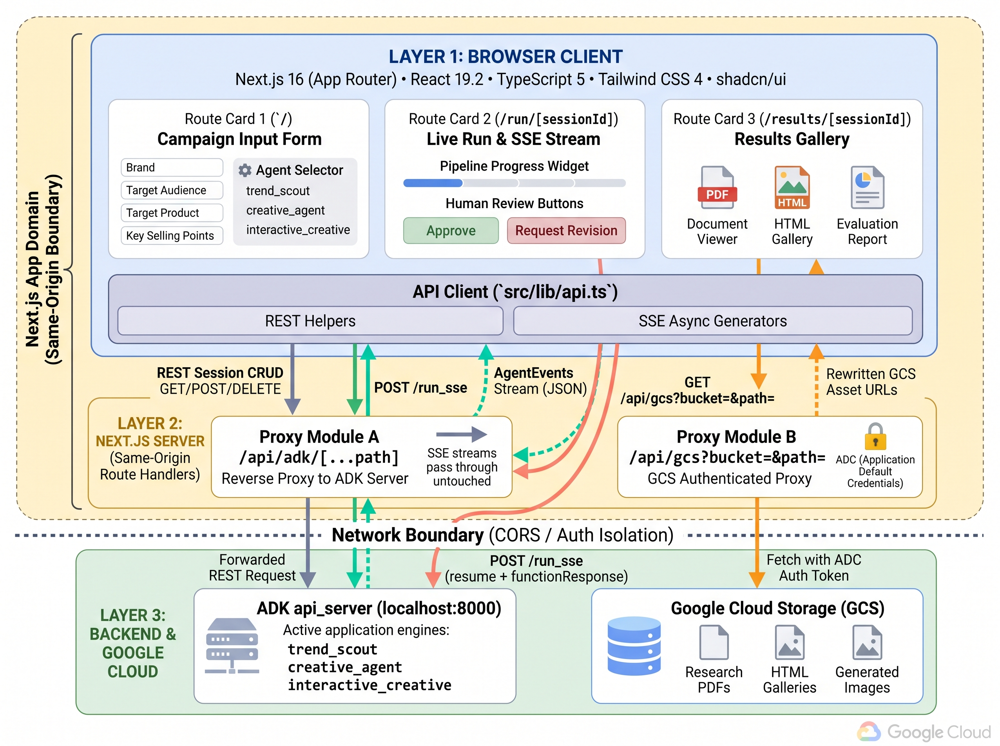
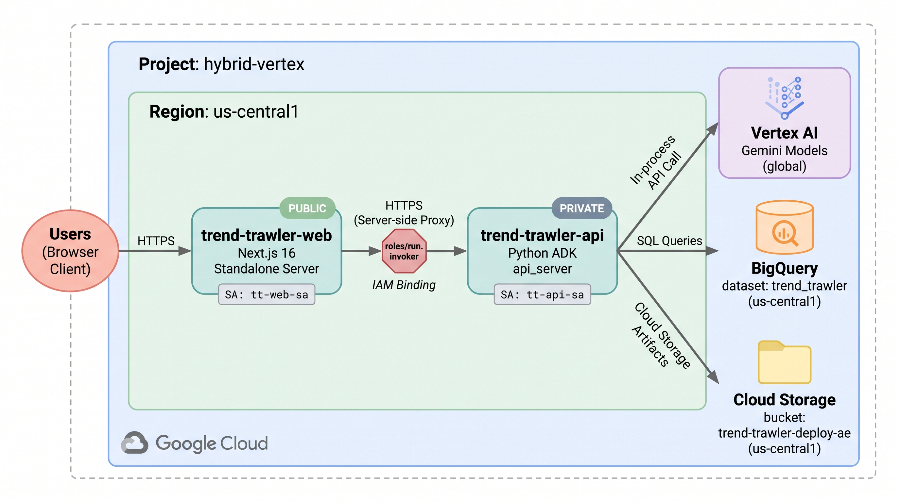
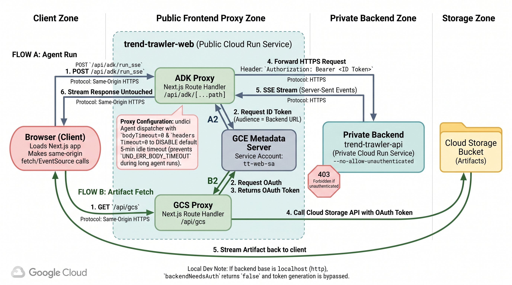
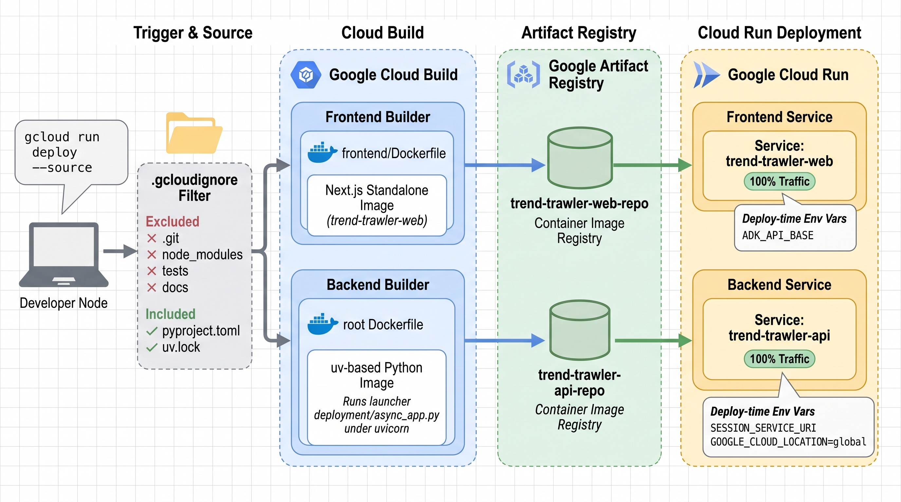

# Agent Architecture Diagrams

Per-agent ADK architecture diagrams generated with the PaperBanana MCP pipeline
(`gemini-3.1-flash-image`), in the style of official Google Cloud documentation.
Each shows the agent/graph composition (ADK 2 graph `Workflow`s exposed as
`NodeTool`s, `AgentTool` wrapping, `RetryUntilKeyNode` retry wrappers) and the
per-agent tooling. The `trend_scout` and `creative_agent` diagrams were regenerated
2026-09-29 for the P2 graph-Workflow migration (no more Sequential/Parallel/RunIf agents);
the `interactive_creative` diagram was added 2026-09-29. The `creative_agent` diagram was
regenerated again 2026-10-08 for the creative-quality gates (it now also covers the interactive
variant and human calibration), and the `interactive_creative` and `creative_eval` diagrams plus the
three creative workflow diagrams were regenerated the same day (#263–#280: structured brief,
`brief_gate` / `copy_gate` / `concept_gate`, post-render image QA, eval gates on rendered images,
brief-review checkpoint, human ratings). The pre-gates versions are kept in [`archive/`](archive/)
and linked from each row.

| Diagram | Agent | Highlights |
|---|---|---|
|  | `trend_scout/` | Root `LlmAgent` (resumable `App`) → `AgentTool` gather/pick sub-agents + `understand_trends_agent_resilient` (`NodeTool`: `RetryUntilKeyNode`, max 3, over a START → searcher → synthesizer graph `Workflow`) → opt-in `review_trends` checkpoint → flat persistence tools; shared session state; BigQuery (idempotent `MERGE`) + GCS sinks |
|  | `creative_agent/` (+ `interactive_creative/`, calibration) | **Regenerated 2026-10-08** for the creative-quality work (#263–#280). Banded: the root has just two tools (`memorize` + one `creative_pipeline` `NodeTool` call); `creative_pipeline` chains research (brand history + trend/campaign planners → report composer → `brief_writer` `CreativeBrief` → `brief_gate` → research PDF) → ad copy (drafter across the brief's angles → critic with brief checks → `copy_gate`) → visuals (art director → concept drafter/critic/finalizer → `concept_gate` → render → image QA with ≤1 re-render) → finalize (LLM judge: binary gates + advisory scores on the rendered images → eval report, HTML gallery, BigQuery rows). Also shows the `interactive_creative` variant (checkpoint 1 = editable brief, checkpoint 2 = one feedback revision, checkpoint 3 = editable concepts → reviser → render + QA → finalize), the human-rating calibration loop, and the BigQuery (`trend_creatives`, `creative_evals.gates_pass_rate`, `creative_ratings`) / Cloud Storage sinks. Previous (2026-09-29, pre-gates) version: [archive/creative_agent_architecture_2026-09-29.png](archive/creative_agent_architecture_2026-09-29.png) |
|  | `interactive_creative/` | **Regenerated 2026-10-08.** Banded by stage: the resumable root (`App` + `ResumabilityConfig`, Gemini Pro) calls the pipelines as `NodeTool`s and pauses at three `LongRunningFunctionTool` checkpoints. Research (brand history + planners → `research_join` → merge → `refinement_gate` → report composer → `brief_writer` → `brief_gate` → research PDF) → **checkpoint 1** `review_research` (edit the structured brief) → ad copy (drafter → critic → `copy_gate` / reviser) → **checkpoint 2** `review_ad_copies` (one feedback revision via `prepare_copy_revision` → `ad_copy_user_reviser`, then review again) → visual concepts (art director → drafter → critic → finalizer → `concept_gate` / fixer) → **checkpoint 3** `review_visual_concepts` (edit concepts) → `visual_concept_reviser` → `visual_generator_resilient` + image QA (≤1 re-render) → `finalize_pipeline` (judge on rendered images with brief gates → persist) → summary; sinks BigQuery (`trend_creatives`, `creative_evals`), Cloud Storage, session state. Previous (2026-09-29) version: [archive/interactive_creative_architecture_2026-09-29.png](archive/interactive_creative_architecture_2026-09-29.png) |
|  | `creative_eval/` | **Regenerated 2026-10-08.** Inputs from session state (`creative_brief`, `ad_copy_critique`, `final_visual_concepts`, `generated_images`) → `evaluate_all_creatives` → one concurrent `gemini-3.1-pro-preview` judge call per creative: ad copy (brief block; 5 gates `delivers_proposition` / `product_named` / `uses_reason_to_believe` / `mandatories_met` / `avoid_respected` + 6 dimensions) and visuals (rendered `gs://` image + image-QA hint, prompt fallback; 5 gates incl. advisory `brand_cue_present` + 6 dimensions) → `normalize_gates` → score = mean/10 → passed = score ≥ 0.7 AND gates → `CreativeEvaluationReport` (`gates_pass_rate`, `brief_used`, `image_judged`, warnings) → BigQuery `creative_evals` + Cloud Storage JSON; separate human-calibration band (rating → `/ratings` → `creative_ratings` → Cohen's kappa). Previous (2026-07-13) version: [archive/creative_eval_architecture_2026-07-13.png](archive/creative_eval_architecture_2026-07-13.png) |

## Agent Workflow Diagrams

Companion diagrams to the architecture set above, also generated with PaperBanana
(2026-10-01; the three creative workflows regenerated 2026-10-08). Where the architecture diagrams show *how an agent is composed*, these
show *the order a run executes in*: phases, branches, human-review pauses, retries,
and where results are persisted.

| Diagram | Agent | Run order |
|---|---|---|
|  | `trend_scout/` | Input → gather top 25 trends → branch on `interactive_trend_pick` (pause at `review_trends` for a human pick, or autonomous pick of the 3 most relevant) → research via `understand_trends_agent_resilient` → persist (`record_research_gaps`, BigQuery `target_trends_crf`, `selected_trends.txt`, session state to GCS) |
|  | `creative_agent/` | **Regenerated 2026-10-08.** The root makes one call: kickoff → `memorize` missing fields → `creative_pipeline` (one `NodeTool` call) → final summary. Stage bands, each with its bounded loop: research (planners → `research_join` → `refinement_gate` → composer → `brief_writer` → `brief_gate` ⇄ `brief_reviser`, ≤1 round → research PDF); ad copy (drafter → critic → `copy_gate` ⇄ reviser, flagged copies only); visuals (art director → concept drafter/critic/finalizer → `concept_gate` ⇄ fixer, ≤1 round → render ⇄ image QA, ≤1 re-render); finalize (judge on rendered images → eval report → HTML gallery → BigQuery + Cloud Storage). Previous (2026-10-01) version: [archive/creative_agent_workflow_2026-10-01.png](archive/creative_agent_workflow_2026-10-01.png) |
|  | `interactive_creative/` | **Regenerated 2026-10-08.** Four resumable run segments, each ending at a pause: research → **checkpoint 1** `review_research` (approve or edit the structured brief / report); resume (re-save PDF if edited) → ad copy with `copy_gate` → **checkpoint 2** `review_ad_copies` (feedback → `prepare_copy_revision` → `ad_copy_user_reviser`, one revision, then review once more); resume → visual concepts with `concept_gate` → **checkpoint 3** `review_visual_concepts` (edits → `visual_revision_notes`); resume → `visual_concept_reviser` (skipped without notes) → render + image QA → `finalize_pipeline` judge → persist → summary. Previous (2026-10-01) version: [archive/interactive_creative_workflow_2026-10-01.png](archive/interactive_creative_workflow_2026-10-01.png) |
|  | `creative_eval/` | **Regenerated 2026-10-08.** `finalize_pipeline`'s evaluate node → `evaluate_all_creatives` (max 2 concurrent judge calls, one per creative) → each call gets the brief (or none), the creative and, for visuals, the rendered `gs://` image + image-QA hint (else the prompt text) → Gemini Pro judge (structured output: gates + 6 dimension scores) → `normalize_gates` → score = mean/10 → passed iff score ≥ 0.7 AND every non-advisory gate passes → `CreativeEvaluationReport` → persist node → BigQuery `creative_evals` + Cloud Storage JSON. Previous (2026-10-01) version: [archive/creative_eval_workflow_2026-10-01.png](archive/creative_eval_workflow_2026-10-01.png) |

## Infrastructure Diagrams

Event-driven orchestration diagrams for the Cloud Run functions + Eventarc
triggers (`cloud_functions/creative_fanout/`) and how they interact with the
Vertex AI Agent Engine.

| Diagram | Scope | Highlights |
|---|---|---|
|  | System (breadth) | Pub/Sub trigger → **Eventarc** → Orchestrator (`crf_entrypoint`, concurrency=100) reaps stale `PROCESSING` rows (>45 min → re-queue, or `FAILED` after 3 attempts), claims up to `max_rows` oldest `NULL`/orphaned-`QUEUED` trends (`CRF_MAX_ROWS_PER_RUN`, default 3) + marks `QUEUED` → **fans out** one worker message per trend → **Eventarc** → serialized Worker (`agent_worker_entrypoint`, concurrency=1 / max-instances=1 for project-wide Gemini quota) → atomic `QUEUED→PROCESSING` lock (`processing_attempts + 1`) → **Vertex AI Agent Engine** (`creative_agent`, AgentPlatform SDK `client.runtimes.get`) → `PROCESSED`/`FAILED` → BigQuery (`target_trends_crf`, `trend_creatives`, `creative_evals`) + GCS. Redrawn 2026-09-29 for legibility (two bands, large type; the full step detail lives in this row and `cloud_functions/creative_fanout/main.py`) |
|  | Worker (depth) | How one worker turns Pub/Sub **at-least-once** delivery into **exactly-once** processing: atomic BigQuery lock (`NULL→QUEUED→PROCESSING→PROCESSED/FAILED`), duplicate-redelivery short-circuit (return + ACK), the `agent_session` create→stream→delete triad (same `user_id`, delete always in `finally`), and the ACK-success / NACK-retry semantics |

## Frontend Diagrams

The Next.js web app (`frontend/`), how it connects to the ADK backend, and how it is served.

| Diagram | Scope | Highlights |
|---|---|---|
|  | App architecture + request flow | Next.js 16 App Router client (React 19, Tailwind 4, shadcn/ui) — form `/`, live run view `/run/[sessionId]` that **polls** the async-job `/runs` API, results `/results/[sessionId]` — talks only to same-origin Route Handlers: `/api/adk/[...path]` reverse-proxies REST session CRUD and the async-job `/runs` kick-off/poll/resume endpoints to the backend launcher `deployment/async_app.py` (serving `trend_scout`, `creative_agent`, `interactive_creative`); `/api/gcs` uses **ADC** to proxy Cloud Storage artifacts. Same-origin boundary avoids CORS + Cloud Workstations port-auth |
|  | Serving + Cloud Run deployment | **Current (dev):** one Cloud Workstations VM runs `next dev` (:3000) + the `deployment/async_app.py` launcher under uvicorn (:8000) side by side, bridged by the same-origin proxy. **Target (Cloud Run, implemented):** two Cloud Run services — a containerized Next.js frontend (`trend-trawler-web`) whose `ADK_API_BASE` points at a private backend (`trend-trawler-api`, the `async_app` launcher), reached via a metadata-server ID token (IAM `run.invoker`); `/api/gcs` uses ADC; shared GCS + BigQuery in `us-central1`. The backend runs `--no-cpu-throttling --min-instances 1` so detached runs keep CPU. Runbook in [`deployment/README.md`](../../deployment/README.md#frontend--api_server-on-cloud-run). The frontend is **IAP-gated** (domain-restricted). Includes a cross-reference to the batch fan-out (CRF) diagrams |

### Live Cloud Run Deployment

The as-built two-service Cloud Run deployment (project `<PROJECT_ID>`, `us-central1`),
captured from three angles. Complements `frontend_cloudrun_deployment.png` above (which
contrasts the dev workstation vs. the Cloud Run target) with the detail of the live system.

| Diagram | Scope | Highlights |
|---|---|---|
|  | Deployment topology (what runs where) | **IAP-gated** public `trend-trawler-web` (Next.js standalone, SA `tt-web-sa`) → `roles/run.invoker` → private `trend-trawler-api` (the `deployment/async_app.py` launcher, SA `tt-api-sa`, `--no-cpu-throttling --min-instances 1`); the backend calls **Vertex AI** (Gemini, `global`), **BigQuery** (dataset `trend_trawler`), and **Cloud Storage** (`trend-trawler-deploy-ae`) in-process, all in `us-central1`; sessions persist in a dedicated Agent Engine (`SESSION_SERVICE_URI`) |
|  | Request & auth flow | IAP admits the browser to `trend-trawler-web`; same-origin calls → the `/api/adk` proxy mints a metadata-server **ID token** (audience = backend URL) and forwards `Bearer`-authed HTTPS to the private backend, which serves the async-job `/runs` **poll** responses (detached `asyncio` run survives client disconnect); `/api/gcs` uses an **OAuth access token** to stream artifacts; unauthenticated backend calls get `403` |
|  | Build & deploy pipeline | `gcloud run deploy --source` uploads source (filtered by **`.gcloudignore`** — excludes `.git`/`node_modules`/`tests`/`docs`, keeps `pyproject.toml`+`uv.lock`) → **Cloud Build** builds each image (`frontend/Dockerfile` → Next.js standalone; root `Dockerfile` → `uv` + the `deployment/async_app.py` launcher under uvicorn) → **Artifact Registry** → new 100%-traffic **Cloud Run** revision, with per-service deploy-time env vars |

Runbook: [`deployment/README.md` → Frontend + api_server on Cloud Run](../../deployment/README.md#frontend--api_server-on-cloud-run).

## Bandit creative experiments

| Diagram | Scope | Highlights |
|---|---|---|
|  | Bandit experiments + scripted behaviour shifts | IAP-gated `trend-trawler-web` (Deploy panel, Behaviour shifts editor, run selector) → `/api/adk` proxy → `trend-trawler-api` `/experiments`, which writes `experiment.json` / `runs/N.json` to Cloud Storage, uploads + deploys the **CPR `BanditPredictor`** (JAX linear Thompson sampling, 1 replica) on Agent Platform, and starts **run N** of the synthetic-traffic **Cloud Run Job** (`SHIFTS_JSON`, `TRAFFIC_RUN`, `FORGET`). The job simulates readers with the scheduled shifts, calls the endpoint `:predict` in batches of 100, replays the baselines and the unshifted **ghost** Linear TS on the same random draws, and writes run-numbered events and episode metrics (`traffic_run`, `shift_response`, `regimes`) to **BigQuery**, which the api aggregates into per-shift responses and the paired shift cost |

Guide: [`docs/bandit/README.md`](../bandit/README.md).

## Regenerating

Diagrams are generated one at a time (respecting the shared 2 RPM
`gemini-3.1-flash-image` cap) via the `paperbanana-figures` skill. To tweak a
label without a full regenerate, use `continue_diagram(run_id=..., feedback=...)`.
