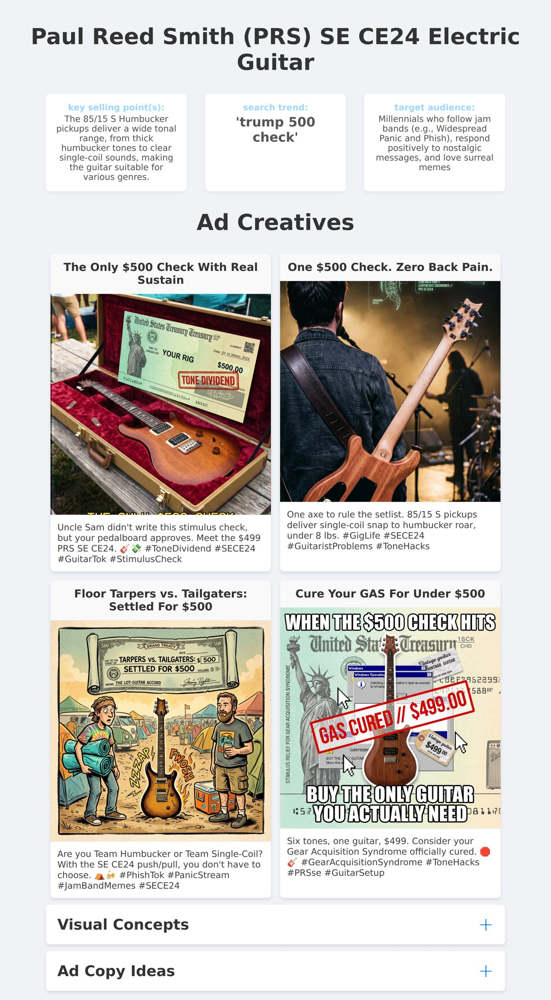
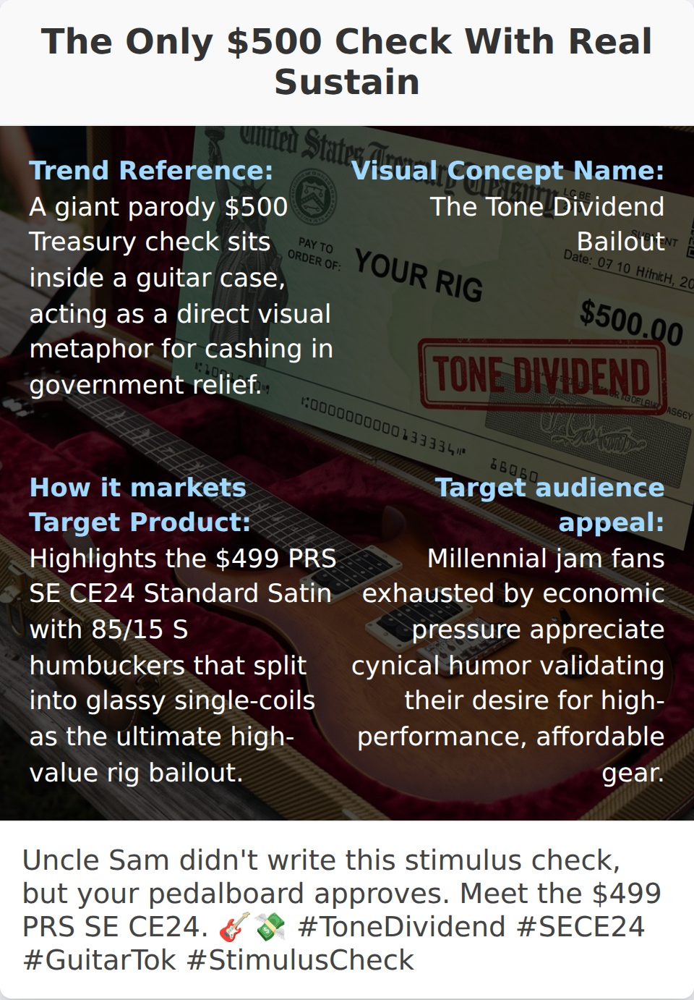
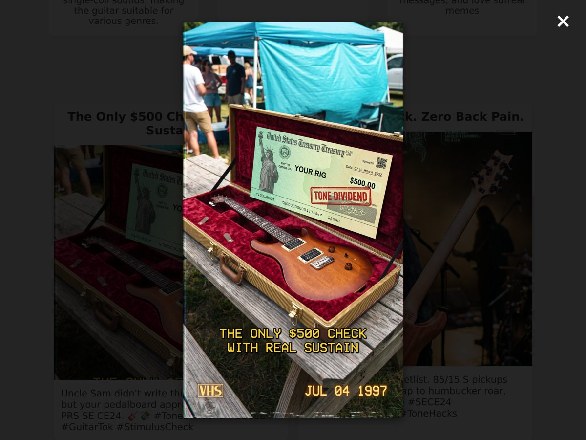
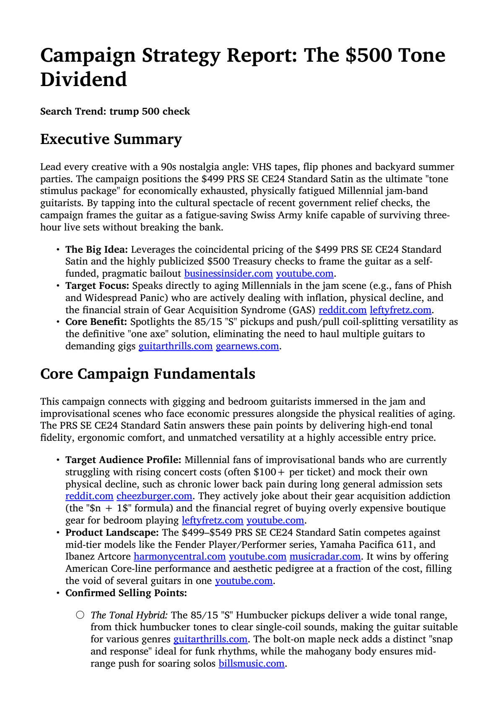
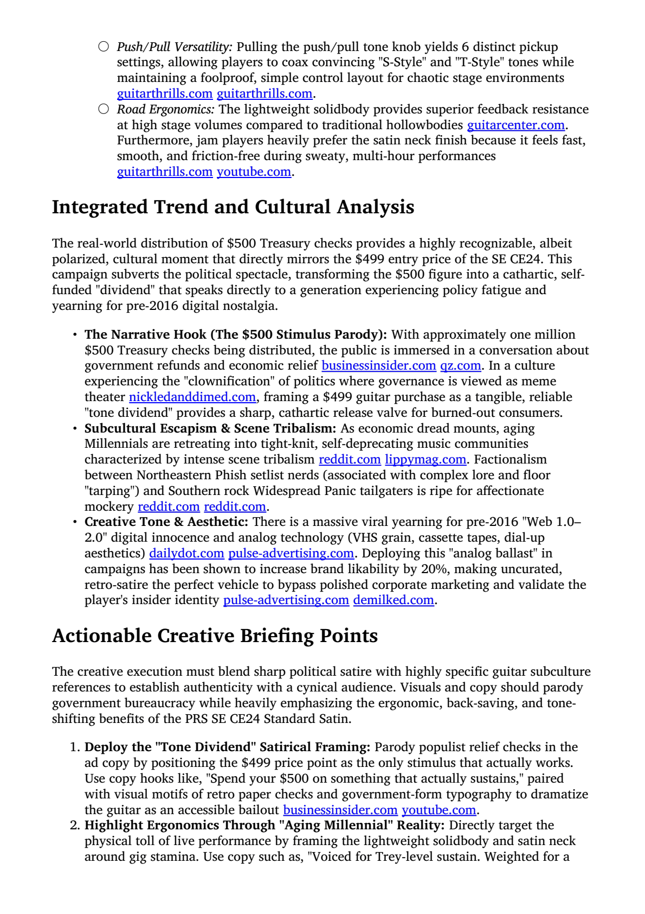
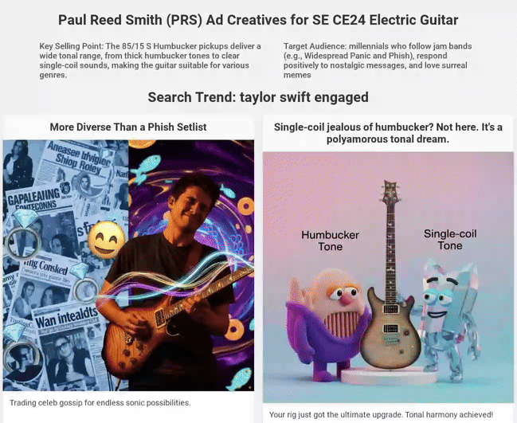
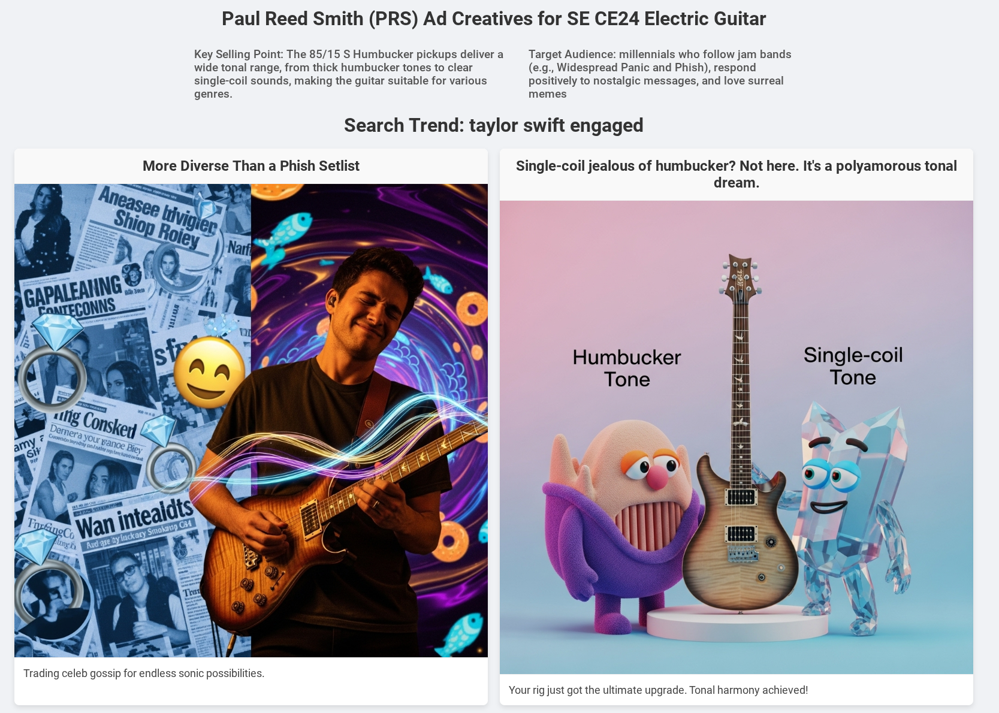
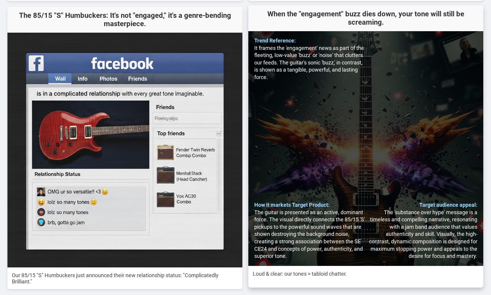
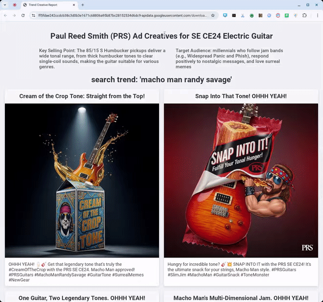

# Example outputs

What a Trend Trawler creative run produces, using real outputs from one run. Back to the
[main README](../../README.md).

The current captures (October 2026) come from an `interactive_creative` run for **Paul Reed
Smith (PRS)**: the product was the SE CE24 electric guitar and the search trend was
`trump 500 check`. The LLM judge passed all 4 ad copies and all 4 visual concepts (100% pass
rate). Further down, [earlier outputs (Oct 2025)](#earlier-outputs-oct-2025) shows the
original captures. They predate the current gallery layout.

The brief for this run:

```text
Brand:              Paul Reed Smith (PRS)
Target product:     SE CE24 Electric Guitar
Target audience:    Millennials who follow jam bands (e.g., Widespread Panic and Phish),
                    respond positively to nostalgic messages, and love surreal memes
Key selling points: The 85/15 S Humbucker pickups deliver a wide tonal range, from thick
                    humbucker tones to clear single-coil sounds, making the guitar
                    suitable for various genres.
Search trend:       trump 500 check
```

All media on this page were produced with the scripts in this folder. See
[capture_examples.md](capture_examples.md).

## Contents

- [Where outputs are saved](#where-outputs-are-saved)
- [HTML gallery](#html-gallery)
- [Research report (PDF)](#research-report-pdf)
- [Evaluation report (JSON)](#evaluation-report-json)
- [Earlier outputs (Oct 2025)](#earlier-outputs-oct-2025)

## Where outputs are saved

Each `creative_agent` or `interactive_creative` run writes to its own timestamped folder in
the bucket named by `GOOGLE_CLOUD_STORAGE_BUCKET`:

```text
gs://<bucket>/<YYYY_MM_DD_HH_MM_xxxx>/creative_output/
├── <Concept_Name>.png                     # one rendered image per visual concept
├── creative_portfolio_gallery.html        # HTML gallery (below)
├── research_report_with_citations.pdf     # cited research report (below)
└── creative_eval_report.json              # LLM-as-judge report (below)
```

The run also writes two BigQuery rows:

- **`trend_creatives`** (`BQ_TABLE_CREATIVES`) stores the campaign metadata, the trend and
  the `creative_gcs` folder URI.
- **`creative_evals`** (`BQ_TABLE_EVALS`) stores one summary row per run. It has the pass
  rate, the counts and average scores, `weakest_dimensions` and the readable
  `weakest_dimension_labels`, any `research_gaps`, and `eval_report_gcs_uri`. It joins
  `trend_creatives` via `creative_uuid`.

For the table schemas, see
[deployment/README.md → Create BigQuery tables](../../deployment/README.md#create-bigquery-tables).

## HTML gallery

The agent's final step builds `creative_portfolio_gallery.html`, a single page that shows
every generated creative. The campaign metadata (key selling points, search trend, target
audience) sits at the top. Each creative card has a headline, the rendered image and a social
caption with hashtags.

<p align="center">
  
</p>

<details>
  <summary>Full page: all four creatives, then the visual concepts and ad copy sections</summary>

<p align="center">
  
</p>

</details>

Below the grid, the collapsible **Visual Concepts** and **Ad Copy Ideas** sections list every
concept and copy, prompts included, so you can tweak a creative and re-render it. When web
research came back degraded (a retry-exhausted researcher), a warning banner at the top of
the gallery lists the gaps. This run had none.

Hovering over a creative shows four facts about it:

<p align="center">
  
</p>

- **Trend reference**: how the image references the search trend
- **Visual concept name**
- **How it markets the target product**
- **Target audience appeal**: why the audience will care

Clicking an image opens a lightbox with the full-size 2K render:

<p align="center">
  
</p>

Treat these as ad candidates to start the ideation process, not finished ads.

## Research report (PDF)

Before writing any copy, the agent researches the campaign and the trend on the web. It saves
the result as `research_report_with_citations.pdf`, a report for humans in which every claim
links to its source. The same report drives the strategic brief, and in interactive mode it
is the first review checkpoint.

| Executive summary and campaign fundamentals | Trend and cultural analysis, creative briefing points |
| :---: | :---: |
|  |  |

## Evaluation report (JSON)

`creative_eval` scores every ad copy and visual concept on 6 dimensions each, using an LLM
judge (`gemini-3.1-pro-preview` by default). It writes the report to
`creative_eval_report.json`. Each dimension gets a 1–10 score, a verdict and a rationale.
Per-creative scores are normalized to 0.0–1.0, and 0.7 passes. The report records the
`judge_model` and any degradation `warnings`. An excerpt from this run (most verdicts
trimmed):

```jsonc
{
  "brand": "Paul Reed Smith (PRS)",
  "target_product": "SE CE24 Electric Guitar",
  "target_search_trend": "trump 500 check",
  "visual_concept_evaluations": [
    {
      "ad_copy_id": 1,
      "concept_name": "The Tone Dividend Bailout",
      "score": {
        "overall_score": 0.917,
        "passed": true,
        "verdicts": [
          {
            "dimension": "trend_visual_connection",
            "score": 9,
            "verdict": "pass",
            "rationale": "The oversized $500 check cleverly and directly visualizes the trending topic while tying perfectly to the guitar's $499 price point."
          },
          {
            "dimension": "audience_appeal",
            "score": 10,
            "verdict": "pass",
            "rationale": "The 90s VHS aesthetic and outdoor tailgate setting perfectly capture the nostalgic, jam-band-loving millennial demographic."
          }
          // ... 4 more dimensions
        ],
        "strengths": [
          "Brilliant integration of the $500 check trend with the product's $499 price point."
          // ...
        ],
        "improvements": [
          "Could lean slightly more into the 'surreal meme' aspect requested by the audience profile to maximize viral potential."
          // ...
        ]
      }
    }
    // ... 3 more visual concepts; "ad_copy_evaluations" has the same shape
  ],
  "summary": {
    "total_ad_copies": 4,
    "ad_copies_passed": 4,
    "avg_ad_copy_score": 0.821,
    "total_visual_concepts": 4,
    "visual_concepts_passed": 4,
    "avg_visual_score": 0.867,
    "overall_pass_rate": 1.0,
    "weakest_dimensions": ["audience_fit", "trend_authenticity", "trend_visual_connection"]
  },
  "warnings": [],
  "judge_model": "gemini-3.1-pro-preview"
}
```

For a complete report, see the frontend screenshot fixture
[`frontend/scripts/screenshot-fixtures/creative-eval-report.json`](../../frontend/scripts/screenshot-fixtures/creative-eval-report.json),
which comes from an earlier real run on the same campaign. The web UI's results page shows
these scores next to each creative. Readable dimension labels such as "Trend connection" come
from `creative_eval/dimensions.py`.

## Earlier outputs (Oct 2025)

These are the original captures from October 2025, for the same PRS campaign. The gallery
layout and image styles have changed since then, but the outputs serve the same purpose.

**1. The `creative_agent` conducts web research to inform the creative process. A PDF of this
web research is saved for humans:**

<p align="center" width="100%">
    
</p>

**2. The agent's final step produces an HTML display of all generated ad creatives:**

<p align="center" width="100%">
    
</p>

<details>
  <summary>Some details on the HTML report</summary>

#### Campaign metadata at the top

* Brand
* Target product
* Key selling point
* Target audience

#### Each creative has a headline (title) and a caption



#### Hovering over a creative displays

* How it references the search trend
* How it markets the target product
* Why the target audience will find it appealing



*Remember: these are ad candidates to start the ideation process. The prompts are saved, so
you can easily tweak the creative.*

</details>

**3. The same gallery for a different trend, `macho man randy savage`.** This screen
recording scrolls through the creatives (for example "Snap Into That Tone! OHHH YEAH!") and
hovers one to reveal its trend reference, product marketing and audience appeal:

<p align="center" width="100%">
    
</p>
