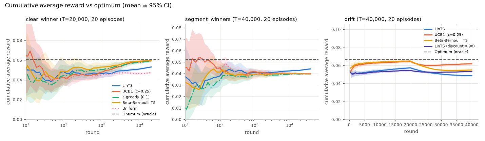
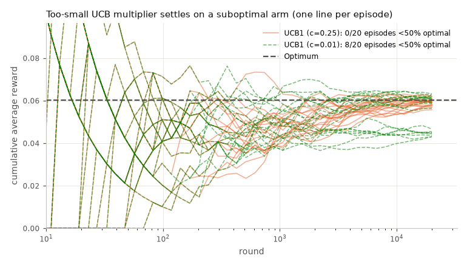
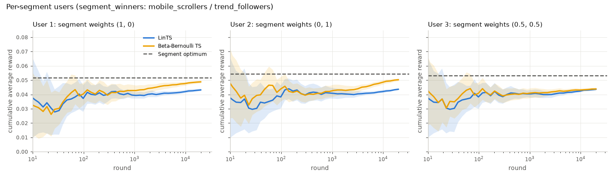
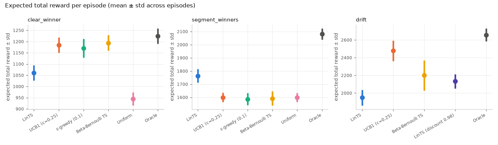
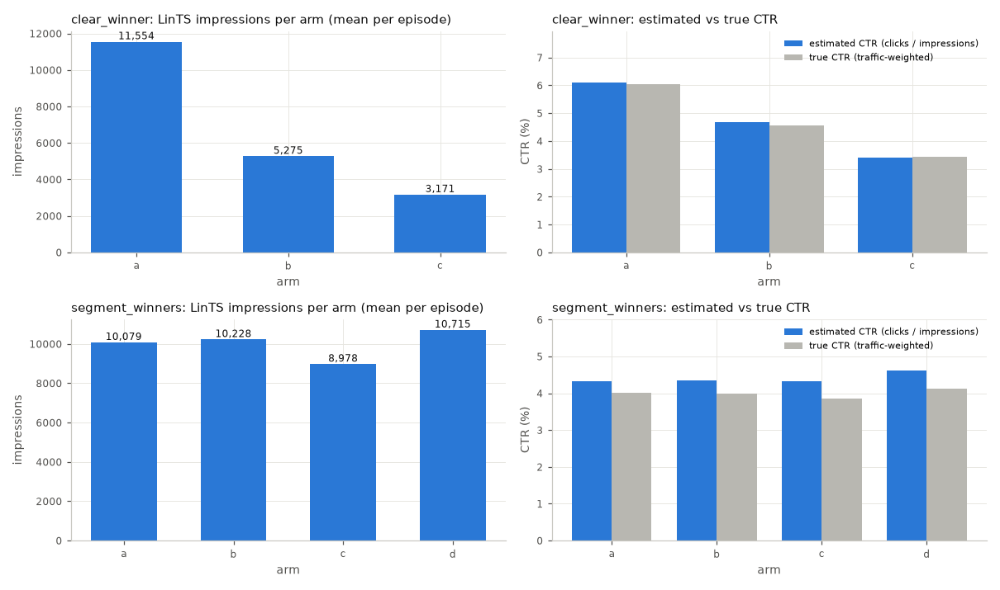
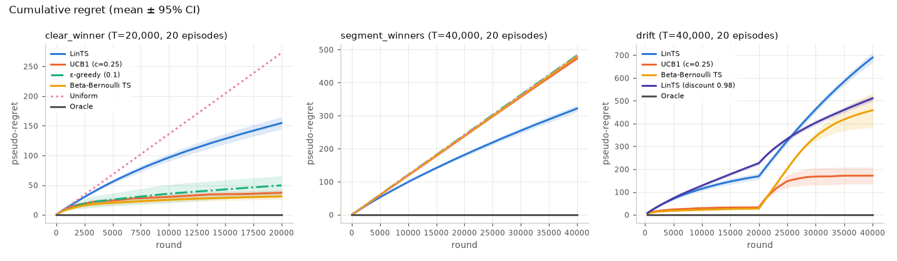
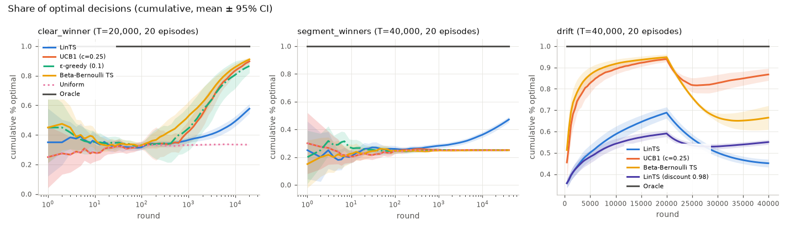
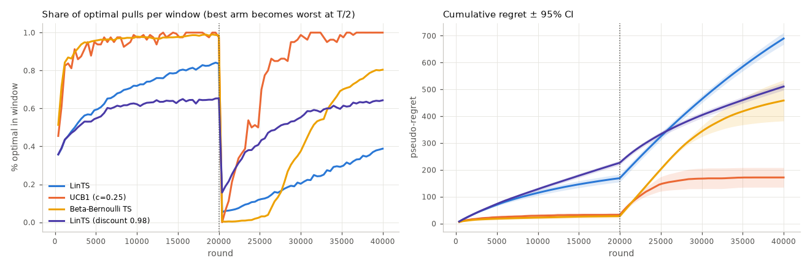
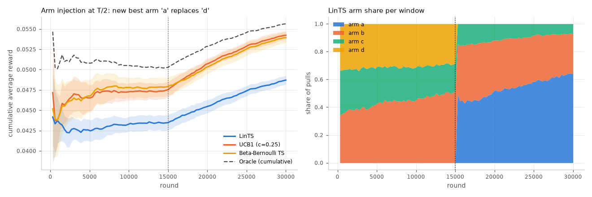

# Bandit simulation: notebook parity (PR 1)

This page covers the offline simulator in the `bandit/` package. It is PR 1 of
[`docs/plans/2026-10-02-bandit-experiments.md`](../plans/2026-10-02-bandit-experiments.md),
and the interfaces are in [`docs/bandit/contracts.md`](../bandit/contracts.md). The figures
reproduce the two internal reference notebooks (the toy UCB notebook and the "more realistic
models" notebook) using JAX linear Thompson sampling (LinTS) and the five baselines, on
synthetic traffic. Nothing here touches GCP.

## How to run

```bash
# one simulation -> JSON (per-episode §3 rows + §5-shaped aggregate + scalar summary)
uv run python -m bandit.cli simulate --scenario segment_winners --ctr-mode demo \
  --reward-mode click \
  --policies linear_ts,ucb1,epsilon_greedy,beta_bernoulli_ts,uniform,oracle \
  --episodes 10 --horizon 20000 --out /tmp/sim.json

# every figure on this page (8 simulations, 20 episodes each, ~8 min on a laptop CPU)
uv run python experiments/bandit/notebook_parity.py --generate \
  --data-dir /tmp/bandit_parity --fig-dir experiments/bandit/figures
# redraw from existing JSON
uv run python experiments/bandit/notebook_parity.py --data-dir /tmp/bandit_parity
```

**Policy specs.** A policy spec can take options, for example `ucb1:c=0.01`,
`epsilon_greedy:epsilon=0.2` or `linear_ts:discount=0.98`. The spec string becomes the
policy's label in the output, so you can compare variants side by side. The aliases
`lints`, `egreedy` and `bbts` also work. `--policies` separates specs with `,` or `;`, and a
bare `key=value` continues the previous spec, so multi-option specs work from the shell:
`--policies 'lints:discount=0.97,exploration_scale=0.1,ucb1,bbts'` (or
`'lints:discount=0.97,exploration_scale=0.1;ucb1;bbts'`).

**Other CLI flags:**

| Flag | What it does |
|---|---|
| `--segment-mix 1,0,0,0` | Overrides the scenario's segment mix. A mix with every weight in [0.05, 1] is recorded as a contracts §9 `scenario_overrides.segment_mix`; any other mix (such as single-segment readers) is applied directly and isn't recorded. |
| `--arm-schedule '[[0,[1,2,3]],[10000,[0,1,2]]]'` | Expires and injects arms at batch boundaries. |
| `--drift gradual` | Switches the drift scenario to the gradual variant. |
| `--judge-wrong 1` | Reverses the order the judge scores imply (0–1). |
| `--gap-scale 0.5` | Narrows (< 1) or widens (> 1) the gap between creatives (0.25–2). |
| `--noise-scale 0` | Multiplies the scenario's seeded noise (0–2). |
| `--drift-at 0.3` | Moves the drift change point (0.2–0.8 of T; `drift` only). |
| `--checkpoint-spacing linear --num-checkpoints 100` | Gives finer resolution late in the episode, for the drift and injection plots. The contract default is about 50 log-spaced checkpoints. |
| `--no-propensity` | Skips the Monte Carlo propensities for LinTS. They don't feed any metric, and skipping them makes the run about 10x faster. |

**Default settings.** All figures use demo CTRs, click reward, `batch_size` 100 (the
policy updates once per batch), seed 0 and 20 episodes. Every policy sees the same users
and the same coin flips (common random numbers), so differences between policies are paired.

## What each figure shows

The figures below come from the committed run, and the numbers in the text are means over
20 episodes. "Regret" means pseudo-regret, Σ(p_opt − p_chosen) in expected clicks.

### 1. Cumulative average reward vs optimum (log x)



- **clear_winner** (arms at 6.0 / 4.5 / 3.5 % CTR):
  - The non-contextual policies converge on the winner, as in the toy notebook.
  - LinTS converges much more slowly. It fits 19 coefficients per arm where Beta-Bernoulli TS
    fits 1, and here the context carries no signal.
- **segment_winners**:
  - LinTS is the only policy that rises above the pooled-average plateau, toward the
    optimum line.
- **drift**: covered in figure 8.

### 2. A UCB multiplier that is too small settles on a suboptimal arm



This is the toy notebook's "epsilon = 1" cell.

| UCB multiplier | Episodes with < 50 % optimal pulls | % optimal | Regret | Expected total reward |
|---|---|---|---|---|
| c = 0.01 | 8 / 20 | 59 % | 122 | 1084 ± 165 |
| c = 0.25 | 0 / 20 | 90 % | 37 | 1184 ± 34 |

The large variance at c = 0.01 is the signature of lock-in: some episodes are perfect and
others are stuck on a suboptimal arm.

### 3. Per-segment users (notebook cluster weights (1,0) / (0,1) / (0.5,0.5))



This is `segment_winners` restricted to the `mobile_scrollers` and `trend_followers`
segments, with the segment-mix weights shown in each panel title.

- **Single-segment users** (the (1, 0) and (0, 1) panels): there is no heterogeneity to
  exploit, so Beta-Bernoulli TS wins. Its regret is 50 / 54, against 165 / 195 for LinTS.
- **The 50/50 user**: the two segments want different arms, so a pooled policy can't do
  well. LinTS and Beta-Bernoulli TS tie at T = 20k (regret 179 vs 175), and LinTS's curve
  is still rising, consistent with the notebook's remark that mixed users "need more data".

### 4. Expected total reward ± std per policy (error bars)



This is the realistic notebook's headline plot. In **segment_winners**, LinTS earns
1763 ± 51 clicks per episode. Every non-contextual policy earns about 1590–1600, uniform
included, and the oracle earns 2081.

### 5. Impressions and estimated vs true CTR per arm (LinTS)



- **clear_winner**: LinTS gives the best arm 11.6k of 20k impressions, and its estimated
  CTRs match the true ones.
- **segment_winners**: impressions are split almost evenly, because each arm wins one
  segment.
  - Each arm's estimated CTR (about 4.3–4.6 %) sits above its traffic-weighted true CTR
    (about 3.9–4.1 %).
  - That gap is the selection effect a contextual policy should produce: it shows each arm
    to the users it suits.

### 6. Cumulative regret ± 95% CI



### 7. % optimal arm (cumulative)



### 8. Drift recovery (the best arm becomes the worst at T/2)



- **Before the drift**: discounting costs LinTS some accuracy. At T/2 the discounted
  variant reaches 59 % optimal, against 69 % for the undiscounted one.
- **After the drift**: the discounted variant (γ = 0.98 per batch, an effective memory of
  about 50 batches, or 5k rounds) recovers. The undiscounted posterior keeps favouring the
  old winner.
  - Total regret is 511 with discounting and 690 without.
- **UCB1**: recovers fastest (regret 172), because its log t bonus keeps re-checking arms
  whose means went stale.
- **Beta-Bernoulli TS**: recovers slowly, with large variance across episodes (regret
  459 ± 77, 95 % CI half-width).

### 9. Arm injection (the notebook's "sparse graph update")



The run uses 4 arms. Arms b, c and d are live until T/2, when arm a (the best one, at 6.0 %)
is injected and arm d expires.

- **LinTS**: picks up the new arm. Its share of pulls on a climbs to about 65 % by the end.
- **UCB1 and Beta-Bernoulli TS**: switch faster (regret 39 and 53, against 178 for LinTS).

## Findings

These figures and this table predate the exploration retune: LinTS ran with
`exploration_scale` 1.0. The [exploration sweep](#exploration-sweep) has the current
numbers (`exploration_scale` 0.5).

| Scenario | LinTS | UCB1 | ε-greedy | BB-TS | uniform | oracle |
|---|---|---|---|---|---|---|
| clear_winner (T = 20k) | 155 | 37 | 50 | 31 | 273 | 0 |
| segment_winners (T = 40k) | **322** | 473 | 482 | 479 | 482 | 0 |
| drift (T = 40k) | 690 (511 with γ = 0.98) | 172 | – | 459 | – | 0 |

The table shows final pseudo-regret, mean over 20 episodes, in demo mode. The 95 % CI
half-width is about 11 for LinTS in `clear_winner` and `segment_winners`, and 22 in `drift`.

**When context matters, LinTS wins.** In `segment_winners`, LinTS has 33 % less regret than
non-contextual TS (322 vs 479). LinTS reaches 47 % optimal pulls overall and 42–52 % within
each segment. Every pooled policy stays at the 25 % chance level, because the arms' pooled
CTRs are within 0.3 pp of each other.

**When context doesn't matter, LinTS pays for its parameters.** In `clear_winner`, LinTS has
about 5x the regret of Beta-Bernoulli TS (155 vs 31), and the 1-arm-per-segment users in
figure 3 show the same effect. With d = 19 and about 5k pulls per arm, LinTS's
posterior sd for a context's score is about 1.3 pp. That is close to the 1.5 pp arm gap, so
Thompson sampling keeps exploring.

**Steps to converge** use the notebook's definition: a moving average over a window of
`clamp(T/10, 10, 2000)` rounds crossing the optimum. In `clear_winner` the means are
3.0k rounds for BB-TS, 3.6k for UCB1 and 9.8k for LinTS. The minimum possible is the window,
2k; the oracle's value is 2.5k.

**Calibration** holds for every scenario in both CTR modes: α from bisection hits the target
mean CTR within ±10 % (tested). The realized `clear_winner` arm CTRs are 6.03 / 4.55 / 3.42 %.

## Discount sweep (drift)

A live `drift` experiment (2026-10-05, demo, 4 arms, 20 × 40k) put the endpoint fifth of six:
per-episode regret oracle 0, UCB1 219, Beta-Bernoulli TS 377, ε-greedy 449, **LinTS 566**,
uniform 740. That endpoint never forgot (`discount = 1.0`). This sweep picks the per-batch
discount the api now deploys for `drift` (contracts §7).

**From a memory window to γ.** `update` applies γ once per batch, so a round `t` rounds old
keeps weight γ^(t / batch). Choosing γ = exp(−batch / N) makes that exp(−t / N): an
exponential memory of about N rounds (N ≈ batch / (1 − γ) for γ near 1). With `batch_size`
100, N = 5k gives γ = 0.980 and N = 50k gives γ = 0.998 (`bandit.config.discount_for_memory`).
Because realistic mode runs 10× the horizon, it needs 10× the window for the same behaviour,
hence a much smaller per-batch discount.

**Setup.** 4 synthetic arms, click reward, seed 0, `--no-propensity`, `exploration_scale`
1.0 (the default at the time). Values are mean ± sd of per-episode pseudo-regret (sd across
episodes, not a CI).

Drift, demo (T = 40k, change at 20k; 20 episodes; the γ ≤ 0.95 rows are from a 10-episode run):

| Policy | Regret | Memory N |
|---|---|---|
| oracle | 0 | |
| UCB1 | 182 ± 66 | |
| Beta-Bernoulli TS | 443 ± 146 | |
| **LinTS γ = 0.98 (chosen)** | **583 ± 23** | 5k |
| LinTS γ = 0.985 | 579 ± 21 | 6.6k |
| LinTS γ = 0.99 | 586 ± 23 | 10k |
| LinTS γ = 0.975 | 590 ± 21 | 4k |
| LinTS γ = 0.995 | 596 ± 36 | 20k |
| LinTS γ = 0.97 | 602 ± 18 | 3.3k |
| LinTS γ = 0.95 | 626 ± 15 | 2k |
| ε-greedy | 653 ± 88 | |
| LinTS γ = 0.9 / 0.8 / 0.7 | 667 / 699 / 714 | 950 / 450 / 280 |
| LinTS γ = 1 (old default) | 690 ± 34 | ∞ |
| uniform | 764 ± 3 | |

Drift, realistic (T = 400k, change at 200k; 10 episodes):

| Policy | Regret | Memory N |
|---|---|---|
| UCB1 | 362 ± 91 | |
| Beta-Bernoulli TS | 852 ± 323 | |
| **LinTS γ = 0.998 (chosen)** | **1035 ± 49** | 50k |
| LinTS γ = 0.999 | 1038 ± 70 | 100k |
| LinTS γ = 0.996 | 1121 ± 46 | 25k |
| LinTS γ = 0.993 | 1197 ± 31 | 14k |
| ε-greedy | 1241 ± 212 | |
| LinTS γ = 0.99 / 0.98 | 1258 / 1345 | 10k / 5k |
| LinTS γ = 1 (old default) | 1367 ± 74 | ∞ |
| uniform | 1549 ± 2 | |

The optimum is flat around a window of 1/8 of the horizon in both modes (5k of 40k, 50k of
400k), so that is the rule (`DISCOUNT_MEMORY_ROUNDS`): γ = 0.98 demo, 0.998 realistic.
Discounting cuts LinTS's drift regret by 16 % (demo) and 24 % (realistic), enough to pass
ε-greedy and uniform. **It does not make LinTS beat UCB1 or Beta-Bernoulli TS.** With 19
coefficients per arm the posterior re-learns far more slowly after the swap than a
one-rate-per-arm policy; UCB1's bonus keeps re-checking the arm it has shown least, which is
exactly the old loser that became the winner.

**Discount hurts the stationary scenarios**, so they keep γ = 1:

| Scenario (4 arms) | γ = 1 | 0.995 | 0.99 | 0.98 | 0.95 | best baseline |
|---|---|---|---|---|---|---|
| clear_winner demo (T = 20k, 10 ep) | **177** | 189 | 195 | 206 | 225 | BB-TS 59 |
| segment_winners demo (T = 40k, 10 ep) | **325** | 351 | 371 | 398 | 430 | UCB1 473 |
| clear_winner realistic (T = 200k, 5 ep) | **271** | | | | | BB-TS 57 (γ = 0.998: 355) |
| segment_winners realistic (T = 400k, 5 ep) | **563** | | | | | ε-greedy 910 (γ = 0.998: 708) |

Lowering `exploration_scale` looked like it helped LinTS everywhere in this sweep. The
next section tests that properly and ships it.

## Exploration sweep

`exploration_scale` s scales the posterior draw: LinTS samples θ̃ ~ N(μ, s² Λ⁻¹). It was 1.0.
It is now **0.5 for every scenario and ctr mode** (`bandit.config.DEFAULT_EXPLORATION_SCALE`,
the `LinTSParams` default; contracts §7). The discount table above is unchanged.

**Setup.** s ∈ {0.05, 0.1, 0.2, 0.35, 0.5, 1.0} × γ. For `drift`, γ ∈ {0.95, 0.97, 0.98, 0.99, 1}
in demo mode and the same memory windows in realistic mode, γ ∈ {0.995, 0.997, 0.998, 0.999, 1}.
For the stationary scenarios, γ ∈ {1, 0.995} in demo and {1, 0.9995} in realistic, to check
whether a little forgetting helps once exploration is lower. Every scenario ran with 3 and
4 synthetic arms in both ctr modes, against all five baselines, with click reward, seed 0
and no propensities. Demo mode ran 30 episodes (T = 20k / 40k). Realistic mode ran 10
episodes (T = 200k / 400k): with 35 policies, one realistic `drift` cell took about 20 min
on a shared 32-core box. Policies share common random numbers, so each episode's
difference from the old default is paired. The s = 0.05 rows sit below the validated
range [0.1, 5]; they ran through `bandit.policies.linear_ts` directly to see the trend.

**Old vs new default.** Values are mean pseudo-regret ± 95 % CI (1.96 · sd / √episodes). Δ is
the paired per-episode difference, new minus old. `drift` uses γ = 0.98 (demo) and 0.998
(realistic) in both columns. Worst is the highest single-episode regret. LQ min is the
worst episode's share of optimal pulls over the last quarter of the horizon: a low value
means a run that locked onto a wrong creative.

| Scenario | Mode | K | Ep | s = 1.0 | **s = 0.5** | Δ (paired) | sd old / new | Worst old / new | % opt old / new | LQ min old / new | UCB1 | ε-greedy | BB-TS | uniform |
|---|---|---|---|---|---|---|---|---|---|---|---|---|---|---|
| clear_winner | demo | 3 | 30 | 154 ± 8 | **129 ± 14** | −24 ± 12 (−16 %) | 24 / 40 | 207 / 216 | 58 / 63 | 49 / 42 | 39 | 47 | 31 | 273 |
| clear_winner | demo | 4 | 30 | 179 ± 8 | **155 ± 15** | −24 ± 14 (−13 %) | 22 / 43 | 231 / 240 | 43 / 49 | 30 / 32 | 70 | 72 | 61 | 268 |
| clear_winner | realistic | 3 | 10 | 210 ± 24 | **155 ± 38** | −56 ± 28 (−26 %) | 39 / 61 | 262 / 260 | 69 / 75 | 72 / 71 | 147 | 72 | 30 | 546 |
| clear_winner | realistic | 4 | 10 | 266 ± 23 | **202 ± 37** | −64 ± 33 (−24 %) | 36 / 60 | 322 / 331 | 56 / 63 | 59 / 49 | 215 | 109 | 58 | 536 |
| segment_winners | demo | 3 | 30 | 255 ± 11 | **237 ± 18** | −18 ± 11 (−7 %) | 31 / 49 | 332 / 390 | 60 / 62 | 59 / 53 | 403 | 400 | 401 | 469 |
| segment_winners | demo | 4 | 30 | 325 ± 10 | **311 ± 12** | −14 ± 9 (−4 %) | 27 / 34 | 379 / 403 | 46 / 48 | 43 / 43 | 474 | 478 | 478 | 482 |
| segment_winners | realistic | 3 | 10 | 413 ± 24 | **367 ± 35** | −46 ± 27 (−11 %) | 39 / 56 | 461 / 460 | 67 / 69 | 70 / 67 | 860 | 775 | 798 | 943 |
| segment_winners | realistic | 4 | 10 | 556 ± 28 | **518 ± 37** | −38 ± 34 (−7 %) | 45 / 59 | 631 / 594 | 54 / 56 | 52 / 58 | 960 | 934 | 953 | 967 |
| drift | demo | 3 | 30 | 513 ± 9 | **422 ± 15** | −90 ± 11 (−18 %) | 25 / 42 | 568 / 501 | 55 / 63 | 52 / 59 | 159 | 705 | 466 | 784 |
| drift | demo | 4 | 30 | 586 ± 8 | **502 ± 14** | −84 ± 12 (−14 %) | 23 / 40 | 633 / 573 | 40 / 49 | 35 / 41 | 174 | 640 | 451 | 765 |
| drift | realistic | 3 | 10 | 856 ± 24 | **677 ± 34** | −179 ± 50 (−21 %) | 39 / 56 | 907 / 765 | 63 / 71 | 64 / 77 | 251 | 1423 | 798 | 1590 |
| drift | realistic | 4 | 10 | 1035 ± 30 | **784 ± 31** | −251 ± 23 (−24 %) | 49 / 50 | 1100 / 845 | 47 / 60 | 46 / 59 | 362 | 1241 | 852 | 1549 |

**s = 0.5 helps in every cell, beyond noise.** The paired CI excludes zero in all 12 cells.
The gain is 4–16 % in the stationary scenarios and 14–24 % in `drift`. Early-horizon
regret (the first T/8 rounds) is equal or lower in every cell, and so is regret after the
drift swap (second half: 284 → 271, 307 → 293, 506 → 466, 568 → 488). `segment_winners` keeps
its clear win: 34–53 % less regret than the best baseline (it was 31–47 %).

**The cost is spread, not lock-in.** The across-episode sd grows 1.0–2.0×, but the worst
episode stays within 5 % of the old worst in 6 of 8 stationary cells (+6 % and +17 % in the
two `segment_winners` demo cells) and improves in all four `drift` cells. LQ min stays close
to the old value everywhere (lowest cell: 32 % vs 30 % before).

**Why not lower.** Mean regret at γ = 1 (sd across episodes in brackets):

| s | cw demo 3 | cw demo 4 | cw real 3 | cw real 4 | seg demo 3 | seg demo 4 | seg real 3 | seg real 4 | LQ min (worst cell) |
|---|---|---|---|---|---|---|---|---|---|
| 0.05 | 113 (46) | 138 (50) | 113 (71) | 193 (103) | 236 (53) | 310 (41) | 354 (48) | 567 (52) | 22 % |
| 0.1 | 121 (51) | 142 (44) | 120 (68) | 189 (69) | 234 (48) | 317 (47) | 361 (76) | 551 (75) | 29 % |
| 0.2 | 120 (55) | 158 (42) | 124 (90) | 170 (81) | 240 (51) | 309 (39) | 351 (59) | 548 (51) | 24 % |
| 0.35 | 128 (47) | 151 (38) | 143 (88) | 205 (97) | 232 (47) | 315 (48) | 356 (73) | 511 (71) | 15 % |
| **0.5** | 129 (40) | 155 (43) | 155 (61) | 202 (60) | 237 (49) | 311 (34) | 367 (56) | 518 (59) | **32 %** |
| 1.0 | 154 (24) | 179 (22) | 210 (39) | 266 (36) | 255 (31) | 325 (27) | 413 (39) | 556 (45) | 30 % |

The table covers the eight stationary cells; LQ min is the lowest of the eight. Below 0.5
the mean moves little: within noise in the `segment_winners` cells, and 10–27 % lower in
`clear_winner` at the best smaller scale. But the sd reaches up to 3× the old one, and some
episodes lock on: at s = 0.35 one `clear_winner` realistic 4-arm episode spent only 15 % of
its last quarter on the best creative. s = 0.5 is the knee.

**A small discount doesn't help the stationary scenarios.** At s = 0.5, γ = 0.995 (demo) or
0.9995 (realistic) moved regret by −18 to +10 against γ = 1, inside the noise in every cell. It
helps some cells at s ≤ 0.2, but not consistently, so stationary scenarios keep γ = 1.

**Drift's discount stays.** At s = 0.5 the drift optimum stays flat around the shipped γ
(demo 3 / 4 arms: γ = 0.98 → 422 / 502, 0.97 → 421 / 507; realistic: γ = 0.998 → 677 / 784,
0.997 → 649 / 827). Lower exploration does want more forgetting, though. Mean regret, 4 arms:

| s \ γ (demo) | 1.0 | 0.99 | 0.98 | 0.97 | 0.95 |
|---|---|---|---|---|---|
| 0.1 | 751 | 569 | 475 | 422 | 396 |
| 0.2 | 743 | 548 | 485 | 444 | 434 |
| 0.35 | 710 | 519 | 483 | 458 | 479 |
| **0.5** | 710 | 535 | **502** | 507 | 531 |
| 1.0 | 689 | 585 | 586 | 604 | 628 |

| s \ γ (realistic) | 1.0 | 0.999 | 0.998 | 0.997 | 0.995 |
|---|---|---|---|---|---|
| 0.1 | 1482 | 1029 | 810 | 699 | 647 |
| 0.2 | 1482 | 978 | 826 | 685 | 695 |
| 0.35 | 1455 | 925 | 767 | 728 | 744 |
| **0.5** | 1422 | 929 | **784** | 827 | 866 |
| 1.0 | 1367 | 1038 | 1035 | 1072 | 1146 |

**Not shipped: a drift-only retune.** s = 0.2 with a 2k / 20k-round memory (γ = 0.95 demo, 0.995
realistic) reaches 370 / 434 (demo, 3 / 4 arms) and 570 / 695 (realistic): another 11–16 %
below the shipped default. It would mean a per-scenario exploration scale on top of a retuned
discount, and its sd is 1.0–2× the shipped default's (44–111). The single s = 0.5 already
meets the bar, so the simpler change shipped.

**Against the baselines.** LinTS still trails Beta-Bernoulli TS clearly in `clear_winner`
(2.5–5×). In `drift` it is now level with Beta-Bernoulli TS: lower in 3 of 4 cells
(422 vs 466, 677 vs 798, 784 vs 852; 502 vs 451 in demo with 4 arms), all within BB-TS's
wide CI (± 50–220, because BB-TS sometimes never notices the swap). It is still 2–3× UCB1,
and beating UCB1 in `drift` likely needs a different model (a shared context effect plus
per-arm intercepts, or change detection), not a tuning knob.

## Scripted shifts

A traffic run can script up to four behaviour shifts (contracts §10):
- `promote` a challenger;
- `demote` a creative (or `"leader"`, whoever leads at that moment);
- change the audience `mix`;
- a temporary `shock` to one creative's click rate.

Shifts apply to every policy alike and keep the common random numbers. `--forget` gives
`linear_ts` the shift discount (memory = T / 8, γ = 0.98 at 40k rounds):

```bash
uv run python -m bandit.cli simulate --scenario segment_winners --episodes 5 \
  --policies 'linear_ts;linear_ts:discount=1.0;ucb1;epsilon_greedy;beta_bernoulli_ts;uniform;oracle' \
  --shifts '[{"kind":"demote","at_frac":0.5,"segment":null,"creative_id":"leader","drop_pp":0.015}]' \
  --forget --out /tmp/shift_sim.json
```

The pooled leader at round 20,000 resolves to `synthetic-d`. It is the `trend_followers`
winner, and it drops from 5.5 % to 2.5 % there (1.5 pts under the runner-up). It is also
nudged down in two other segments, so it ends at least 1.5 pts under the best creative everywhere.
Only one segment's best creative changes, so the dent is small. `shift_response` (means
over 5 episodes; windows of 2,000 rounds; recovery = trailing 1,000-round % optimal back to
80 % of its pre-shift level):

| Policy | % optimal before → after | Regret / round before → after | Recovery (rounds) |
|---|---|---|---|
| `linear_ts` (forgetting, γ = 0.98) | 0.440 → 0.408 | 0.0087 → 0.0082 | 1,690 (5/5) |
| `linear_ts:discount=1.0` | 0.495 → 0.405 | 0.0076 → 0.0084 | 3,972 (5/5) |
| `ucb1` | 0.249 → 0.234 | 0.0119 → 0.0102 | 1,080 (5/5) |
| `oracle` | 1.000 → 1.000 | 0 → 0 | 1,000 (5/5) |

- **Forgetting halves the recovery time** in this run, but it costs a little in the stationary
  first half. Whole-run regret is 331 with forgetting and 325 without.
- **1,000 is the floor:** the trailing window must hold only post-shift rounds, so a policy the
  shift didn't dent reports exactly the window.

## Caveats

- **Demo CTRs are inflated.** Demo mode averages about 4 % CTR, against about 0.8 % in
  realistic mode. Realistic mode needs about 10x the horizon for the same statistical
  power: the scenario presets use 200k / 400k rounds, and the gaps are scaled by 0.2.
- **The model is misspecified on purpose.** The truth is logistic with a latent segment.
  LinTS fits an independent linear-Gaussian model per arm on the observable context only,
  so it can never reach the segment oracle exactly. Least squares on the true
  probabilities caps a linear policy at about 86 % optimal in `segment_winners`.
- **Noise variance.** The simulator sets LinTS `noise_var` to the Bernoulli variance at the
  scenario's target CTR: p(1−p), about 0.045 in demo mode. In engaged mode it is 2p − p²
  on dwell-scaled rewards (`bandit.config.default_noise_var`). The `LinTSParams` default of
  0.25 is about 6x too wide at a 4 % CTR and over-explores. In an earlier probe at T = 20k (with
  a less separable segment layout) it reached 30 % optimal in `segment_winners`, against 36 % with the matched variance.
- **UCB and ε-greedy settings.** UCB uses c = 0.25 and ε-greedy uses ε = 0.1, both tuned
  for click-scale rewards. The notebooks' `epsilon` of 2 or 50 assumed CTRs around 0.2 or
  watch-time-scale rewards, which is why the defaults here are smaller.
- **Steps to converge are noisy.** The measure is computed on realized rewards, as in the
  notebook, so a lucky window can "converge" even for a poor policy: uniform did so in
  7 of 20 `clear_winner` episodes. Use it alongside regret and % optimal.
- **Out of scope here.** Reward delay is applied once per batch, as in the notebook's
  update delay with delay = `batch_size`. Delay sweeps and steps-to-converge vs K are left
  for later work. The propensity floor (`min_propensity`) clips the logged MC propensities
  but does not change the argmax selection, so off-policy estimates based on it are
  approximate.
